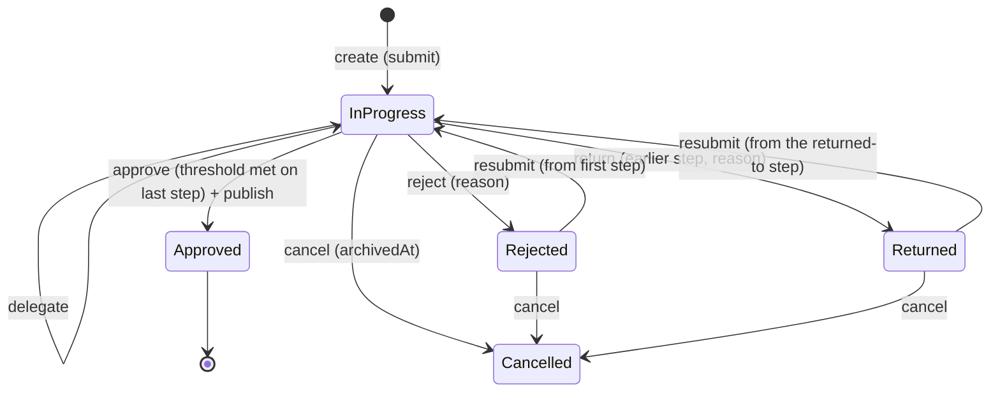

# مراجعة سلامة منظومة الـ Workflow — UAEAF

| | |
|---|---|
| **التاريخ** | 2026-09-11 |
| **النوع** | مراجعة تدقيقية مستقلة (audit). لا تعديل على كود إنتاجي أو schema أو index أو DTO أو migration، ولا أي أمر Git. |
| **خط الأساس** | شجرة العمل الحالية على `main` (غير مُلتزَمة). تشمل دفعة الأمان الصغيرة المنفَّذة قبل بدء المراجعة بموافقة سابقة: فحص انتماء `revisionId` في `workflowInstances.create/resubmit`، وفهرس فريد `{entityType, entityId, versionNumber}` مع إعادة المحاولة. انظر الملحق أ. |
| **أدلة التشغيل** | `api/test/e2e/workflow-integrity.e2e-spec.ts` (جديد) على MongoDB مؤقتة (`mongodb-memory-server`)، بنفس إعداد الـ e2e الحالية. |
| **خارج النطاق** | صفحة "كلمة الرئيس" وشغلها الجاري. |

---

## حالة التنفيذ — دفعة "قبل ٢ أكتوبر" (2026-09-11)

نُفّذت بموافقة صريحة، والمراجعة أدناه باقية كما كُتبت.

| البند | الحالة | الدليل |
|---|---|---|
| F1 — "ذذ" واستيراد `zod` | **منفَّذ** | `nest build` يخرج بـ 0 |
| F2 — بوابة الأنواع في pre-push | **لم يُطبَّق**: الـ hook الحالي وحده 135 ث على هذا الجهاز، والمقترح يرفعه إلى نحو 421 ث (الحد 60). البديل في تقرير الدفعة | أزمنة مقيسة |
| F3 — H1 (العدّ داخل الدورة) | **منفَّذ** | `workflow-action-history.repository.spec.ts` (4)؛ اختبارا `[H1]` صارا `it` |
| F4 — H11(ج)(د) + OUT-01 | **منفَّذ**: عند الإنشاء وعند كل فعل بعده عدا الإلغاء، دون تغيير schema | 13 اختبار وحدة؛ `[H11/S8]` submission ×2 و`[OUT-01]` صارت `it` |
| OUT-02 — التفويض | **مُخفَّف مؤقتًا**: `403` ثابت، والكود باقٍ خلف `DELEGATION_ENABLED` | `[OUT-02]` صار اختبار إيقاف؛ حُذف `[S4]` لأن ما وثّقه لم يعد ممكنًا |
| مزامنة توثيق الدفعة السابقة | **منفَّذ** | 07، `public-api-contract.md`، `openapi.json` |

المتبقي `it.failing`: 9 — H2، H11(ب) ×2، H4، H5، H6 ×2، OUT-03، OUT-04.

---

## ١. الحكم العام

**FAIL** — مساران مؤكَّدان باختبار ينشران محتوى بموافقات أقل مما تتطلبه خطواته:
- **H1**: موافقات دورة سابقة تُحسب للنسخة المعاد تقديمها. نُشرت نسخة بموافقة واحدة عليها في خطوة "2 من 3".
- **H11**: `create` لا يقرأ الـ definition أصلًا، فيمكن اعتماد سجل عبر definition نوع آخر.

ويُضاف إليهما أن بناء الإنتاج (`nest build`) مكسور حاليًا بحرفين دخيلين في ملف schema (OUT-05).

---

## ٢. جدول الفرضيات

معيار الخطورة كما حدّدتَه:
- **P0**: نشر بلا الموافقات المطلوبة، أو تلف بيانات، أو تسريب، أو ثغرة.
- **P1**: إعداد خاطئ يفسد السلوك بصمت.
- **P2**: دين بلا أثر حالي.

"يمس ٢ أكتوبر؟" مبنية على نطاق المعلَم الموثَّق: "public website + minimum static pages"، بمحتوى تجريبي، ولوحة التحكم بعد أكتوبر ([project-status-and-frontend-kickoff-2026-09-07.md:274](../../audits/project-status-and-frontend-kickoff-2026-09-07.md), §4.6, §5.1). راجع القرار D-12.

| # | الفرضية | الحكم | الدليل | الخطورة | التكلفة | يمس ٢ أكتوبر؟ |
|---|---|---|---|---|---|---|
| H1 | `countDistinctApprovers` تعدّ دون شرط `Approved`، و/أو تحسب موافقات دورة سابقة | **صحيح جزئيًا.** الشق الأول **خطأ**: الاستعلام يشترط `action: 'Approved'`. الشق الثاني **صحيح ومؤكَّد**: لا حدّ للدورة ولا للـ revision، فتُحسب موافقات ما قبل `Returned`/`Rejected` للنسخة الجديدة | `workflow-action-history.repository.ts:22-32`؛ `workflow-instances.service.ts:129-134`؛ اختبارا `[H1]` (مسار الإرجاع: الـ instance تقدّمت للخطوة التالية بموافقة C وحدها؛ مسار الرفض: الزائر رأى `"Rejected, second draft"` منشورة بموافقة واحدة عليها) | **P0** | S | لا يمنع التسليم (الفريق ينشر محتوى تجريبيًا)، ويُصلَح قبله لأن كلفته S |
| H2 | لا شيء يمنع أكثر من instance نشطة لنفس السجل | **صحيح ومؤكَّد.** القاعدة (Week 2 §4) مطبَّقة في الـ service كقراءة ثم كتابة، والفهرس `{entityType, entityId}` غير فريد. كما أن `operation` غير مخزَّن (H3)، فالقاعدة تعمل على (النوع، المعرّف) لا (النوع، المعرّف، العملية) | `workflow-instances.service.ts:64-76`؛ `workflow-instances.repository.ts:19-24`؛ `workflow-instance.schema.ts:54`؛ اختبار `[H2]`: إرسالان متوازيان أنتجا **2** instance نشطتين، ثابت في 4 تشغيلات | P1 | M | لا |
| H3 | `WorkflowInstance` لا يخزّن `operation` | **صحيح.** لا حقل في الـ schema ولا الـ DTO، وكلمة `operation` لا تظهر في الوحدة. الأثر الكامن: `approve()` ينشر عند آخر موافقة أيًّا كانت العملية المقصودة (Delete/Unpublish/Archive أيضًا) | `workflow-instance.schema.ts:29-51`؛ `create-workflow-instance.dto.ts`؛ `workflow-instances.service.ts:182-194` | P1 (كامن: لا يوجد مسار Delete/Unpublish/Archive عبر workflow اليوم) | M + D-05 | لا |
| H4 | فهرس `(entityType, operation)` في `WorkflowPolicy` غير فريد، وهل توجد مكررات؟ | **صحيح.** الفهرس غير فريد، و`findOne` يختار صفًّا اعتباطيًا عند التكرار. المكررات: القاعدة المحلية فيها **0** policy أصلًا. **Atlas لم يُفحص**: لا يوجد رابط Atlas مهيّأ على هذا الجهاز (`api/.env` يشير إلى `127.0.0.1:27017`). الاستعلام جاهز في الملحق ب | `workflow-policy.schema.ts:41`؛ `workflow-policies.repository.ts:17-22`؛ اختبار `[H4]`: policy مكررة قُبلت `201` | P2 اليوم (لا أحد يقرأ الـ policies، انظر OUT-07)، P1 عند ربطها | S | لا |
| H5 | لا unique على `(workflowDefinitionId, sequenceOrder)`، وكيف تتم إعادة الترتيب؟ | **صحيح.** لا فهرس على الخطوات إطلاقًا. `findNext` يطلب ترتيبًا **أكبر تمامًا**، فالخطوة المكررة الترتيب **تُتخطّى بصمت** ولا يراجع أصحابها المحتوى. إعادة الترتيب: **لا يوجد مسار تحديث أصلًا**؛ الـ controller فيه POST/GET/DELETE فقط، والترتيب يتغير بالحذف ثم الإنشاء. لذلك فهرس فريد جزئي على الخطوات غير المؤرشفة لا يكسر أي عملية قائمة. المكررات محليًا 0 (لا خطوات) | `workflow-steps.repository.ts:24-36`؛ `workflow-step.schema.ts:39`؛ `workflow-steps.controller.ts:16-38`؛ اختبار `[H5]`: خطوة بنفس الترتيب قُبلت `201` | P1 | S | لا |
| H6 | لا validation لـ `requiredApprovals` مقابل `assigneeIds` | **صحيح جزئيًا.** الـ DTO يفرض مصفوفة غير فارغة و`requiredApprovals ≥ 1`، ولا يفرض `requiredApprovals ≤` عدد المعيَّنين المختلفين ولا عدم التكرار. الـ schema بلا أي قيد. النتيجة خطوة مستحيلة الإشباع وinstance عالقة إلى الأبد | `create-workflow-step.dto.ts:21-33`؛ `workflow-step.schema.ts:32-36`؛ اختبارا `[H6]`: `3 من [A,B]` و`2 من [A,A]` قُبلا `201` | P1 | S | لا |
| H7 | المعنى الموثَّق لـ `Sequential` | **التوثيق غامض، والسلوك موحّد.** الموثَّق: "Sequential = ordered chain; Parallel + N = N of M". الكود **لا يقرأ `stepType` أبدًا**، فهو يُخزَّن فقط، والخطوتان تتصرفان بشكل واحد عبر `requiredApprovals`. الترتيب موجود بين الخطوات فقط (`sequenceOrder`)، ولا ترتيب بين المعيَّنين داخل خطوة | [08-Workflow-Scenario-Review.md §2.F](../../product/08-Workflow-Scenario-Review.md)؛ `workflow-step.schema.ts:11-17`؛ `workflow-steps.service.ts:16` (الموضع الوحيد الذي يلمسه) | P2 | S بعد D-03 | لا |
| H8 | `WorkflowActionHistory` يرث `BaseSchema`، وهل يوجد ما يعدّل أو يؤرشف؟ | **صحيح بنيويًا، ولا مسار فعلي.** الـ schema فيه `updatedAt/archivedAt`، والـ repository يرث `updateById/softDelete`. لكن الـ controller قراءة فقط، والـ service لا يستدعي إلا `record` و`countDistinctApprovers` و`findByInstance`. ملاحظة: `countDistinctApprovers` لا يشترط `archivedAt: null` بخلاف `findByInstance` (كامن) | `workflow-action-history.schema.ts:25`؛ `workflow-action-history.repository.ts:10`؛ `base.repository.ts:65-73`؛ `workflow-action-history.controller.ts:13-17`؛ استدعاءات `actionHistoryService` في `workflow-instances.service.ts:90,120,129,214,262,323,366` | P2 | S | لا |
| H9 | `revisionId` مطلوب لكل action بما فيها `Delegated`، وهل يدخل نوع بلا revisions؟ | **صحيح.** `revisionId` مطلوب في كل صف تاريخ. `contactMessages` يدخل workflow ولا يمكن أخذ revision له (List B تستثنيه)، والـ DTO يطلب `revisionId`، فتحمل instances الرسائل وأفعالها معرّفًا لا يشير إلى شيء. منذ الدفعة يُتخطّى فحص الانتماء لهذا النوع وحده (بانتظار تأكيدك، D-07) | `workflow-action-history.schema.ts:47-48`؛ `create-workflow-instance.dto.ts:21-23`؛ `workflow-instances.service.ts:442-464`؛ اختبار الوحدة "submits a contact message without a revision to match" | P2 | S + D-07 | لا |
| H10 | الفرق بين 13 و12، وأثر الأنواع الأربعة بلا model | **صحيح ومقصود وموثَّق.** الزائد `contactMessages`. الأنواع بلا model: `articles`، `staticPages`، `externalMediaCoverage`، `publicEvents`. أثرها اليوم: تُقبل لها definitions وpolicies (إعداد ميت)، و`POST /revisions` يرد `400`، و`POST /workflow-instances` يرد `404` منذ الدفعة لأنه لا revision يمكن أن يوجد. قبل الدفعة كان يمكن اعتماد instance لها تُنتج publication تشير إلى revision غير موجودة | `workflow-entity-types.ts:1-34` (FigJam `100:7435`)؛ [09-Integrity…Audit.md](../../product/09-Integrity-Completeness-Security-Audit.md) (List A/B)؛ [content-authorization…approval.md §1.3](../../security/content-authorization-architecture-approval.md) | P2 | — | لا |
| H11 | فحوص الانتماء: الخطوة الحالية للـ definition، و`Policy.entityType = Definition.entityType`، ومنع definition غير نشطة | **صحيح في الأوجه الأربعة، وكلها مؤكَّدة.** (أ) الانتقالات الداخلية سليمة، لكن `return()` يقبل خطوة من definition أخرى (OUT-01). (ب) الـ policy تُخزَّن دون قراءة الـ definition. (ج) الـ definition غير النشطة تبدأ instances جديدة. (د) إضافة: `create` لا يطابق نوع السجل بنوع الـ definition، فيُعتمد سجل عبر definition نوع آخر، وقد يكون معيَّنها الوحيد هو المرسِل نفسه | `workflow-instances.service.ts:64-76` (لا قراءة للـ definition)، `:257` (مقارنة الترتيب فقط)؛ `workflow-policies.service.ts:18-26`؛ اختبارات `[H11/S8]` ×4 و`[OUT-01]`: كلها `201` | (د) **P0**؛ (أ)(ج) P1؛ (ب) P2 اليوم | S | (د)(ج)(أ) تُصلَح قبله (S) |
| H12 | Conditional validation للأفعال | **مُعالَج في طبقة أخرى (DTO + service)، بثغرات صغيرة.** سبب الرفض مطلوب (`MinLength(1)`)، والإرجاع يطلب الخطوة والسبب، والتفويض يطلب المستخدم. والحقول لا تُكتب في غير أفعالها لأن الـ service هو الكاتب الوحيد. الثغرات: سبب من مسافات فقط يُقبل، ولا حدّ طول (doc 07 يقول 1000)، ولا فحص أن المفوَّض إليه مستخدم موجود ونشط | `action-reason.dto.ts:13-18`؛ `return-workflow-instance.dto.ts:5-14`؛ `delegate-workflow-instance.dto.ts:6-8` | P2 | S | لا |
| H13 | تعديل definition/steps أثناء instances جارية | **صحيح.** لا مسار تحديث، لكن يمكن إضافة خطوة أو أرشفتها في أي وقت، والـ instance تقرأ السلسلة حيّة في كل فعل ولا تحتفظ بنسخة: <br>• خطوة تُضاف بعد التقديم تصبح مطلوبة. <br>• أرشفة الخطوة الحالية تُعلِّق الـ instance ("The current step no longer exists"). <br>• أرشفة الـ definition لا تمنع instances جديدة. <br>• التفويض يعدّل خطوات مشتركة (OUT-02). <br>موثَّق كـ NEEDS-DECISION | `workflow-steps.repository.ts:24-43`؛ `workflow-instances.service.ts:472-476`؛ `workflow-definitions.service.ts:30-32`؛ [08 §6.7](../../product/08-Workflow-Scenario-Review.md) | P1 | M–L + D-06 | لا |

---

## ٣. الـ state machine الفعلية

### ٣.١ القواعد الموثَّقة ومصادرها

| # | القاعدة | المصدر |
|---|---|---|
| R1 | instance نشطة واحدة كحد أقصى لكل (entityType, entityId). `Rejected`/`Returned` غير نهائية | تعليق الكود "BE-PLAN-010 Week 2 §4" (`workflow-instances.service.ts:58-63`، `workflow-instances.repository.ts:16-18`). **نص قرارات Week 2 §1–§12 غير موجود في المستودع.** وسجّل [08 §2.P](../../product/08-Workflow-Scenario-Review.md) غياب القيد كـ GAP |
| R2 | الموافقة الذاتية تُحكم بعضوية `assigneeIds` وحدها | [09 §1.2 بند 4](../../product/09-Integrity-Completeness-Security-Audit.md) (FigJam `100:7512` row `379:1`) |
| R3 | `Rejected` يُبقي نفس الـ instance. إعادة التقديم بعد الرفض تبدأ من أول خطوة، وبعد الإرجاع تكمل من الخطوة المُرجَع إليها | تعليق الكود "Week 2 §2" (`workflow-instances.service.ts` فوق `resubmit`). وكان مفتوحًا في [08 §12 س1](../../product/08-Workflow-Scenario-Review.md) |
| R4 | اعتماد آخر خطوة ينشر تلقائيًا (Add/Edit)، و`Publish` ليس عملية مستقلة | [09 §1.2 بند 2](../../product/09-Integrity-Completeness-Security-Audit.md) (FigJam `277:4402`) |
| R5 | القراءة العامة عبر `publications → revisions.snapshotData` وحدها ("Approved ≠ Published") | [08 §2.L](../../product/08-Workflow-Scenario-Review.md)؛ `publications.service.ts:63-69`؛ [public-api-contract.md](../../../api/docs/api/public-api-contract.md) |
| R6 | publication واحدة `Live` كحد أقصى لكل سجل | `publication.schema.ts:22-25` (confirmed 2026-09-03) |
| R7 | `publications.revisionId` علاقة 1:1 | [08 §2.M](../../product/08-Workflow-Scenario-Review.md)؛ [07 `publications`](../../product/07-Mongoose-Schema-Specification.md) (unique) |
| R8 | `Unpublish` قابل للعكس بلا دورة موافقة، و`Archive` نهائي | `publications.service.ts:15-19` (§6)؛ [09 §1.2 بند 1](../../product/09-Integrity-Completeness-Security-Audit.md) |
| R9 | الـ revisions ثابتة ودائمة، ورقم النسخة يتزايد لكل سجل | [08 §2.L](../../product/08-Workflow-Scenario-Review.md)؛ [07 `revisions`](../../product/07-Mongoose-Schema-Specification.md) |
| R10 | يُمنع HardDelete ما دام للسجل revision واحدة | [09](../../product/09-Integrity-Completeness-Security-Audit.md)؛ `revisions.service.ts` (`assertHardDeletable`, §10) |
| R11 | تسجيل مزدوج: `workflowActionHistory` + `auditLogs StatusChange` | [10 Week 2](../../product/10-Backend-Build-Test-Plan.md) |
| R12 | أشكال الخطوة: Sequential سلسلة، Parallel + N = N من M. التعيين لمستخدمين بالاسم فقط | [08 §2.F](../../product/08-Workflow-Scenario-Review.md) (FigJam `100:7468`) |
| R13 | الـ definition مقيَّدة بنوع واحد، ويمكن تعدّدها للنوع. الاختيار عبر `workflowPolicies` لكل (entityType, operation) بمؤشر واحد | [08 §2.A/B و§6.2–6.5](../../product/08-Workflow-Scenario-Review.md) |
| R14 | `isActive` = "whether this definition is usable" | `create-workflow-definition.dto.ts:22`؛ [08 §6.4](../../product/08-Workflow-Scenario-Review.md) |
| R15 | عمليات الـ policy: `Add|Edit|Delete|Unpublish|Archive`، و`workflowDefinitionId` مطلوب عند `workflowRequired=true` | [09 §1.2 بند 2](../../product/09-Integrity-Completeness-Security-Audit.md)؛ `create-workflow-policy.dto.ts:22-28` (موصوف ولا يُفرض) |
| R16 | List A (13) وList B (12 = A ناقص `contactMessages`) | `workflow-entity-types.ts:1-13` (FigJam `100:7435`) |
| R17 | `revisionId` على الـ instance وكل فعل هو "النسخة الدقيقة التي رُوجعت" | [09 §1.2 بند 3](../../product/09-Integrity-Completeness-Security-Audit.md)؛ `workflow-instance.schema.ts:25-27` |
| R18 | `Returned` يحمل الخطوة **الأسبق** التي أُرجع إليها | [08 §2.K](../../product/08-Workflow-Scenario-Review.md)؛ `return-workflow-instance.dto.ts` |
| R19 | `POST /revisions` و`POST /workflow-instances` يشترطان أيضًا `<entityType>:Update` | [content-authorization…approval.md §2.2 وREQUIRED CHANGES واختبار الأمان (f)](../../security/content-authorization-architecture-approval.md) — **معتمد** |
| R20 | لا يعدّل أحد حدود صلاحياته بشكل غير مباشر، ولا يتجاوز الموافقة عبر API | [Operating Model §8](../UAEAF-ENGINEERING-OPERATING-MODEL.md) |

**غير موثَّق، ويحتاج قرارًا (القسم ٧):**
- دلالة التفويض: تعليق الـ service نفسه يقول إنها غير مفصّلة.
- معنى Sequential داخل خطوة.
- حدّ دورة الموافقات.
- `operation` على الـ instance: [08 §6.2](../../product/08-Workflow-Scenario-Review.md) يقول "presumably copied … not stated".
- تغيّر الـ definition أثناء السير.
- `revisionId` لأنواع List A فقط.
- مسار العودة من `Unpublished` إلى `Live`.

لم تُقرأ FigJam في هذه المراجعة، واعتمدتُ على نصوصها المنقولة في 08 و09 وتعليقات الكود. البنود التي مصدرها FigJam وحده مذكورة بأرقام العُقد أعلاه.

### ٣.٢ الحالات والانتقالات كما في الكود



| الانتقال | الشروط المطبَّقة فعلًا | ما يُكتب | الناقص مقابل القواعد |
|---|---|---|---|
| **create** | revision من هذا السجل (List B) [الدفعة]؛ لا instance نشطة (قراءة ثم كتابة)؛ للـ definition خطوة أولى | `workflowInstances` جديد؛ `workflowActionHistory: Submitted`؛ `auditLogs: StatusChange null→InProgress` | لا قراءة للـ definition (نوع/نشاط/أرشفة) — H11؛ لا policy — OUT-07؛ لا `operation` — H3؛ لا قيد قاعدة بيانات — H2؛ لا `<entityType>:Update` — OUT-04 |
| **approve** | الحالة `InProgress`؛ الفاعل في `assigneeIds` للخطوة الحالية | `Approved` في التاريخ؛ عند بلوغ الحد: الخطوة التالية، أو `Approved` + `publications.createLive` (إعادة الـ Live السابقة إلى `Archived` ثم إدراج جديد) | العدّ عبر الدورات — H1؛ لا compare-and-set للحالة — OUT-03؛ النشر بغض النظر عن العملية — H3 |
| **reject** | `InProgress`؛ الفاعل معيَّن؛ سبب | `Rejected` في التاريخ؛ `status=Rejected` | — |
| **return** | `InProgress`؛ الفاعل معيَّن؛ ترتيب الهدف أقل | `Returned` + `returnedToStepId`؛ `currentStepId=target` | الهدف قد يكون من definition أخرى — OUT-01 |
| **resubmit** | `Rejected`/`Returned`؛ revision من هذا السجل [الدفعة] | `Resubmitted`؛ `revisionId` جديد؛ `InProgress` | لا يبدأ دورة عدّ جديدة — H1 |
| **delegate** | `InProgress`؛ الفاعل معيَّن | `Delegated`؛ **`workflowSteps.assigneeIds += delegate`** (خطوة الـ definition المشتركة) | يمتد لكل instances الـ definition — OUT-02؛ الدلالة غير موثَّقة — D-04 |
| **cancel** | ليست `Approved` | `archivedAt` على الـ instance؛ `auditLogs` | — |
| **publications: unpublish/archive** | `publications:Publish` | `status` على صف الـ publication | لا يمر بالـ workflow ولا بالـ policy (Unpublish/Archive عمليتا policy) — H3/D-05؛ لا مسار `Unpublished → Live` رغم أنه موثَّق قابلًا للعكس — OUT-12 |

### ٣.٣ أين تُطبَّق كل قاعدة

| القاعدة | schema | DTO | service | لا مكان |
|---|---|---|---|---|
| R1 instance نشطة واحدة | — | — | ✓ قراءة ثم كتابة | قيد قاعدة البيانات |
| R2 التعيين | — | — | ✓ `loadAssignedStep` | — |
| R6 Live واحدة | — | — | ✓ `createLive` (غير ذري) | قيد قاعدة البيانات |
| R7 publication واحدة لكل revision | — | — | — | ✓ لا مكان |
| R9 رقم النسخة | ✓ فهرس فريد [الدفعة] | — | ✓ إعادة المحاولة [الدفعة] | — |
| R12 N من M | — | جزئي (`≥1`) | ✓ عدّ المختلفين | `N ≤ M`، التكرار، الدورة |
| R13 نوع الـ definition | — | — | — | ✓ لا مكان |
| R14 `isActive` | — | — | — | ✓ لا مكان |
| R15 `workflowDefinitionId` عند الحاجة | — | موصوف فقط | — | ✓ لا مكان |
| R17 revision السجل | — | — | ✓ [الدفعة، List B] | لـ `contactMessages` |
| R18 الخطوة الأسبق | — | ✓ `IsMongoId` | ✓ الترتيب فقط | الانتماء للـ definition |
| R19 `<entityType>:Update` | — | — | — | ✓ لا مكان |
| R20 حدود الصلاحية | — | — | — | ✓ التفويض يكسرها |

---

## ٤. مشاكل خارج القائمة

| # | المشكلة | الدليل | الخطورة | التكلفة |
|---|---|---|---|---|
| OUT-01 | `return()` يقبل خطوة من definition أخرى، فيقرّر معيَّنوها في محتوى ليس لهم | `workflow-instances.service.ts:257`؛ اختبار `[OUT-01]` → `201` | P1 | S |
| OUT-02 | التفويض يضيف المفوَّض إليه إلى `assigneeIds` **خطوة الـ definition** لا الـ instance، فيحق له اعتماد كل instances تلك الـ definition الآن ولاحقًا. يكسر R20. وفي خطوة "2 من 3" يكفي المفوِّض ومن اختاره (S4) | `workflow-steps.repository.ts:45-49`؛ `workflow-instances.service.ts:376`؛ اختبار `[OUT-02]` → `201`؛ اختبار `[S4]` | P1 (أمني، داخلي) | M + D-04 |
| OUT-03 | اعتمادان نهائيان متزامنان يُنشئان publicationين للـ revision نفسها (يكسر R7)، لأن `approve()` يقرأ الحالة ويكتبها دون شرط، و`createLive` غير ذري | `workflow-instances.service.ts:115-194`؛ `publications.repository.ts:40-53`؛ `publication.schema.ts:53` (لا unique على `revisionId`)؛ اختبار `[OUT-03]` → 2 صفوف، ثابت في 4 تشغيلات | P2 اليوم (نفس النص)، P1 مع H2 | M |
| OUT-04 | فحص `<entityType>:Update` على `POST /revisions` و`POST /workflow-instances` **معتمد ولم يُنفَّذ** (R19)، فمن يحمل `revisions:Create` وحده يقترح محتوى لأي نوع | `revisions.controller.ts:17-25`؛ `workflow-instances.controller.ts:35-49`؛ اختبار `[OUT-04]` → `201` | P1 | S–M + D-10 |
| OUT-05 | **البناء مكسور.** `WorkflowActioذذnHistoryDocument` في `workflow-action-history.schema.ts:6` (عُدّل 13:49، لم يُعدَّل في هذه المراجعة)، و`nest build` يفشل بخطأين. وفي `workflow-action-history.service.ts:5` استيراد غير مستخدم `zod/v4/core` (عُدّل 14:08، مصدر مخالفة الـ lint الخامسة عشرة) | مخرجات `npm run build`: `TS2724` ×2 | حاجز إصدار | S |
| OUT-06 | الاختبارات لا تفحص الأنواع: `isolatedModules: true` يجعل ts-jest ينقل كل ملف منفردًا، فبقيت 694+33 خضراء والبناء مكسور | `api/tsconfig.json:8`؛ مخرجات الـ suite مقابل مخرجات البناء | P1 (عملية) | S |
| OUT-07 | الـ policies لا يقرؤها أحد: `findByEntityTypeAndOperation` بلا مستدعٍ، والـ definition يختارها العميل في جسم الطلب. حتى بعد إصلاح H11 يبقى اختيار definition أخف لنفس النوع إن وُجدت | `workflow-policies.service.ts:36-41`؛ grep بلا مستدعٍ خارج الوحدة | P1 + D-01 | M |
| OUT-08 | الاعتماد النهائي ينشر revision لسجل أُرشف بعد التقديم | `workflow-instances.service.ts:182-194` (لا قراءة للسجل) | P2 + D-08 | S |
| OUT-09 | `resubmit` يقبل نفس الـ revision المرفوضة للتو. ومع H1 قد تمر على موافقاتها القديمة | `workflow-instances.service.ts:296-346` | P2 (يُغلق مع H1) | — |
| OUT-10 | `create` لا يتحقق من وجود السجل لـ `contactMessages`، ولا يعيد فحص الأرشفة لـ List B (الـ revision تثبت وجوده لحظة أخذها فقط) | `workflow-instances.service.ts:64-76` | P2 | S |
| OUT-11 | انحراف doc 07 عن الكود: <br>• `workflowInstances.entityType` "12-type" (الكود 13). <br>• enum الأفعال 4 قيم (الكود 6). <br>• `reason` maxlength 1000. <br>• `versionNumber` min 1. <br>• لا صف لـ `workflowInstances.revisionId`. <br>(08 يصف 07 بأنه قديم) | [07](../../product/07-Mongoose-Schema-Specification.md) مقابل الـ schemas | P2 | S |
| OUT-12 | `Unpublished` موثَّق "قابلًا للعكس بلا دورة موافقة" ولا مسار يعيده إلى `Live` | `publications.controller.ts:25-35`؛ `publication.schema.ts:19-20` | P2 + D-11 | S |

---

## ٥. أدلة الاختبار

**الملف:** `api/test/e2e/workflow-integrity.e2e-spec.ts`، وفيه 20 اختبارًا. كل اختبار يبني سجله وdefinitionه ولا يعتمد على غيره.

**سلوك صحيح اليوم (characterization) — 5:**

| الاختبار | ما يثبته |
|---|---|
| `[S1]` | سلسلة A ثم B ثم C: B يُرفض `403` قبل دوره، ولا نشر قبل C |
| `[S2]` | "2 من 3": موافقة واحدة لا تكفي، والثانية تنشر |
| `[S3]` | نفس الشخص مرتين يُحسب مرة |
| `[S4]` | بعد تفويض A إلى D يُحسب **D وA معًا**. سلوك حالي بلا توثيق، يُحدَّث بعد D-04 |
| `[S6]` | رفض نسخة لاحقة لا يمسّ المنشورة: `Live` واحدة والنص القديم |

**عيوب مؤكَّدة (`it.failing`) — 15.** كل واحد يمر ما دام العيب قائمًا، ويتحول تلقائيًا لتنبيه عند الإصلاح:

| الاختبار | الفرضية | القيمة التي أثبتت العيب |
|---|---|---|
| does not count approvals of the returned revision… | H1 | الخطوة الحالية صارت الثانية بعد موافقة واحدة |
| does not count an approval given before a rejection… | H1 | الزائر رأى `"Rejected, second draft"` |
| creates one instance when submitted twice at once | H2 | 2 instance نشطتان |
| refuses a policy whose definition governs another type | H11(ب) | `201` |
| refuses a policy whose definition is inactive | H11(ب) | `201` |
| refuses a submission through a definition of another type | H11(د) | `201` |
| refuses a submission through an inactive definition | H11(ج) | `201` |
| refuses a second policy for the same type and operation | H4 | `201` |
| refuses a second step with the same order | H5 | `201` |
| refuses a step that needs more approvals than assignees | H6 | `201` |
| refuses a step that lists the same assignee twice… | H6 | `201` |
| refuses to return to a step of another definition | OUT-01 (H11-أ) | `201` |
| does not let a delegate approve another instance… | OUT-02 | `201` |
| publishes a revision once when two final approvals… | OUT-03 | 2 publications للـ revision |
| refuses a revision from an actor with no Update permission… | OUT-04 | `201` |

**ما يُثبت بالكود لا بالاختبار، ولماذا:**
- **H3، H8، H9، H10:** حقائق بنيوية، غياب حقل أو وجود وراثة، ودليلها الملف والسطر. H3 لا يمكن اختبار أثره أصلًا، لأن الطلب لا يستطيع التعبير عن العملية.
- **H7، H13، OUT-07، OUT-08، OUT-12:** سلوك صحيح بلا قاعدة موثَّقة تخالفه. كلها قرارات مفتوحة (D-01، D-03، D-06، D-08، D-11)، وكتابة `it.failing` لها تعني اختيار القرار نيابةً عنك.
- **H12:** ثغراته نظافة (P2) لا تخالف قاعدة معتمدة. حدّ 1000 مصدره doc 07 الموصوف بالقِدم.
- **OUT-05، OUT-06:** دليلهما مخرجات البناء والإعداد.

كل عيب يخالف قاعدة موثَّقة له `it.failing`.

**التحقق من سبب الفشل:** `it.failing` يمر أيضًا إن فشل الاختبار لسبب خاطئ، كخطأ في التهيئة. لذلك شُغّلت نسخة مؤقتة حُوّل فيها كل `it.failing` إلى `it`، وقُرئت رسالة كل فشل. **الخمسة عشر فشلوا جميعًا عند التأكيد الأخير بالقيمة المذكورة أعلاه**، لا في التهيئة، ثم حُذفت النسخة المؤقتة. اختبارا التزامن (H2 وOUT-03) ثابتان في **4 تشغيلات** متتالية.

**الـ suite الكاملة:**

| | قبل | بعد |
|---|---|---|
| unit | 81 ملفًا / 694 ✓ | 81 ملفًا / 694 ✓ |
| e2e | 14 ملفًا: 13 ✓ + 1 ✗ (المعروف `_id` في `public-api-cms-composition`) | 15 ملفًا: 14 ✓ + 1 ✗ (المعروف نفسه) |
| اختبارات e2e | 14: 13 ✓ | 34: 33 ✓ |
| lint (`oxlint`) | 15 مخالفة، كلها سابقة: `ValidationPipe` غير مستخدم في 13 ملف e2e، واستيرادان غير مستخدمين | لم يُضف الملف الجديد مخالفة |
| build (`nest build`) | يفشل: `TS2724` ×2 (OUT-05) | كما هو |

**فحوص القراءة فقط على قاعدة البيانات:** نُفّذت على `127.0.0.1:27017/uaeaf`، وهي القاعدة المهيّأة الوحيدة، بسكربت يرفض أي مضيف غير محلي. استُخدم `countDocuments` و`aggregate` فقط. **كل مجموعات الـ workflow فارغة (0 وثيقة)**، فلا مكررات ولا تنظيف مطلوب محليًا. **Atlas لم يُفحص**: لا يوجد رابط Atlas في `api/.env`، والنمط موجود في القالب `.env.example` فقط ولم يُستعمل. الاستعلامات جاهزة في الملحق ب.

---

## ٦. خطة الإصلاح المقترحة

بصيغة writing-plans: كل بند مهمة لها ملفات محددة، واختبار يتحول من `failing` إلى أخضر، وترتيب آمن. التنفيذ يحتاج موافقتك الصريحة بندًا بندًا. قبل أي فهرس فريد: شغّل استعلامات الملحق ب على Atlas. محليًا لا حاجة، فالمجموعات فارغة.

### المجموعة الأولى — قبل ٢ أكتوبر (حاجز إصدار + P0 بكلفة S)

| # | التغيير | schema؟ | migration/تنظيف؟ | الترتيب | يتحول أخضر |
|---|---|---|---|---|---|
| F1 | حذف "ذذ" من `workflow-action-history.schema.ts:6`، واستيراد `zod` غير المستخدم من `workflow-action-history.service.ts:5` | لا (اسم نوع TS) | لا | أولًا | `npm run build` يخرج بـ 0 |
| F2 | إضافة `tsc --noEmit -p tsconfig.json` إلى سكربت `test` أو كخطوة CI قبل Jest | لا | لا | بعد F1 | كان سيكشف OUT-05 |
| F3 | **H1**: العدّ ضمن الدورة الحالية فقط. `countDistinctApprovers(instanceId, stepId, since)` حيث `since` = `actionDate` لآخر `Submitted`/`Resubmitted` للـ instance. ملفات: `workflow-action-history.repository.ts`، `.service.ts`، و`workflow-instances.service.ts` (`approve`) | لا (استعلام) | لا | بعد F2 | اختبارا `[H1]` |
| F4 | **H11(ج)(د) + OUT-01**: `create` يقرأ الـ definition عبر `WorkflowDefinitionsService.findById`. يرفض غير الموجودة أو المؤرشفة `404`، وغير النشطة `409`، والنوع المختلف `400`. و`return()` يرفض خطوة `workflowDefinitionId`ها مختلف `400`. ملفات: `workflow-instances.service.ts`، `workflow-instances.module.ts` (استيراد `WorkflowDefinitionsModule`) | لا | لا | بعد F3 | `[H11/S8]` submission ×2، `[OUT-01]` |

### المجموعة الثانية — قبل ٦ نوفمبر (P1، قبل أن يستخدم المحررون لوحة التحكم)

| # | التغيير | schema؟ | migration/تنظيف؟ | الترتيب | يتحول أخضر |
|---|---|---|---|---|---|
| F5 | **H2**: ضمان قاعدة البيانات لـ instance نشطة واحدة. حقل `active: true` عند الإنشاء، يُزال عند `Approved` والإلغاء، مع فهرس فريد جزئي `{entityType, entityId}` بشرط `{active: true}`. والـ service يحوّل `E11000` إلى `409` | **نعم** | نعم: backfill لـ `active` + فحص مكررات Atlas أولًا | بعد المجموعة الأولى | `[H2]` |
| F6 | **OUT-03**: انتقالات ذرية. `approve/reject/return/resubmit/delegate` تكتب بشرط `{_id, status, currentStepId}` المقروءين، ولا تطابق → `409`. مع فهرس فريد على `publications.revisionId` (R7) كحاجز أخير | **نعم** (فهرس) | فحص مكررات `revisionId` أولًا | بعد F5 | `[OUT-03]` |
| F7 | **OUT-02 + D-04**: التفويض يُخزَّن على الـ instance (`delegations: [{stepId, from, to}]`) ولا يمسّ `workflowSteps`. و`loadAssignedStep` يضم المفوَّضين لهذه الـ instance، والعدّ يتبع D-04 | **نعم** (حقل بقيمة افتراضية `[]`) | لا | بعد F6 | `[OUT-02]`؛ يُحدَّث `[S4]` حسب D-04 |
| F8 | **H5 + H6**: فهرس فريد جزئي `{workflowDefinitionId, sequenceOrder}` للخطوات غير المؤرشفة (تحقق من دعم `archivedAt: null` في `partialFilterExpression` على الخادم المستهدف، والبديل حقل `current: true`). وفي الـ DTO/service: `requiredApprovals ≤` عدد المختلفين، ومنع التكرار، وقاعدة D-03 لـ Sequential | **نعم** (فهرس) | فحص مكررات Atlas | مستقل | `[H5]`، `[H6]` ×2 |
| F9 | **OUT-04**: فحص `<entityType>:Update` في `RevisionsController.create` و`WorkflowInstancesController.create` كما في R19. ومنح الصلاحيات الأولي حسب D-10 | لا (صلاحيات seed) | seed صلاحيات | بعد D-10 | `[OUT-04]` |
| F10 | **OUT-07 + H3**: الخادم يختار الـ definition من الـ policy بـ (entityType, operation)، والعميل يرسل `operation` ولا يرسل `workflowDefinitionId`. ويُخزَّن `operation` على الـ instance | **نعم** | لا (المجموعات فارغة) | بعد D-01/D-05 | اختبار جديد يُكتب مع القرار |
| F11 | **H11(ب) + H4**: الـ policy تتحقق من الـ definition (موجودة، نشطة، نفس النوع) ومن `workflowRequired ⇒ workflowDefinitionId`. وفهرس فريد جزئي `{entityType, operation}` | **نعم** (فهرس) | فحص مكررات Atlas | مع F10 | `[H11/S8]` policy ×2، `[H4]` |

### المجموعة الثالثة — لاحقًا

| # | التغيير | schema؟ | migration؟ | يتحول أخضر / دليل |
|---|---|---|---|---|
| F12 | **H13 + D-06**: قصير الأمد، رفض إضافة أو أرشفة خطوة لـ definition لها instances نشطة. طويل الأمد، نسخة من سلسلة الخطوات على الـ instance عند التقديم | قصير: لا؛ طويل: نعم | طويل: نعم | اختبار جديد |
| F13 | **H3/D-05**: أثر الاعتماد حسب العملية (Unpublish/Archive/Delete) | نعم | لا | اختبار جديد |
| F14 | **H8**: repository للتاريخ لا يرث `BaseRepository` (إنشاء وقراءة فقط) | لا | لا | — |
| F15 | **H9/D-07**: `revisionId` اختياري لـ `contactMessages` في الـ DTO وschema التاريخ | نعم | لا | — |
| F16 | **H12**: سبب غير فارغ بعد القص، و`maxlength 1000`، والمفوَّض إليه مستخدم `Active` | لا | لا | — |
| F17 | **OUT-12/D-11**: مسار `Unpublished → Live` | لا | لا | — |
| F18 | **OUT-08/D-08**: رفض الاعتماد النهائي لسجل مؤرشف | لا | لا | — |
| F19 | **OUT-11**: مزامنة doc 07 مع الكود، ومعها مزامنة توثيق الدفعة المعلّقة | لا | لا | — |

---

## ٧. قرارات مطلوبة منك

| # | القرار | الخيارات | توصيتي | السبب |
|---|---|---|---|---|
| D-01 | كيف تُختار الـ definition عند التقديم؟ | (أ) الخادم من الـ policy بـ (entityType, operation)؛ (ب) العميل يختار مع تحقق النوع والنشاط | **(أ)** | يغلق تجاوز الـ policy (OUT-07) ويطابق [08 §6.2](../../product/08-Workflow-Scenario-Review.md). (ب) يترك اختيار definition أخف لنفس النوع |
| D-02 | حدّ دورة الموافقات، ونطاق الإرجاع | (أ) كل (إعادة) تقديم تحتاج موافقات جديدة في كل خطوة تُعاد، والعدّ من آخر `Submitted/Resubmitted`؛ (ب) العدّ لكل revision | **(أ)**. ويبقى الإرجاع كما وُثّق: يكمل من الخطوة المُرجَع إليها، والخطوات قبلها تحتفظ باعتمادها | (ب) يمرّر نفس الـ revision المرفوضة على موافقاتها القديمة (OUT-09) |
| D-03 | معنى `Sequential` داخل خطوة | (أ) موافقة واحدة من أي معيَّن، والترتيب بين الخطوات فقط، مع فرض `requiredApprovals = 1`؛ (ب) ترتيب بين المعيَّنين داخل الخطوة | **(أ)** | هذا ما يفعله الكود فعلًا. (ب) منطق جديد بلا طلب موثَّق |
| D-04 | دلالة التفويض | (أ) نقل لهذه الـ instance فقط: المفوَّض إليه يحل محل المفوِّض، ولا يُحسبان معًا؛ (ب) صوت إضافي لهذه الـ instance فقط؛ (ج) الحالي (إضافة دائمة للـ definition) | **(أ)**، والمفوَّض إليه مستخدم `Active` يحمل `workflowInstances:Approve` | (ج) يكسر R20. و(ب) يجعل "2 من 3" شخصًا ومن اختاره (S4) |
| D-05 | `operation` على الـ instance وأثر الاعتماد | Add/Edit → نشر؛ Unpublish → `Unpublished`؛ Archive → `Archived`؛ Delete → أرشفة، وHardDelete فقط إن سمحت الـ policy ولم توجد revisions | **كما هو مقترح** | يكمّل R4 وR10 وR15 دون مفاهيم جديدة |
| D-06 | تعديل الـ definition أثناء السير | (أ) رفض التعديل ما دامت instances نشطة؛ (ب) نسخة من السلسلة على الـ instance | **(أ) الآن، و(ب) لاحقًا** | (أ) بكلفة S يمنع التعليق والخطوات المفاجئة، و(ب) أنظف لكنه L |
| D-07 | `contactMessages` و`revisionId`، وتأكيد استثناء الدفعة | (أ) `revisionId` اختياري لهذا النوع؛ (ب) يبقى إلزاميًا بلا معنى | **(أ)**، مع تأكيد استثنائه من فحص الانتماء | لا revision يمكن أن يوجد لرسالة، وحقل إلزامي بلا معنى يضلّل التاريخ |
| D-08 | الاعتماد النهائي لسجل أُرشف بعد التقديم | (أ) رفض `409`؛ (ب) نشر | **(أ)** | المؤرشف خارج الموقع، كقرار الـ revisions السابق |
| D-09 | تأكيد 1:1 بين publication وrevision (فهرس فريد) | (أ) نعم: العودة بقلب حالة الصف نفسه، والرجوع لنسخة قديمة بـ revision جديدة؛ (ب) السماح بصفوف متعددة | **(أ)** | موثَّق في 07 و08، ويحمي من OUT-03 |
| D-10 | المنح الأولي لفحص `<entityType>:Update` | من [content-authorization…approval.md §7 بند 3](../../security/content-authorization-architecture-approval.md)، ما زال مفتوحًا | مراجعة منح يدوية لا منح تلقائي | الوثيقة نفسها توصي بذلك |
| D-11 | مسار `Unpublished → Live` | (أ) `PATCH /publications/:id/relive` بصلاحية `publications:Publish` بلا دورة موافقة؛ (ب) يمر بالـ workflow | **(أ)** | هذا ما يقوله R8 حرفيًا |
| D-12 | افتراض نطاق ٢ أكتوبر | هل ينشر محررو الاتحاد عبر الـ workflow قبل ٢ أكتوبر، أم الفريق بمحتوى تجريبي؟ | تأكيد الافتراض الثاني | إن كان الأول، تنتقل F5–F9 إلى المجموعة الأولى |

**موافقات معلّقة ليست قرارات تصميم:**
- تنفيذ F1: حذف الحرفين والاستيراد.
- مزامنة توثيق الدفعة: doc 07 والـ API contract. أُجّلت لأن قيود هذه المراجعة تمنع تعديل غير ملفاتها.

---

## الملحق أ — إثبات عدم تعديل كود إنتاجي

أوقات آخر تعديل من نظام الملفات (التوقيت المحلي +03:00). بدأت المراجعة 14:16.

| الوقت | الملف | المصدر |
|---|---|---|
| 12:54–13:02 | `revisions/dto/create-revision.dto(.spec).ts`، `revisions.controller.ts` | إصلاح س٤ السابق |
| 13:49 | `workflow-action-history/schemas/workflow-action-history.schema.ts` | **ليس مني.** الحرفان "ذذ" (OUT-05) |
| 13:59–14:11 | `workflow-instances.service(.spec).ts`، `workflow-instances.module.ts`، `revisions.service(.spec).ts`، `revision.schema.ts`، `test/e2e/workflow-engine.e2e-spec.ts` | الدفعة الصغيرة، بموافقتك قبل المراجعة |
| 14:08 | `workflow-action-history/workflow-action-history.service.ts` | **ليس مني.** استيراد `zod` غير المستخدم |
| 14:36 | `test/e2e/workflow-integrity.e2e-spec.ts` | **المراجعة**: ملف اختبار جديد |
| — | `test/e2e/workflow-integrity-reasons.e2e-spec.ts` | **المراجعة**: نسخة مؤقتة لقراءة أسباب الفشل، أُنشئت وحُذفت |
| — | `docs/engineering/reviews/workflow-integrity-review.md` | **المراجعة**: هذا التقرير |

خارج المستودع: سكربت الفحص للقراءة فقط في مجلد الـ scratchpad المؤقت. لم يُنفَّذ أي أمر Git.

## الملحق ب — استعلامات القراءة فقط لـ Atlas

للتشغيل في `mongosh` على Atlas قبل بناء أي فهرس فريد. قراءة فقط.

```js
// H4 — policies مكررة
db.workflowPolicies.aggregate([{ $match: { archivedAt: null } },
  { $group: { _id: { entityType: '$entityType', operation: '$operation' }, n: { $sum: 1 } } },
  { $match: { n: { $gt: 1 } } }]);

// H5 — خطوات بنفس الترتيب في definition واحدة
db.workflowSteps.aggregate([{ $match: { archivedAt: null } },
  { $group: { _id: { d: '$workflowDefinitionId', o: '$sequenceOrder' }, n: { $sum: 1 } } },
  { $match: { n: { $gt: 1 } } }]);

// H2 — أكثر من instance نشطة لسجل
db.workflowInstances.aggregate([{ $match: { archivedAt: null, status: { $ne: 'Approved' } } },
  { $group: { _id: { t: '$entityType', e: '$entityId' }, n: { $sum: 1 } } },
  { $match: { n: { $gt: 1 } } }]);

// R7 / OUT-03 — أكثر من publication للـ revision نفسها
db.publications.aggregate([{ $group: { _id: '$revisionId', n: { $sum: 1 } } }, { $match: { n: { $gt: 1 } } }]);

// الدفعة — أرقام نسخ مكررة (يجب أن تكون صفرًا قبل بناء الفهرس الفريد)
db.revisions.aggregate([{ $group: { _id: { t: '$entityType', e: '$entityId', v: '$versionNumber' }, n: { $sum: 1 } } },
  { $match: { n: { $gt: 1 } } }]);

// H6 — خطوات مستحيلة الإشباع أو بمعيَّنين مكررين
db.workflowSteps.aggregate([{ $match: { archivedAt: null } },
  { $project: { requiredApprovals: 1, all: { $size: '$assigneeIds' }, distinct: { $size: { $setUnion: ['$assigneeIds', []] } } } },
  { $match: { $or: [{ $expr: { $gt: ['$requiredApprovals', '$distinct'] } }, { $expr: { $ne: ['$all', '$distinct'] } }] } }]);
```
