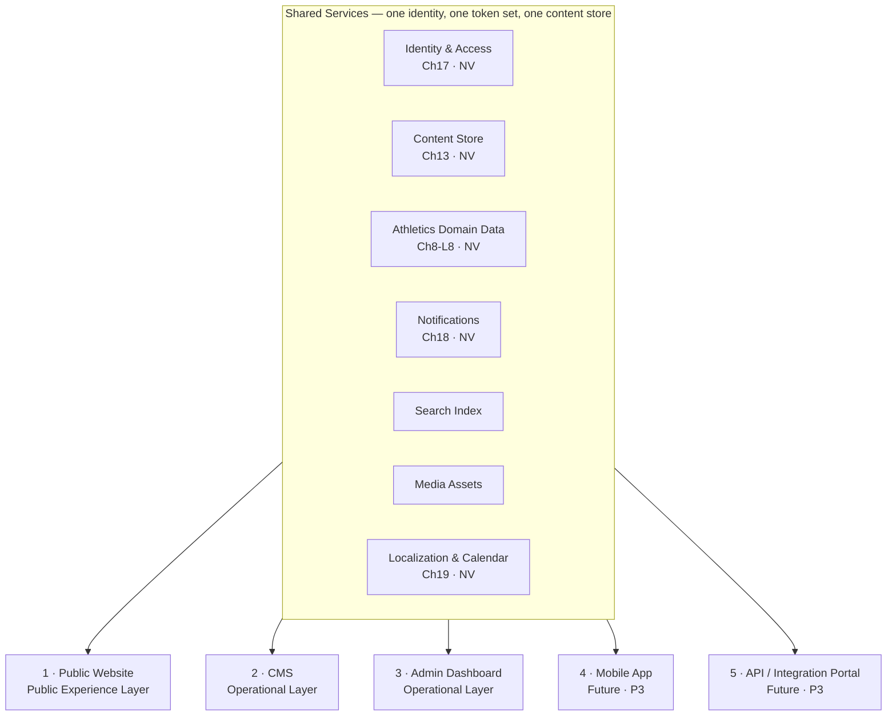
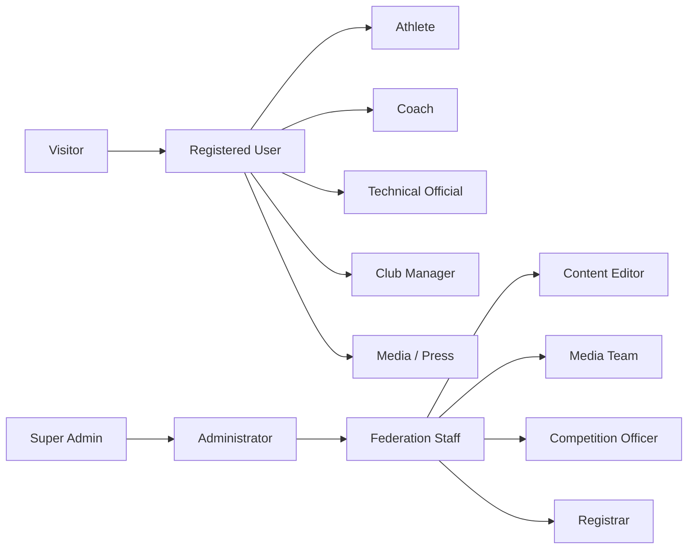
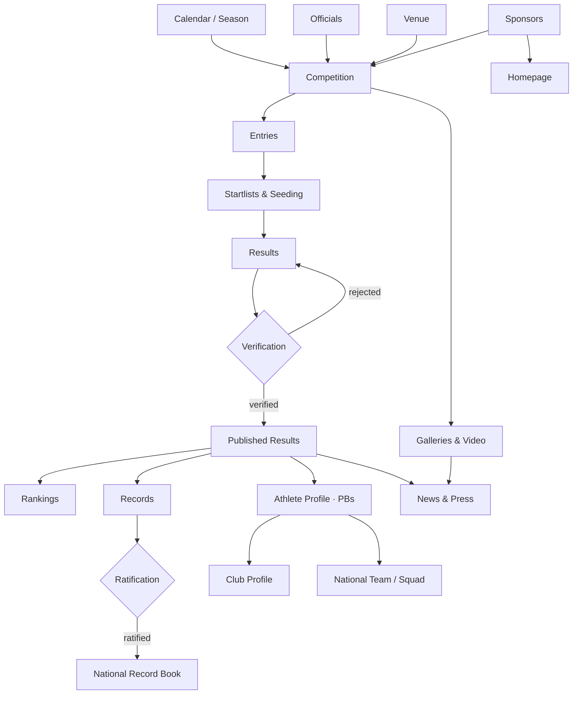
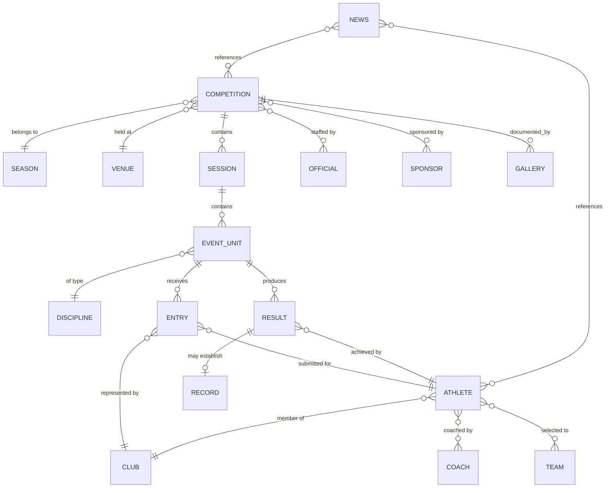

# UAEAF Digital Platform — Information Architecture & Screen Inventory
### Product Planning Document · Pre-UI Phase

**Document:** UAEAF Product Architecture v0.1.0 (Draft for Review)
**Status:** Draft v0.2 — reconciled against the built public homepage. Contains items marked **Needs Validation** and one open product decision (§15.1)
**Source of Truth:** UAEAF Enterprise Design System Framework v1.0.0 (`/docs/design-system`)
**Scope:** Information Architecture · Navigation · Screen Inventory · CMS Scope · Product Structure
**Implementation evidence:** `UAEAF-Home.dc.html` (built public homepage — treated as **[B]**, see §0.4)
**Out of Scope (deliberately):** UI design, layout, components, color, spacing, typography, wireframes

> **Normative language** (inherited from Chapter 2): MUST · MUST NOT · SHOULD · SHOULD NOT · MAY.
>
> **Evidence convention used throughout this document:**
> - **[D]** = Documented — traceable to a chapter that exists in this project
> - **[I]** = Inferred — derived from a documented rule by direct logical consequence
> - **[A]** = Assumption — not documented anywhere; requires stakeholder validation
> - **[NV]** = Needs Validation — depends on a chapter that is **missing** from the project

---

## 0. Documentation Availability Audit (read this first)

The Master Index (`00-MASTER-INDEX.md`) declares **27 chapters (0–26), all "Frozen"**. Only **9 files** are actually present in this project. This IA task depends heavily on chapters that are **not available for reading**.

### 0.1 Chapters available

| # | Chapter | Used in this document for |
|---|---|---|
| 0–1 | Introduction & Brand Identity | Platform philosophy, Dual Experience split, business goals |
| 2 | Design Principles (PR-001→PR-010) | Responsive strategy, scale rules, CMS rules, publishing quality gates |
| 3 | Design Tokens | — (not IA-relevant) |
| 4 | Typography | — (not IA-relevant) |
| 5 | Grid, Layout & Motion | — (not IA-relevant) |
| 6 | Accessibility & Government Compliance | Utility screens (accessibility statement), compliance reporting |
| 7 | Semantic Tokens & Theming | — (not IA-relevant) |
| 8-L1 | Foundation Components | — (not IA-relevant) |
| 8-Gov | Global Component Governance | Analytics/telemetry scope, permissions-adjacent contracts |

### 0.2 Chapters MISSING — and what each blocks

| # | Missing chapter | Declared identifiers | What it blocks in this document |
|---|---|---|---|
| 8-L2 | Forms Components | `F.` | Form-screen inventory detail |
| **8-L3** | **Navigation Components** | `N.` | **§8 Navigation Model** — the documented navigation philosophy and component set |
| 8-L4 | Feedback Components | `FB.` | Notification/toast surface planning |
| 8-L5 | Data Display Components | `DD.` | List/table screen behaviour |
| 8-L6 | Media Components | `M.` | Media & gallery screen scope |
| **8-L7** | **Enterprise Components** | `EC.` | Dashboard composite screens |
| **8-L8** | **Sports/Domain Components** | `SP.` | **Athletics domain entities** — the authoritative domain vocabulary |
| 9 | Content Design System | `CR.` (8 levels) | Content governance per screen |
| **10** | **Sports-Specific Scenarios** | 10 scenarios | **§9/§10 Relationships** — real athletics workflows |
| **11** | **UX Patterns** | `PT-` (9 patterns) | Flow definitions across screens |
| **12** | **Dashboard Patterns** | `DB-` / `WG-` (5 templates) | **§6 Dashboard Modules** — module tree and widget scope |
| **13** | **CMS System** | `CT-` | **§5 CMS Inventory** — the authoritative content-type list |
| 14 | SEO Guidelines | ADR-0025 | URL/slug strategy, taxonomy |
| 15–16 | AI Readability / AI Platform Strategy | ADR-0026/0027 | AI surface placement in CMS |
| **17** | **Data Privacy & Identity Architecture** | ADR-0028/0029 | **§2 User Types & permissions** — identity model, minors' data |
| 18 | Notifications Architecture | ADR-0030 | Notification centre scope |
| **19** | **Calendar & Localization** | ADR-0031 | Calendar/season model, Hijri/Gregorian, AR/EN scope |
| **20** | **Page Templates** | `TMP-` (12 templates) | **§4 Screen Inventory** — the authoritative public template set |
| 21 | Technical Architecture | ADR-0033 | API/rendering constraints |
| 22 | Governance | ADR-0034 | Approval workflow roles |
| 23–24 | Checklists / Known Constraints | ADR-0035 | Launch gating, documented limits |
| 25 | Future Roadmap | — | §13 Future Expansion (non-binding by declaration) |
| 26 | Glossary | — | Domain term normalisation |

### 0.3 Quantities the Master Index *does* state (usable anchors) **[D]**

Even without the chapter bodies, the Master Index commits to these counts. This document is structured to **reconcile against them** once the chapters are supplied:

| Anchor | Documented count | Consequence for this document |
|---|---|---|
| Public page templates (`TMP-`) | **12** | §4 proposes a template mapping; it **MUST** be reconciled to exactly TMP-01…TMP-12 **[NV]** |
| Dashboard templates (`DB-`) | **5** | §6 proposes 5 dashboard archetypes; identifiers **MUST** be aligned **[NV]** |
| UX patterns (`PT-`) | **9** | §8 flows **MUST** be expressed using these 9 patterns, not new ones **[NV]** |
| Content rule levels (`CR-`) | **8** | §5 CMS field governance **MUST** map to these 8 levels **[NV]** |
| Sports scenarios (Ch 10) | **10** | §9/§10 relationships **MUST** cover all 10 **[NV]** |
| Content types (`CT-`) | *count not stated* | §5 list is a **proposal**, not a documented inventory **[NV]** |
| UI components | ~103 across L1–L8 | Confirms component sufficiency; no IA impact |

> **Governance note [D]:** Chapter 22 is the exclusive path for any change to a Frozen chapter. Therefore this document **MUST NOT** be treated as amending the Design System. It is a *product* artefact that consumes it. Every conflict discovered here must be raised as an ADR under Chapter 22, not resolved locally.

### 0.4 Additional evidence used: the built implementation

This project contains a **complete, functioning public homepage** (`UAEAF-Home.dc.html`), built against this Design System and reviewed with the federation across many iterations. It is treated as **[B] = Built** — a third evidence class alongside [D]/[I]/[A]:

> **[B] outranks [A].** Where this document previously *assumed* a structure and the built design settled it differently, **the built design wins** and the assumption is retired. Every divergence is recorded in **§15 Implementation Delta**.

**What the build establishes as settled product fact:**

| Area | Settled by the build | Sections updated |
|---|---|---|
| Main navigation | **7 top-level items**, two carrying dropdown children | §3.1, §8.1 |
| Competitions grouping | Calendar + Results & Rankings + National Records are children of one **Events** parent | §3.1, §8.1 |
| Athletes & Clubs | **Top-level**, not grouped under a "People & Organisations" parent | §3.1, §8.1 |
| Media | Exposed as **Media Centre** — one top-level destination | §3.1, §8.1 |
| Services | **Removed from the public surface** by explicit decision — no e-services column, no services block | §3.1, §7, §8.3, §15 |
| Contact | Lives in the **footer**, not in main navigation | §8.1, §8.3 |
| Homepage composition | **11 content sections in a fixed order** | §7 |
| Footer composition | 4-column grid + newsletter + affiliations + legal strip | §8.3 |
| Theming | **Three** appearance modes (light / dark / high-contrast) + AR↔EN toggle | §12 |
| Layer separation | Public layer built full-screen-per-section; no dashboard artefacts leaked in | §1.1 confirmed |

### 0.5 Platform capabilities proven by the build **[B]**

These are no longer proposals — they exist, and therefore they constrain the architecture:

| Capability | Consequence for the architecture |
|---|---|
| RTL-first with full AR↔EN switching | §12 RTL parity is proven achievable, not aspirational |
| Three appearance modes incl. high-contrast | Confirms **[D]** ADR-0002 (dedicated dark logo asset); raises Chapter 6 compliance from claim to fact |
| Live per-event countdown + calendar (.ics) export | Competition entity **MUST** carry a precise start datetime; export is a first-class output, not a future feature |
| Section-level filters (discipline · emirate · category) | Confirms §5.4 controlled vocabularies — they now have live consumers |
| Verified-results language already public ("نتائج معتمدة" · "آخر اعتماد") | **[D]** PR-010 attribution is already surfaced; the data model **MUST** support it |
| External channel embeds (reels) inside the media mosaic | Media entity needs an external-channel reference field |
| One merged animated sponsor strip across all tiers | Sponsor entity needs `tier` + display order, but **not** separate per-tier page regions |

---

## 1. Platform Overview

### 1.1 Foundational architectural fact **[D]**

**ADR-0001 (Dual Experience Architecture)** is the single most important input to this entire IA. It states that the platform serves two fundamentally different audiences and **MUST** be built as two experience layers over one token set:

| Layer | Audience | UX character (documented) |
|---|---|---|
| **Public Experience** | General public, media, international visitors | Emotional, inspiring, Premium |
| **Operational Experience** | Daily operational users | Efficiency, clarity, Data-first |

> Documented guiding principle: *"the public must be impressed, and the daily user must complete their work in the fewest possible steps."*
>
> Documented risk to guard in IA: **decoration leaking from public into dashboard, or dashboard austerity leaking into public.** Consequence for this document: **no screen may exist in both layers.** Every screen in §4 declares exactly one layer.

### 1.2 The five products



| # | Product | Layer **[D]** | Purpose | Primary users | Status |
|---|---|---|---|---|---|
| 1 | **Public Website** | Public | National and international face of the federation; competitions, results, athletes, news, media, services | Visitor, media, athlete, club, international bodies | Build now (P0) |
| 2 | **CMS** | Operational | Author, translate, review, publish and schedule every public content object | Content Editor, Media Team, Administrator | Build now (P0) |
| 3 | **Admin Dashboard** | Operational | Run the federation: registry, competitions, entries, results, records, rankings, users, reports | Federation Staff, Administrator, Super Admin | Build now (P0/P1) |
| 4 | **Mobile App** | Public | Live results, calendar, notifications, athlete-facing tasks | Public, athlete, coach | Not built — architecture must accommodate (P3) |
| 5 | **API / Integration Portal** | Operational | Machine access for World Athletics / AAA / media / timing vendors | Partners, timing providers | Not built (P3) |

**Shared Services — architectural mandates that follow from documented principles:**

| Service | Mandate | Basis |
|---|---|---|
| Identity & Access | One account, one role model, one session model across all five products | **[NV]** Ch17 |
| Content Store | One content object serves web, app and API — no duplicated authoring | **[D]** PR-004 (Content First) + **[D]** PR-008 (Built to Scale) |
| Domain Data | Results, records, rankings are computed from one canonical source, never re-entered per surface | **[D]** PR-010 (every published number has a documented source) |
| Notifications | One template + delivery layer, multi-channel | **[NV]** Ch18 |
| Search | One index spanning content + registry + results | **[I]** required by §8.7 search scope |
| Localization & Calendar | AR/EN + calendar model resolved centrally, not per screen | **[NV]** Ch19 |

---

## 2. User Types

> **Blocking dependency [NV]:** Chapter 17 (Data Privacy & Identity Architecture, ADR-0028/0029) defines the real identity model. Everything in §2 is therefore **[A]** unless marked otherwise, and **MUST** be validated against Chapter 17 before any implementation. In particular: **minors' data** (athletics has a large youth base) is a privacy-critical question this document cannot answer.

### 2.1 Role model



### 2.2 Role definitions

| # | User type | Layer | Purpose | Permissions (proposed) | Primary goals | Main navigation |
|---|---|---|---|---|---|---|
| 1 | **Visitor** | Public | Anonymous consumer of public information | Read published content only | Find results, calendar, news, athlete/club info | Public main nav |
| 2 | **Registered User** | Public | Authenticated public user | Read + own profile + saved items + notification prefs | Follow athletes/competitions, receive alerts | Public main nav + account menu |
| 3 | **Athlete** | Public + limited self-service | Registered competitor | Read + own profile (submit-for-approval) + own entries + own results history + own documents | Enter competitions, track own results/records, keep licence valid | Public nav + "My Athletics" area |
| 4 | **Coach** | Public + limited self-service | Certified coach | Athlete role scope + view assigned athletes + submit entries on their behalf | Manage squad entries, review athlete performance | Public nav + Coach area (P2) |
| 5 | **Technical Official** | Public + operational (narrow) | Judge / referee / timekeeper | View assignments + submit field results for verification (never publish) | See assignments, file results | Officials area (P2) |
| 6 | **Club Manager** | Public + operational (narrow) | Represents an affiliated club | Manage club profile (approval-gated), club roster, club entries, transfers requests | Keep roster and affiliation current, register members | Club Portal (P2) |
| 7 | **Media / Press** | Public + gated | Accredited journalist | Public + press kit + embargoed releases + accreditation requests + high-res assets | Get assets and accreditation fast | Public nav + Press area (P2) |
| 8 | **Content Editor** | Operational | Authors public content | Create/edit/translate content; **submit for review**; MUST NOT publish alone | Publish accurate bilingual content on time | CMS nav |
| 9 | **Media Team** | Operational | Owns media library and press output | Editor scope + media library management + accreditation handling | Manage galleries, video, press releases | CMS nav (Media modules) |
| 10 | **Competition Officer** | Operational | Runs competitions end-to-end | Competitions, entries, startlists, seeding, results entry, results verification | Run an event correctly and publish verified results | Dashboard nav |
| 11 | **Registrar** | Operational | Owns the people/club registry | Athletes, licences, coaches, officials, clubs, transfers, affiliation approvals | Keep the national registry authoritative | Dashboard nav |
| 12 | **Administrator** | Operational | Department-level authority | All staff scopes + publish + approve + configure module settings | Governance and throughput | Dashboard nav (full) |
| 13 | **Super Admin** | Operational | Platform owner | Everything + roles/permissions + integrations + feature flags + audit | Platform integrity | Dashboard nav (full + system) |

### 2.3 Permission rules derived from documented principles

| Rule | Basis |
|---|---|
| **Author ≠ Publisher.** Content Editor **MUST NOT** be able to publish unilaterally. | **[D]** PR-010: zero "Beta"/"Coming Soon" reaching public; **[D]** Ch22 governance model |
| **Every published number is attributable.** Results/records/statistics screens **MUST** carry a verified source field, and unverified figures **MUST NOT** be publicly renderable. | **[D]** PR-010 KPI: *"every published number documented with its source"* |
| **AI output is never auto-published.** Any AI-assisted field **MUST** pass human review. | **[D]** PR-007 anti-pattern |
| **Results have a two-step state:** entered → verified. Only verified results feed rankings/records. | **[I]** from PR-010 + **[NV]** Ch10 scenarios |
| Role model **MUST** be attribute-checked server-side, never by hiding UI only. | **[I]** standard practice; **[NV]** Ch17/Ch21 |

---

## 3. Global Information Architecture

> **Two duties on this section.** (1) **[B]** The hierarchy is now anchored on the navigation actually built — see §0.4. (2) **[NV]** Chapter 20 declares **12** page templates; the mapping of each node to `TMP-01…TMP-12` remains **unresolved** until Chapter 20 is supplied.

### 3.1 Public hierarchy — as built **[B]**, extended where the build has no surface yet

The tree is now anchored on the navigation **actually shipped** in `UAEAF-Home.dc.html`. **[B]** = exists in the built navigation · **[P]** = proposed extension, no entry point yet.

```
Home                                              [B]
│
├── About the Federation                          [B]  (dropdown · 4 children)
│   ├── About the Federation                      [B]  founding & mandate
│   ├── Board of Directors                        [B]  members & structure
│   ├── Regulations & Reports                     [B]  technical rules & annual reports
│   ├── Technical Committees                      [B]  officiating · coaching · sports medicine
│   ├── Vision, Mission & Strategy                [P]
│   ├── History & Milestones                      [P]
│   └── Affiliations & Memberships                [P]  (footer strip only today)
│
├── Clubs                                         [B]  top-level
│   ├── Club Directory (filter by emirate)        [B]
│   └── Club Profile                              [P]
│
├── Athletes                                      [B]  top-level
│   ├── Athlete Directory (filter by discipline)  [B]
│   ├── Athlete Profile                           [P]
│   └── Athlete Results History                   [P]
│
├── Events                                        [B]  (dropdown · 3 children)
│   ├── Championship Calendar                     [B]  confirmed events through 2026
│   ├── Results & Rankings                        [B]  official results & national rankings
│   ├── National Records                          [B]  ratified national marks
│   ├── Competition Detail                        [P]
│   │   ├── Information & Venue                   [P]
│   │   ├── Startlists                            [P]
│   │   ├── Live Results                          [P]
│   │   └── Final Results                         [P]
│   └── Results Archive                           [P]
│
├── News                                          [B]  top-level
│   ├── News Listing (category filter)            [B]
│   ├── News Article                              [P]
│   └── Press Releases                            [P]
│
├── Media Centre                                  [B]  top-level
│   ├── Gallery Mosaic + Lightbox                 [B]
│   ├── Videos & Reels                            [B]  external channel embeds
│   ├── Album Detail                              [P]
│   ├── Live Stream                               [P]
│   └── Press Kit & Brand Assets                  [P]
│
├── Athletics (the sport)                         [P]  no built entry point
│   ├── Disciplines · Age Categories              [P]
│   └── Anti-Doping                               [P]
│
├── Coaches · Technical Officials                 [P]  no built entry point
│
├── Footer-only destinations                      [B]
│   ├── Contact & Location (map · address · hours)[B]
│   ├── Help Centre                               [B]
│   ├── Newsletter subscription                   [B]
│   ├── Affiliations (World Athletics·AAA·NOC)    [B]
│   ├── Accessibility Statement                   [B]
│   └── Sitemap                                   [B]
│
└── Utility  (not in navigation)
    ├── Search Results                            [B]  overlay + suggested queries
    ├── Account (login · register · profile)      [P]
    ├── Legal (privacy · terms · cookies)         [P]
    └── System (404 · 500 · maintenance)          [P]
```

**Structural decisions — now evidenced, not assumed:**

| Decision | Status | Rationale |
|---|---|---|
| **Events** is the single parent for calendar, results, rankings and records | **[B] settled** | The four are one continuous data chain (§9); one parent keeps main nav scannable |
| **Clubs and Athletes are top-level** | **[B] settled — supersedes the earlier [A] grouping proposal** | The two highest-traffic registries earn direct access; a grouping parent added a click for no gain |
| **Media Centre** is one destination, not a branch | **[B] settled** | Matches how federations publish: a single media hub adjacent to the newsroom |
| **Services are absent from the public surface** | **[B] settled by explicit instruction** | Largest divergence from the original IA — see §15.1, needs a product ruling |
| **Contact is footer-only** | **[B] settled** | Contact is intent-driven, not browse-driven — consistent with **[D]** PR-001 |
| **Athletics (the sport), Coaches, Officials have no entry point** | **[P] gap** | Rules & Anti-Doping are reachable only via *About → Regulations & Reports* — see §15.2 |
| Utility screens excluded from main navigation | **[B] confirmed** | Search is an overlay; legal sits in the footer strip |
### 3.2 Operational hierarchy — see §6.

---

## 4. Screen Inventory

**Legend** — Login: ● required, ○ public, ◐ optional (enhanced when logged in) · CMS: ● fully CMS-managed, ◐ partly, ○ system/data-driven · Mobile: ● in future app scope, ○ out · Priority per §11.

> **Build status [B]:** of the screens below, **one is built** — the Homepage, which additionally *previews* the calendar, results & rankings, clubs, athletes, news, media and sponsors domains inline. Every navigation destination in §3.1 marked **[B]** has a committed entry point but no destination page yet. Screens whose only route was Services are blocked pending §15.1.

### 4.1 Public Website — core

| Section | Screen | Purpose | User | Login | CMS | Mobile | Priority |
|---|---|---|---|---|---|---|---|
| Home | Homepage | Federation front door; routes to every domain | All | ◐ | ● | ● | **P0** |
| About | Federation Overview | Institutional identity | Visitor | ○ | ● | ○ | P1 |
| About | Vision, Mission & Strategy | Strategic positioning | Visitor | ○ | ● | ○ | P1 |
| About | Board of Directors | Governance transparency | Visitor | ○ | ● | ○ | P1 |
| About | Organisational Structure | Who does what | Visitor | ○ | ● | ○ | P2 |
| About | Committees | Committee scope & members | Visitor | ○ | ● | ○ | P2 |
| About | History & Milestones | Heritage narrative | Visitor | ○ | ● | ○ | P2 |
| About | Affiliations & Memberships | International legitimacy | Visitor, media | ○ | ● | ○ | P1 |
| Athletics | Disciplines Index | Explain the sport | Visitor | ○ | ● | ○ | P2 |
| Athletics | Discipline Detail | Per-discipline rules & records | Visitor, athlete | ○ | ● | ● | P2 |
| Athletics | Age Categories | Eligibility clarity | Athlete, coach, club | ○ | ● | ○ | P2 |
| Athletics | Rules & Regulations | Authoritative rulebook access | Athlete, coach, official | ○ | ● | ○ | P1 |
| Athletics | Anti-Doping | Compliance obligation | Athlete, coach | ○ | ● | ○ | P1 |

### 4.2 Public Website — competitions (the operational heart)

| Section | Screen | Purpose | User | Login | CMS | Mobile | Priority |
|---|---|---|---|---|---|---|---|
| Competitions | Competition Calendar | Season-wide schedule with filters | All | ○ | ◐ | ● | **P0** |
| Competitions | Competition Detail | Single source of truth for one event | All | ○ | ◐ | ● | **P0** |
| Competitions | Entry / Registration Info | How to enter, deadlines, fees | Athlete, coach, club | ○ | ● | ● | P1 |
| Competitions | Startlists | Who competes, when, in which heat | All | ○ | ○ | ● | P1 |
| Competitions | Live Results | Real-time results during the event | All, media | ○ | ○ | ● | **P0** |
| Competitions | Final Results | Official verified results | All, media | ○ | ○ | ● | **P0** |
| Competitions | Results Archive | Historical results search | Media, athlete, researcher | ○ | ○ | ● | P1 |
| Competitions | Rankings | National ranking by discipline/category/season | All | ○ | ○ | ● | **P0** |
| Competitions | National Records | Ratified record book | All, media | ○ | ○ | ● | P1 |
| Competitions | Medal / Club Standings | Aggregate competition outcome | All | ○ | ○ | ● | P2 |

> **Quality gate [D]** — PR-010: every figure on these screens **MUST** carry a documented source, and no screen here may display a provisional figure without an explicit verified/unverified state. This is an IA requirement, not a UI one: it forces a `verification_status` attribute on the results entity (§10).

### 4.3 Public Website — people & organisations

| Section | Screen | Purpose | User | Login | CMS | Mobile | Priority |
|---|---|---|---|---|---|---|---|
| Athletes | Athlete Directory | Find any registered athlete | All | ○ | ◐ | ● | P1 |
| Athletes | Athlete Profile | Canonical athlete record: bio, PBs, results, records | All, media | ○ | ◐ | ● | **P0** |
| Athletes | Athlete Results History | Full competitive record | Media, coach | ○ | ○ | ● | P1 |
| Teams | National Teams Index | Team overview | Visitor | ○ | ● | ○ | P2 |
| Teams | Team / Squad Detail | Squad composition for a campaign | Visitor, media | ○ | ◐ | ● | P2 |
| Clubs | Club Directory | Find clubs, filter by emirate | Visitor, athlete | ○ | ◐ | ● | P1 |
| Clubs | Club Profile | Club identity, roster, results | Visitor, athlete | ○ | ◐ | ● | P1 |
| Coaches | Coach Directory | Find certified coaches | Athlete, club | ○ | ◐ | ○ | P2 |
| Coaches | Coach Profile | Certification & assignments | Athlete, club | ○ | ◐ | ○ | P2 |
| Officials | Officials Directory | Registry of technical officials | Club, staff | ○ | ◐ | ○ | P2 |
| Officials | Courses & Certification | Pathway into officiating | Official, coach | ○ | ● | ○ | P2 |

### 4.4 Public Website — news, media, services, resources

| Section | Screen | Purpose | User | Login | CMS | Mobile | Priority |
|---|---|---|---|---|---|---|---|
| News | News Listing | Latest federation news | All | ○ | ● | ● | **P0** |
| News | News Article | Single story | All | ○ | ● | ● | **P0** |
| News | Category / Tag Archive | Topical browsing & SEO surface | All | ○ | ● | ● | P1 |
| News | Press Releases | Official statements for media | Media | ○ | ● | ○ | P1 |
| Media | Gallery Index | Browse photo albums | All | ○ | ● | ● | P1 |
| Media | Album Detail | One event's photo set | All | ○ | ● | ● | P1 |
| Media | Videos | Video library | All | ○ | ● | ● | P2 |
| Media | Live Stream | Broadcast surface during events | All | ○ | ◐ | ● | P2 |
| Media | Press Kit & Brand Assets | Logo, guidelines, high-res assets | Media | ◐ | ● | ○ | P2 |
| Services | Services Index | Discover available services | All | ○ | ● | ○ | P1 |
| Services | Service Detail | Requirements, steps, entry point | Athlete, club, coach | ○ | ● | ○ | P1 |
| Resources | Documents & Downloads | Regulations, forms, reports | All | ○ | ● | ○ | P1 |
| Contact | Contact & Location | Reach the federation | All | ○ | ● | ● | P1 |
| Contact | Departments Directory | Route enquiries correctly | All | ○ | ● | ○ | P2 |
| Contact | FAQ | Self-service answers | All | ○ | ● | ○ | P2 |

### 4.5 Public Website — utility & system

| Section | Screen | Purpose | User | Login | CMS | Mobile | Priority |
|---|---|---|---|---|---|---|---|
| Utility | Search Results | Cross-domain retrieval | All | ○ | ○ | ● | P1 |
| Utility | Accessibility Statement | Compliance obligation | All | ○ | ● | ○ | **P0** |
| Utility | Privacy Policy | Legal obligation | All | ○ | ● | ○ | **P0** |
| Utility | Terms of Use | Legal obligation | All | ○ | ● | ○ | P1 |
| Utility | Cookie Notice / Preferences | Consent management | All | ○ | ● | ○ | P1 |
| Utility | Sitemap | Navigation fallback & SEO | All | ○ | ○ | ○ | P2 |
| System | 404 Not Found | Recovery path | All | ○ | ◐ | ● | **P0** |
| System | 500 Error | Failure state | All | ○ | ◐ | ● | P1 |
| System | Maintenance | Planned downtime | All | ○ | ● | ○ | P2 |

> **[D]** Accessibility Statement is **P0**, not P2: PR-003 is the one principle that *"is never defeated"*, and Chapter 6 governs government compliance.

### 4.6 Account & self-service (authenticated public)

| Section | Screen | Purpose | User | Login | CMS | Mobile | Priority |
|---|---|---|---|---|---|---|---|
| Account | Login | Authenticate | Registered+ | ○ | ○ | ● | P1 |
| Account | Register | Create account | Visitor | ○ | ○ | ● | P1 |
| Account | Password Recovery / Reset | Regain access | Registered+ | ○ | ○ | ● | P1 |
| Account | Identity Verification | Verify email/phone | Registered+ | ● | ○ | ● | P1 **[NV]** |
| Account | Profile & Preferences | Manage own data, language, theme | Registered+ | ● | ○ | ● | P1 |
| Account | Notification Centre | Own alerts | Registered+ | ● | ○ | ● | P2 **[NV]** |
| Account | Saved / Following | Followed athletes & competitions | Registered+ | ● | ○ | ● | P3 |
| My Athletics | My Entries | Own competition entries & status | Athlete, coach | ● | ○ | ● | P2 |
| My Athletics | My Results & PBs | Own performance record | Athlete | ● | ○ | ● | P2 |
| My Athletics | My Licence & Documents | Registration validity | Athlete, coach, official | ● | ○ | ● | P2 |
| Club Portal | Club Roster Management | Maintain members | Club Manager | ● | ○ | ○ | P2 |
| Club Portal | Club Entries | Enter members into competitions | Club Manager | ● | ○ | ○ | P2 |
| Club Portal | Transfer Requests | Move an athlete between clubs | Club Manager | ● | ○ | ○ | P3 |
| Officials | My Assignments | Assigned duties | Official | ● | ○ | ● | P2 |
| Press | Accreditation Request | Apply for event access | Media | ● | ○ | ○ | P2 |

### 4.7 CMS screens (Operational Layer)

| Section | Screen | Purpose | User | Login | CMS | Mobile | Priority |
|---|---|---|---|---|---|---|---|
| CMS | CMS Home / My Work | Assigned, drafts, awaiting review | Editor+ | ● | — | ○ | **P0** |
| Content | Content List (per type) | Find and triage content | Editor+ | ● | — | ○ | **P0** |
| Content | Content Editor | Author and translate one object | Editor+ | ● | — | ○ | **P0** |
| Content | Revision History & Diff | Audit and rollback | Editor+ | ● | — | ○ | P1 |
| Content | Review & Approval Queue | Enforce author ≠ publisher | Admin | ● | — | ○ | **P0** |
| Content | Scheduling Calendar | Plan publication | Editor+ | ● | — | ○ | P2 |
| Content | Translation Workbench | AR/EN parity control | Editor+ | ● | — | ○ | P1 **[NV]** |
| Structure | Homepage Sections Manager | Compose the homepage | Admin | ● | — | ○ | P1 |
| Structure | Menu Manager | Main/footer navigation | Admin | ● | — | ○ | P1 |
| Structure | Banner / Announcement Manager | Time-boxed promotion | Editor+ | ● | — | ○ | P2 |
| Media | Media Library | Central asset store | Media Team | ● | — | ○ | **P0** |
| Media | Gallery Builder | Assemble albums | Media Team | ● | — | ○ | P1 |
| Media | Document Library | Regulations, forms, reports | Editor+ | ● | — | ○ | P1 |
| SEO | SEO Metadata Manager | Per-object SEO control | Editor+ | ● | — | ○ | P1 **[NV]** |
| SEO | Redirect Manager | Preserve link equity | Admin | ● | — | ○ | P2 **[NV]** |

### 4.8 Admin Dashboard screens (Operational Layer)

| Section | Screen | Purpose | User | Login | CMS | Mobile | Priority |
|---|---|---|---|---|---|---|---|
| Overview | Role Dashboard | Task-first landing per role | Staff+ | ● | ○ | ○ | **P0** **[NV]** |
| Competitions | Competition List | Manage the season | Comp. Officer | ● | ○ | ○ | **P0** |
| Competitions | Competition Builder | Define event, sessions, disciplines | Comp. Officer | ● | ○ | ○ | **P0** |
| Competitions | Entries Management | Accept, reject, seed entries | Comp. Officer | ● | ○ | ○ | **P0** |
| Competitions | Startlist & Seeding | Build heats and lanes | Comp. Officer | ● | ○ | ○ | P1 |
| Competitions | Results Entry | Capture performances | Comp. Officer, Official | ● | ○ | ◐ | **P0** |
| Competitions | Results Verification | Approve before publication | Admin | ● | ○ | ○ | **P0** |
| Competitions | Record Ratification | Confirm a new national record | Admin | ● | ○ | ○ | P1 |
| Competitions | Rankings Configuration | Ranking rules per season | Admin | ● | ○ | ○ | P2 |
| Competitions | Venue Management | Venue registry | Comp. Officer | ● | ○ | ○ | P2 |
| Competitions | Officials Assignment | Staff an event | Comp. Officer | ● | ○ | ○ | P2 |
| Registry | Athlete Registry | Authoritative athlete records | Registrar | ● | ○ | ○ | **P0** |
| Registry | Licence Management | Issue/renew registration | Registrar | ● | ○ | ○ | P1 |
| Registry | Club Registry | Clubs and affiliation state | Registrar | ● | ○ | ○ | P1 |
| Registry | Affiliation Approvals | Process club applications | Registrar | ● | ○ | ○ | P2 |
| Registry | Coach Registry | Coaches & certification | Registrar | ● | ○ | ○ | P2 |
| Registry | Officials Registry | Officials & grades | Registrar | ● | ○ | ○ | P2 |
| Registry | Transfers | Athlete club changes | Registrar | ● | ○ | ○ | P3 |
| Registry | Team & Squad Management | Select national squads | Admin | ● | ○ | ○ | P2 |
| Media Ops | Accreditation Management | Approve press access | Media Team | ● | ○ | ○ | P2 |
| Users | User Management | Accounts and status | Admin | ● | ○ | ○ | **P0** |
| Users | Roles & Permissions | Define authority | Super Admin | ● | ○ | ○ | **P0** |
| Users | Invitations | Onboard staff | Admin | ● | ○ | ○ | P2 |
| Users | Audit Log | Traceability of every action | Super Admin | ● | ○ | ○ | P1 |
| Reports | Participation Reports | Registration & entry analytics | Admin | ● | ○ | ○ | P2 |
| Reports | Performance Reports | Sport outcomes over time | Admin | ● | ○ | ○ | P2 |
| Reports | Content & Traffic Reports | Publishing effectiveness | Admin | ● | ○ | ○ | P2 |
| Reports | Compliance Report | Accessibility & quality posture | Admin | ● | ○ | ○ | P2 |
| Reports | Export Centre | Bulk data extraction | Admin | ● | ○ | ○ | P3 |
| Settings | Organisation Profile | Federation master data | Admin | ● | ○ | ○ | P1 |
| Settings | Localization & Calendar | Languages, calendar, season | Admin | ● | ○ | ○ | P1 **[NV]** |
| Settings | Notification Templates | Message governance | Admin | ● | ○ | ○ | P2 **[NV]** |
| Settings | Integrations & API Keys | External systems | Super Admin | ● | ○ | ○ | P3 |
| Settings | Feature Flags | Controlled rollout, AI enablement | Super Admin | ● | ○ | ○ | P2 |

**Inventory totals:** Public 56 · Account/Self-service 15 · CMS 15 · Dashboard 33 → **≈119 screens**, of which **21 are P0**.

---

## 5. CMS Inventory

> **[NV] Authoritative source missing.** Chapter 13 defines content types under the `CT-` prefix. The list below is a **justified proposal** derived from §3–§4 and from PR-004, and **MUST** be reconciled with Chapter 13's actual `CT-` register. Items with no justification in the available documentation are marked and may be rejected.

### 5.1 Editorial content types

| Type | Justification | Translatable | Workflow | Scheduling |
|---|---|---|---|---|
| News Article | §4.4 core screen; **[D]** PR-004 (real bilingual content) | ● | Author → Review → Publish | ● |
| Press Release | Distinct media-facing object with embargo semantics | ● | Author → Review → Publish | ● |
| Static Page | §3.1 About/Athletics/Contact branches | ● | Author → Review → Publish | ○ |
| FAQ Entry | §4.4 | ● | Author → Publish | ○ |
| Announcement / Banner | Time-boxed public notice | ● | Author → Publish | ● |

### 5.2 Domain content types (editorial layer over registry data)

> **Critical modelling rule [I]:** athletes, clubs, coaches, officials, competitions and results are **registry entities**, not editorial documents. The CMS **MUST NOT** own their factual data — it owns only their *editorial layer* (narrative bio, feature imagery, highlight selection). Otherwise PR-010 collapses: two sources of truth for the same number. This is the single most important CMS decision in this document.

| Type | CMS owns | Registry owns (not CMS) |
|---|---|---|
| Athlete Profile (editorial) | Narrative bio, portrait, feature flag | Identity, licence, results, PBs, records |
| Club Profile (editorial) | Description, logo, imagery | Affiliation status, roster, official name |
| Coach Profile (editorial) | Bio, portrait | Certification level, validity |
| Competition Page (editorial) | Descriptive copy, hero media, gallery link | Dates, disciplines, entries, results |
| National Team / Squad Page | Campaign narrative, imagery | Squad membership |
| Discipline Page | Explanatory content | Records shown (computed) |

### 5.3 Media & document types

| Type | Justification |
|---|---|
| Image Asset | **[D]** G.3: lazy loading mandatory; central asset governance |
| Gallery / Album | §4.4 |
| Video Asset | §4.4 |
| Document (PDF/form) | §4.4 Resources |
| Press Kit Asset | §4.4; **[D]** Ch1 logo-misuse rules make controlled distribution mandatory |

### 5.4 Structural / configuration types

| Type | Justification |
|---|---|
| Homepage Section Instance | §7 — homepage must be composable without redeployment |
| Menu (main / footer / utility) | §8 |
| Footer Configuration | §8.3 |
| Redirect Rule | **[NV]** Ch14 |
| SEO Metadata (per object) | **[NV]** Ch14 |
| Taxonomy: Category · Tag · Discipline · Emirate · Age Category · Season | Filters in §4.2–§4.4 require controlled vocabularies; **[D]** PR-008 (no unbounded free-text selects) |
| Sponsor / Partner | Present in the built homepage **[I]**; commercial obligation |
| Notification Template | **[NV]** Ch18 |
| Locale String / Label Set | **[NV]** Ch19 |

### 5.5 CMS behavioural requirements (from documented principles)

| Requirement | Basis |
|---|---|
| Every content list **MUST** paginate or virtualise; no full-collection fetch | **[D]** PR-008 anti-pattern: *"news list loading 500+ items in one request"* |
| Every content type **MUST** define an explicit **empty / no-image state** | **[D]** PR-004 checklist |
| Every text field **MUST** be validated against real worst-case Arabic length | **[D]** PR-004 KPI: zero unintended overflow |
| Every editable object **MUST** reserve an AI extension point, hidden until enabled | **[D]** PR-007 |
| Publishing **MUST** be a separate permission from authoring | **[D]** PR-010 + Ch22 |
| AR/EN parity state **MUST** be visible at list level | **[I]** PR-004 + **[NV]** Ch19 |

---

## 6. Dashboard Modules

> **[NV]** Chapter 12 declares **5** dashboard templates (`DB-`) and a widget register (`WG-`). The tree below is a proposal; module-to-`DB-` mapping is unresolved.

```
Dashboard
│
├── Overview                         (role-aware landing · DB-? )
│
├── Content                          [CMS surface]
│   ├── News & Press
│   ├── Pages
│   ├── FAQ
│   ├── Review Queue
│   ├── Scheduling
│   ├── Translations
│   └── Revisions & Audit
│
├── Structure
│   ├── Homepage Sections
│   ├── Menus
│   ├── Banners
│   └── Taxonomies
│
├── Media
│   ├── Media Library
│   ├── Galleries
│   ├── Videos
│   ├── Documents
│   └── Accreditation
│
├── Competitions
│   ├── Competitions
│   ├── Calendar
│   ├── Entries
│   ├── Startlists & Seeding
│   ├── Results Entry
│   ├── Results Verification
│   ├── Records Ratification
│   ├── Rankings Configuration
│   ├── Venues
│   └── Officials Assignment
│
├── Registry
│   ├── Athletes
│   ├── Licences
│   ├── Clubs
│   ├── Affiliations
│   ├── Coaches
│   ├── Officials
│   ├── Transfers
│   └── Teams & Squads
│
├── Users & Access
│   ├── Users
│   ├── Roles & Permissions
│   ├── Invitations
│   └── Audit Log
│
├── Reports
│   ├── Participation
│   ├── Performance
│   ├── Content & Traffic
│   ├── Compliance
│   └── Export Centre
│
└── Settings
    ├── Organisation Profile
    ├── Localization & Calendar
    ├── Notifications
    ├── Integrations & API
    └── Feature Flags
```

**Proposed dashboard archetypes (to be mapped onto the documented 5) [A]:**

| Archetype | Purpose | Primary role |
|---|---|---|
| Task Dashboard | "What needs me today" — queues and approvals | Editor, Registrar |
| Operational Dashboard | Live event control during a competition | Competition Officer |
| Registry Workspace | High-volume record management | Registrar |
| Analytical Dashboard | Trends and reporting | Administrator |
| System Dashboard | Platform health, access, audit | Super Admin |

**Documented constraint on all of them [D]:** PR-006 — dashboards are **Desktop-first**; designing a complex data grid mobile-first then scaling up is an explicit anti-pattern. PR-008 — every grid assumes 10× data growth from day one.

---

## 7. Homepage Breakdown — as built **[B]**

The homepage is no longer a proposal. Eleven content sections ship in a **fixed order**, each occupying a full viewport height with the header height subtracted so no section is clipped. Recorded here as product fact.

| # | Section (as built) | Objective | Business purpose | CMS editable | Reusable | Responsive |
|---|---|---|---|---|---|---|
| — | **Global Header** — logo · 7 nav items · search · language · theme | Orient and route | Every domain reachable in one action | ● menu | ● | ● single row ≥1024px, drawer below |
| — | **Scroll progress lane** under the header | Reading orientation | Perceived quality — **[D]** PR-005 (motion explains state) | ○ | ● | ● |
| 1 | **Hero carousel** — 5 slides, auto-advance, pause on hover/focus/touch, tab strip, next-event card | First impression | **[D]** Design Goal #1 — an international visitor perceives a modern national institution | ● | ● | ● |
| 2 | **Federation by the Numbers** — count-on-view + trend | Scale and credibility | Institutional trust | ◐ | ● | ● 4-up ≥1024px |
| 3 | **Featured Athletes** — full-bleed deck, discipline filter | Humanise the sport | **[D]** Design Goal #3 — engagement and reach | ◐ selection | ● | ● |
| 4 | **Results & Rankings** — tabbed | Deliver the core sporting fact | Primary utility for media and athletes | ○ data | ● | ● |
| 5 | **Clubs Network** — filter by emirate | National coverage | Membership growth | ◐ | ● | ● 2-up ≥1024px |
| 6 | **Upcoming Events** — compact rows, live countdown, .ics export, show-more | Forward-looking engagement | Entry conversion + **[D]** Design Goal #2 | ○ data | ● | ● 3 rows then expand |
| 7 | **News** — category filter, lead + list | Communicate | SEO and AI discoverability — **[D]** Design Goal #3 | ● | ● | ● 1.35fr/1fr ≥1024px |
| 8 | **Media Centre** — full-screen dark mosaic, lightbox, reels | Emotional proof | Brand and broadcast value | ● | ● | ● 4-col auto-rows ≥1024px |
| 9 | **Sponsors & Partners** — one animated strip, all tiers merged | Honour commercial commitments | Revenue obligation | ● | ● | ● pauses on hover/focus |
| 10 | **Newsletter** — inline form with success state | Build owned audience | Retention | ● | ● | ● |
| 11 | **Global Footer** — brand · quick links · location map · contact · affiliations · legal | Complete navigation, trust, compliance | **[D]** PR-003 + Chapter 6 | ● | ● | ● 4-col ≥1024px |
| — | **Floating social rail** — 4 channels + back-to-top | Owned-audience growth | Reach | ● | ● | ● bottom capsule, side rail ≥1620px |

**Two sections from the original proposal that were deliberately NOT built:**

| Proposed section | Outcome | Consequence |
|---|---|---|
| *Services / Quick Actions* block | **Rejected** — removed by explicit instruction | The homepage no longer carries any route into transactional services. See §15.1 |
| *E-Services* footer column | **Replaced** by the federation location map | Service discovery has no homepage or footer surface at all. See §15.1 |

**Homepage governance rules — status after the build:**

| Rule | Basis | Build status |
|---|---|---|
| One Primary CTA per section | **[D]** PR-001 anti-pattern | ✅ observed — hero carries one primary + one secondary |
| Section order **MUST** be CMS-controlled, not hard-coded | **[I]** + Design Goal #2 | ⚠️ **not yet** — order is currently fixed in the page. Required before CMS handover |
| Every section defines an empty state | **[D]** PR-004 | ✅ observed — filters, loading skeletons and no-result states exist |
| No continuous auto-motion without a stop control | **[D]** PR-005 KPI | ✅ observed — carousel pauses on hover/focus/touch, sponsor strip pauses on hover/focus, all motion respects `prefers-reduced-motion` |
| Time-to-first-meaningful-content < 1.5s | **[D]** PR-001 KPI | ⚠️ **at risk** — uploaded imagery is heavy (PNG, up to ~2MB). Must be converted to WebP ≤1600px before launch |
| Touch targets ≥ 44px | **[D]** PR-006 KPI | ✅ observed throughout |

---

## 8. Navigation Model

> **[NV]** Chapter 8-L3 (Navigation Components, `N.` prefix) is missing. This section defines the **navigation model** (what exists, where, and why) — component selection is deferred to L3.

### 8.1 Main Navigation (Public) — as built **[B]**

Seven top-level items; two carry a descriptive dropdown (label + one-line description per child):

| # | Item | Type | Children |
|---|---|---|---|
| 1 | Home | link | — |
| 2 | About the Federation | **dropdown** | About · Board of Directors · Regulations & Reports · Technical Committees |
| 3 | Clubs | link | — |
| 4 | Athletes | link | — |
| 5 | Events | **dropdown** | Championship Calendar · Results & Rankings · National Records |
| 6 | News | link | — |
| 7 | Media Centre | link | — |

**Why seven and not the eight originally proposed:** the build merged *Athletics (the sport)* into **About → Regulations & Reports**, promoted **Clubs** and **Athletes** to top level, and dropped **Services** and **Contact** from the bar. Net effect: fewer items, deeper meaning per item — consistent with **[D]** PR-001.

**Behaviour as built:** active item carries a brand-coloured underline indicator · dropdown children show a supporting description line · below 1024px the whole bar collapses into a drawer with the same tree · nav items also serve as the footer *Quick Links* column (single source, two surfaces).

**Persistent utilities beside the nav (not nav items):** Search (overlay with suggested queries) · Language AR↔EN · Appearance (light / dark / high-contrast).
Basis: **[D]** ADR-0002 requires a dedicated dark-mode logo asset, confirming theme switching is a first-class platform capability; **[NV]** Ch19 governs language scope.

### 8.2 Secondary Navigation

| Context | Model |
|---|---|
| Section landing pages | In-section navigation of that branch's children |
| Competition Detail | Contextual tabs — Info · Startlists · Live · Results · Media |
| Athlete / Club / Coach Profile | Contextual tabs — Overview · Results · Records · Media |
| Directories | Filter + sort rail (controlled vocabularies from §5.4) |
| Long content pages | On-page anchor navigation |

### 8.3 Footer Navigation — as built **[B]**

A four-column grid at ≥1024px, preceded by the newsletter panel and closed by an affiliations + legal strip:

| Column | Contents (as built) |
|---|---|
| Brand | Logo · federation tagline · social channels |
| Quick Links | Mirrors the seven main-nav items — one source, two surfaces |
| **Federation Location** | Embedded map · Zayed Sports City, Abu Dhabi · "Directions on the map" |
| Contact | Address · office hours (Sun–Thu 08:00–15:00) · Help Centre |
| Newsletter panel | Email capture with inline success state |
| Affiliations strip | World Athletics · Asian Athletics Association · National Olympic Committee |
| Legal strip | **Accessibility** · **Sitemap** · language switch · copyright |

**Change from the original proposal:** the *E-Services* column was **removed** and replaced by the location map. **[D]** The Accessibility Statement remains a required footer item (Chapter 6, PR-003) and is present. Privacy · Terms · Cookies are **[P]** — they are P0 in §11 but have **no footer link yet** (see §15.2).

### 8.4 Dashboard Navigation

Persistent primary sidebar carrying the nine §6 modules, plus:
- Module-level secondary navigation on entry
- Global context bar: search · notifications · active season · language · account
- **[D]** PR-006: this navigation is designed Desktop-first; the small-screen form is a reduction of it, never its origin

### 8.5 Breadcrumb Structure

| Layer | Rule |
|---|---|
| Public | `Home / Section / Subsection / Object` — mandatory from depth ≥ 2 |
| Competition child screens | `Home / Competitions / {Competition} / Results` — the competition is always the anchor |
| Dashboard | `Module / Sub-module / Record` |
| Depth limit | Max 4 visible levels; deeper paths truncate the middle |

### 8.6 Quick Actions

| Surface | Actions |
|---|---|
| Public header | Search · Language · Login |
| Public homepage | **[B]** Hero primary CTA (calendar) + secondary CTA (about) · results tab · calendar rows · club filter — *no service actions, see §15.1* |
| Athlete area | Enter a competition · My results · My licence |
| Club portal | Add member · Submit entries |
| CMS | New article · My drafts · Review queue |
| Dashboard (Competition Officer) | New competition · Enter results · Verify results |
| Dashboard (Registrar) | New athlete · Renew licence · Pending approvals |

### 8.7 Search Scope

| Layer | Indexed | Excluded |
|---|---|---|
| Public search | Published news, pages, athletes, clubs, coaches, competitions, results, records, documents, galleries | Drafts, unverified results, personal data, internal records |
| Dashboard search | All of the above **plus** drafts, registry records, users, audit entries — scoped to the caller's permissions | Anything outside the caller's role scope |

**[D]** PR-008: search **MUST** paginate; **[D]** PR-010: unverified results **MUST NOT** surface in public search.

---

## 9. Relationships Between Modules



**The governing chain — and the rule it imposes:**

```
Competition → Entries → Startlist → Results → Verification → Rankings → Records → Profiles → News
```

| Rule | Basis |
|---|---|
| Nothing downstream of **Verification** may be edited directly — rankings, records and PBs are **computed**, never typed | **[D]** PR-010 (documented source per number) |
| A record cannot exist without a verified result behind it | **[I]** same |
| An athlete profile's PB is a **projection** of results, not a field | **[I]** same |
| News may *reference* results but **MUST NOT** restate them as independent values | **[D]** PR-010 + **[D]** ADR-0013 anti-duplication logic applied to content |
| **[NV]** All 10 scenarios in Chapter 10 must be traced against this chain before it is accepted | Ch10 missing |

---

## 10. Content Relationships (Entity References)



### 10.1 Reference table

| Entity | References |
|---|---|
| **Competition** | Season · Venue · Discipline set · Age categories · Entries · Startlists · Results · Officials · Sponsors · Gallery · News · Documents |
| **Result** | Competition · Event unit · Athlete · Club · Discipline · Verification record · Source attribution **[D]** · Record (optional) |
| **Athlete** | Club · Coach(es) · Team(s) · Licence · Disciplines · Results · PBs · Records · Media · News |
| **Club** | Emirate · Athletes · Coaches · Affiliation record · Results · Media |
| **Coach** | Certification · Athletes · Club · Courses |
| **Official** | Grade · Assignments · Courses |
| **Record** | Result · Athlete · Discipline · Category · Ratification record |
| **News** | Category · Tags · Author · Media · Referenced competitions/athletes/clubs |
| **Gallery** | Competition · Athletes · Photographer · Usage rights **[A]** |
| **Sponsor** | Tier · Competitions · Homepage placement · Contract period **[A]** |
| **Document** | Category · Related competition/discipline · Language version |

### 10.2 Mandatory attributes imposed by documented principles

| Attribute | On | Basis |
|---|---|---|
| `verification_status` | Result | **[D]** PR-010 |
| `source_attribution` | Result, Record, Statistic | **[D]** PR-010 KPI |
| `locale_state` (AR/EN parity) | Every editorial entity | **[D]** PR-004 |
| `empty_state_defined` | Every listed entity | **[D]** PR-004 checklist |
| `ai_assisted` + `human_reviewed_by` | Any AI-touched field | **[D]** PR-007 |
| `publisher_id` ≠ `author_id` | Published content | **[D]** PR-010 + Ch22 |

---

## 11. Screen Priority

### P0 — Critical (platform is not launchable without these) · 21 screens
Homepage · Competition Calendar · Competition Detail · Live Results · Final Results · Rankings · Athlete Profile · News Listing · News Article · Accessibility Statement · Privacy Policy · 404 · CMS Home · Content List · Content Editor · Review & Approval Queue · Media Library · Competition List · Competition Builder · Entries Management · Results Entry · Results Verification · Athlete Registry · User Management · Roles & Permissions · Role Dashboard

*Selection logic:* the minimum set that (a) delivers the core sporting fact chain of §9, (b) allows content to be published under the author≠publisher rule, and (c) satisfies the non-negotiable compliance obligations of PR-003/Chapter 6.

### P1 — Important (needed for a complete first release)
About branch · Rules & Regulations · Anti-Doping · Affiliations · Startlists · Results Archive · National Records · Athlete Directory · Athlete Results History · Club Directory · Club Profile · News Archive · Press Releases · Gallery Index · Album Detail · Services Index & Detail · Documents · Contact · Search Results · Terms · Cookies · 500 · Account (login/register/recovery/verification/profile) · Revision History · Translation Workbench · Homepage Sections Manager · Menu Manager · Gallery Builder · Document Library · SEO Manager · Licence Management · Club Registry · Startlist & Seeding · Record Ratification · Audit Log · Organisation Profile · Localization Settings

### P2 — Secondary (post-launch increments)
Organisational Structure · Committees · History · Disciplines · Age Categories · Teams · Coaches · Officials · Medal Standings · Videos · Live Stream · Press Kit · Departments · FAQ · Sitemap · Maintenance · Notification Centre · My Entries · My Results · My Licence · Club Portal (roster, entries) · My Assignments · Accreditation · Scheduling Calendar · Banner Manager · Redirects · Rankings Configuration · Venues · Officials Assignment · Affiliation Approvals · Coach Registry · Officials Registry · Team Management · Accreditation Management · Invitations · All Reports · Notification Templates · Feature Flags

### P3 — Future (architecturally reserved, not built)
Saved/Following · Transfers (public + dashboard) · Export Centre · Integrations & API Keys · Mobile app screens · Volunteer portal · Online payment · Ticketing · Public analytics

---

## 12. Responsive Strategy

**Documented basis [D] — PR-006 (Context-Aware Responsiveness):** *public site = mobile priority; dashboard = desktop priority.* Stated anti-patterns: designing a complex data grid mobile-first, and designing the public hero at 1440px first. Stated KPIs: **zero unintended horizontal scroll at 320px**, **touch targets ≥ 44px on all small screens**.

| Class | Screens | Design origin |
|---|---|---|
| **Mobile First** | Homepage · Calendar · Competition Detail · Live Results · Final Results · Rankings · News Listing/Article · Athlete Profile · Galleries · Search · Contact · Account | 375px, scaling up |
| **Mobile First + tabular fallback** | Results tables · Rankings tables · Records | Mobile card form and desktop table form are **both first-class**; the table is not a shrunken card |
| **Tablet Friendly** | Directories · Album Detail · Services · Documents · Club/Coach profiles | Fluid between both ends |
| **Desktop First** | All Dashboard screens · Results Entry · Startlist & Seeding · Registry workspaces · Reports · Roles & Permissions | 1440px, then reduced |
| **Desktop First + mobile task subset** | Results Entry · My Assignments | Full desktop tool; deliberately reduced trackside subset |
| **Dashboard Only** | Verification · Ratification · Audit Log · Feature Flags · Integrations | No public equivalent — **[D]** ADR-0001 layer separation |
| **Public Only** | Marketing/institutional pages · Press Kit · Legal | Never mirrored into the dashboard |
| **CMS Only** | Editor · Review Queue · Translation Workbench · Media Library | Authoring context |

**Breakpoints as built [B]** — the public layer ships three: **<640px** (single column, drawer nav, seconds column and category chip hidden in event rows) · **640–1023px** (two-column footer and partner grid) · **≥1024px** (single-row header with full nav, 4-up stats, 4-column media mosaic and footer, side-by-side news). A fourth, **≥1620px**, promotes the floating social rail from a bottom capsule to a side rail once gutter exists outside the 1440px container.

**Full-height sections [B]** — every public section is at least `calc(100svh - header)` and grows when its content is taller, so nothing is clipped and nothing is forced to scroll inside a section. This is a public-layer pattern only; **[D]** ADR-0001 forbids carrying it into the dashboard, where density beats spectacle.

**Cross-cutting requirements [D]:** ≥44px touch targets on every small screen · no horizontal scroll at 320px · RTL parity for every screen (G.12 mandates full RTL support and an Arabic RTL screenshot test per component) · `prefers-reduced-motion` respected everywhere.

---

## 13. Future Expansion

Reserved in the architecture, **not built now**. **[D]** PR-010 forbids exposing "Coming Soon" to the public — therefore none of these may appear as a visible placeholder in the public layer.

| # | Expansion | Why reserve it now | Architectural hook required today |
|---|---|---|---|
| 1 | **Mobile App** | Design Goal #1 & #3 | Content and results served API-first; §4 declares mobile scope per screen |
| 2 | **Online Registration & Payment** | Design Goal #2 (full digital transformation) | Entry/licence entities carry payment state from day one |
| 3 | **Club Portal (full)** | Reduces federation admin load | Club-scoped permissions exist in the role model |
| 4 | **Coach Portal (full)** | Athlete development pathway | Coach↔athlete relation modelled now (§10) |
| 5 | **Volunteer Portal** | Event operations at scale | Volunteer treated as a role, not a new identity system |
| 6 | **Ticketing** | Revenue | Competition entity reserves a ticketing reference |
| 7 | **Public Analytics / Open Data** | International credibility | Results exposed through a stable public schema |
| 8 | **API / Integration Portal** | World Athletics, AAA, timing vendors | Canonical IDs on athlete/competition/result from day one |
| 9 | **AI Features** | **[D]** PR-007 + Ch16 | Extension point reserved in every CMS component, hidden until enabled |
| 10 | **Live Broadcast Integration** | Media value | Live Stream is a competition child screen, not a new section |
| 11 | **Anti-Doping Case Management** | Regulatory | **[NV]** privacy scope — Ch17 required before any modelling |

---

## 14. Needs Validation Register

Consolidated list of everything this document could not resolve. Each item blocks a specific decision.

| # | Item | Blocked decision | Required source |
|---|---|---|---|
| 1 | Authoritative `CT-` content-type register | §5 CMS inventory is a proposal | **Ch 13** |
| 2 | `TMP-01…12` public template definitions | §4 screen→template mapping | **Ch 20** |
| 3 | `DB-`/`WG-` dashboard templates & widgets | §6 module tree and dashboard archetypes | **Ch 12** |
| 4 | `PT-` nine UX patterns | §8 flows must use these, not new ones | **Ch 11** |
| 5 | Identity model, role granularity, minors' data | §2 entire permission model | **Ch 17** |
| 6 | Calendar/season model, Hijri/Gregorian, AR/EN scope | §4.2 calendar screens, §5 localization types | **Ch 19** |
| 7 | Notification channels & templates | Notification Centre, template settings | **Ch 18** |
| 8 | `N.` navigation component set | §8 component selection | **Ch 8-L3** |
| 9 | `SP.` sports domain components | §10 domain vocabulary correctness | **Ch 8-L8** |
| 10 | Ten sports scenarios | §9 chain validation | **Ch 10** |
| 11 | SEO/URL/slug/taxonomy strategy | §5 SEO types, §8.7 search | **Ch 14** |
| 12 | Known constraints | Whether any P0 screen is technically blocked | **Ch 24** |
| 13 | Governance workflow roles | §2 author/publisher separation implementation | **Ch 22** |
| 14 | Glossary | Domain term normalisation across all sections | **Ch 26** |

**Assumptions carried forward (must be confirmed or rejected):** thirteen user types (§2.2) · nine dashboard modules (§6) · fourteen homepage sections (§7) · eight main-nav items (§8.1) · sponsor and gallery rights attributes (§10.1) · the P0 set (§11).

---

## 15. Implementation Delta & Reconciliation

Where the **built design [B]** and this **planning document** disagree, and which one governs.

### 15.1 Open product decision — the Services gap 🔴

| | |
|---|---|
| **What changed** | The e-services footer column and the homepage services block were both removed by explicit instruction. |
| **Current state** | The public site has **no route into any transactional service** — not athlete registration, club affiliation, competition entry, certificates, courses or volunteering. |
| **Why this matters** | **[D]** Chapter 0 Design Goal #2 is *"full digital transformation — all federation operations unified in one platform."* An IA with no service entry point cannot satisfy that goal. |
| **What is NOT in conflict** | Removing them from the *homepage and footer* is a defensible **[D]** PR-001 decision — those surfaces were carrying weak, undifferentiated links. |
| **The actual gap** | No replacement surface was designated. |
| **Options** | **(a)** Re-introduce Services as an 8th nav item · **(b)** Nest it under About · **(c)** Expose it only through an authenticated "My Athletics" area reached from the account menu · **(d)** Confirm services are genuinely out of scope for phase one. |
| **Recommendation** | **(c)** — it preserves the clean public bar, honours **[D]** ADR-0001 layer separation (a transaction is operational, not promotional), and still satisfies Design Goal #2. |
| **Status** | ⏳ **Awaiting a product ruling.** §4.6 and §11 currently assume services exist at P1–P2. |

### 15.2 Gaps the build reveals

| # | Gap | Severity | Fix |
|---|---|---|---|
| 1 | **Privacy Policy · Terms · Cookie notice have no link anywhere** | 🔴 P0 in §11 — legal exposure | Add to the footer legal strip beside Accessibility and Sitemap |
| 2 | **Homepage section order is hard-coded** | 🟠 blocks CMS handover | Promote to *Homepage Section Instance* content type (§5.4) before CMS build |
| 3 | **Anti-Doping has no destination** | 🟠 regulatory expectation | Either a child of About, or restore the *Athletics* branch |
| 4 | **Coaches and Officials have no public entry point** | 🟡 P2 in §11 | Confirm whether phase one carries them at all |
| 5 | **Image weight** (PNG up to ~2MB) | 🟠 breaches **[D]** PR-002 / PR-001 KPI | Convert to WebP ≤1600px; hero sources are also upscaled from a 188px-tall composite and should be regenerated at 1920×1080 from `hero-images-brief.md` |
| 6 | **Sponsor logos are placeholders** | 🟡 commercial credibility | Generate from `sponsors-logo-prompts.md` and fill both the primary and duplicate strip slots |
| 7 | **No breadcrumb exists yet** (single page) | 🟡 | Required from depth ≥2 per §8.5 once inner pages ship |
| 8 | **Account / login has no surface** | 🟠 blocks every §4.6 screen | Add the account entry to the header utility cluster |

### 15.3 Assumptions retired by the build

| Retired assumption | Replaced by |
|---|---|
| Eight main-nav items | **Seven** (§8.1) |
| *People & Organisations* grouping parent | **Clubs** and **Athletes** promoted to top level |
| *Competitions* as the domain label | **Events** — the label actually shipped |
| *Media* as a branch | **Media Centre** as one destination |
| Fourteen homepage sections | **Eleven**, in a fixed order (§7) |
| Services present on the public surface | **Absent** — pending §15.1 |
| Two appearance modes | **Three** (light / dark / high-contrast) |

### 15.4 What the build validates

| Claim | Evidence |
|---|---|
| **[D]** ADR-0001 dual-layer separation is workable | The public layer was built end-to-end with no operational artefacts leaking in |
| **[D]** PR-003 accessibility-by-default is achievable | Three themes at AA or better · full keyboard reach · 44px targets · complete RTL · reduced-motion honoured |
| **[D]** PR-005 motion-with-purpose is enforceable | Every animation is GPU-only, explains a state change, and is cancellable |
| **[D]** PR-006 context-aware responsiveness | Public layer built mobile-first across three breakpoints |
| **[D]** PR-009 consistency through tokens | The page uses design-system tokens only; token gaps were fixed rather than hard-coded |
| **[D]** PR-010 verified-figure discipline | "Certified results" and "last ratified" language is already public-facing, forcing the §10.2 attributes |

### 15.5 Reconciliation duties before the next phase

| # | Duty |
|---|---|
| 1 | Resolve §15.1 (Services) — everything in §4.6 and §11 depends on it |
| 2 | Close the eight gaps in §15.2, starting with the three marked 🔴/🟠 P0 |
| 3 | Supply Chapters 13 · 20 · 12 so §4, §5 and §6 can bind to real `CT-` / `TMP-` / `DB-` identifiers (§14) |
| 4 | Map the built homepage onto its `TMP-` template id, and each of its 11 sections onto a section content type |
| 5 | Confirm the 7-item navigation with federation stakeholders — it is now the de-facto IA |

---

## References

**Normative (available in project):** Ch 0–1 Introduction & Brand Identity (ADR-0001→0005) · Ch 2 Design Principles (PR-001→PR-010) · Ch 6 Accessibility & Government Compliance · Ch 8 Global Component Governance (G.1–G.12, ADR-0013) · `00-MASTER-INDEX.md`

**Normative (declared, unavailable):** Ch 10, 11, 12, 13, 14, 17, 18, 19, 20, 22, 24, 26 · Ch 8-L2…L8

**Implementation evidence:** `UAEAF-Home.dc.html` (built public homepage)

## Related Chapters

Ch 0 → Dual Experience Architecture drives §1 and §12. Ch 2 → governs §5, §7, §11, §12. Ch 6 → makes §4.5 compliance screens P0. Ch 13 → will supersede §5. Ch 20 → will supersede §4 template mapping. Ch 12 → will supersede §6. Ch 22 → owns any change to this document's relationship with the frozen framework.

---

*End of document — v0.2.0 Draft, reconciled with the built implementation. This is a product planning artefact. It does not amend the Design System; every conflict it surfaces must be raised as an ADR under Chapter 22.*