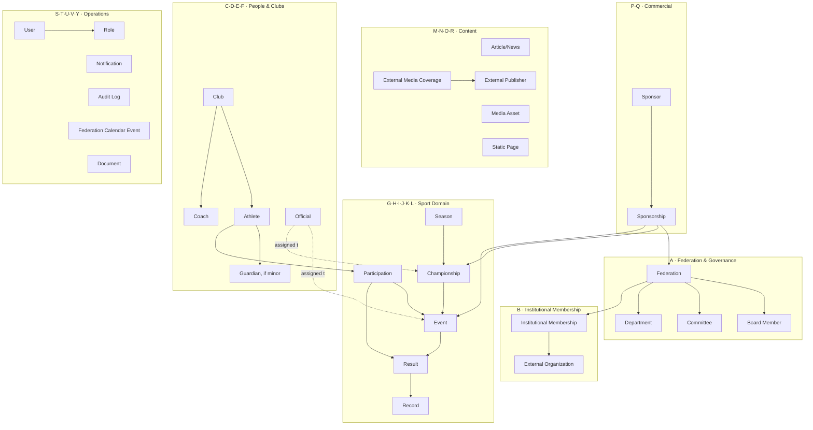
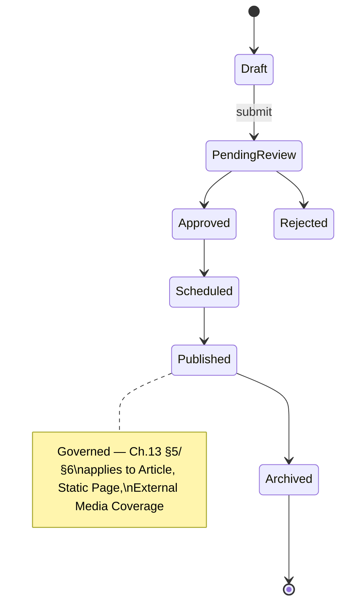

# UAEAF Enterprise Content, Data & Domain Specification

*اتحاد الإمارات لألعاب القوى — مواصفة المجال والبيانات والمحتوى المؤسسية*

> This document is a **business/domain specification**, not a database schema. It contains no Mongoose models, no TypeScript interfaces, no API contracts. It is the artifact that must be reviewed and approved *before* any of those are written. Arabic terminology is primary for every entity/field (this is a UAE federation platform); English identifiers are preserved in parentheses for engineering traceability.

---

## Document Control

| Field | Value |
|---|---|
| Document ID | UAEAF-CONTENT-DATA-003 |
| Version | **2.0.0** |
| Status | **Draft for Federation Approval** — not approved, not final |
| Supersedes | UAEAF-CONTENT-DATA-002 (this repository's prior rebuild) and UAEAF-CONTENT-DATA-001 (the original Google Docs source, "وثيقة هيكلة المحتوى والبيانات", v1.0) |
| Prepared | August 2026 |
| Prepared for | UAE Athletics Federation — review and approval before database schema implementation |
| Internal source of truth consulted | `docs/product/00-MASTER-SPECIFICATION.md` (v0.2.0), `docs/product/01-Information-Architecture.md`, `docs/product/02-Homepage-Specification.md`, `docs/design-system/08-L8-Sports-Components.md`, `docs/design-system/10-Sports-Specific-Scenarios.md`, `docs/design-system/13-CMS-System.md`, `docs/design-system/17-Data-Privacy-Identity.md`, `docs/design-system/19-Calendar-Localization.md`, `CLAUDE.md` |
| What this document does NOT do | Does not modify Figma, frontend, backend, database, Mongoose models, APIs, forms, Design System tokens/components, or create new ADRs. Documentation and domain modeling only. |
| Google Docs note | The original document (`docs.google.com/document/d/1j8AkeV0-yBXzpxDlIIaFwuht5Fo5Gg12pvx1Oalmw2Y`) cannot be edited in place from this session — no Google Docs write/update tool is available, only read/metadata/copy/create-new. This file is the prepared replacement content; it has not been pushed to that URL. See the closing note in §27. |

---

## 1. Purpose

This document defines **what data exists, why it exists, who may see it, and how it relates**, for the entire UAEAF digital platform — public website, CMS, admin dashboard, and future mobile application — as the mandatory precondition for database schema design. It answers the 21 questions posed by this document's own governing brief (entity existence, purpose, content, visibility tiers, relationships, cardinality, lifecycle, workflow, calculated vs. reference fields, multilingual fields, file/document fields, audit requirements, transactional vs. content vs. reference classification, and which decisions require Federation approval vs. which are already governed).

## 2. Scope

**In scope:** every entity implied by the public website, the CMS, the admin dashboard, and this task's own domain map (A–Z, §5) — including domains not previously modeled in this repository: Participation, Sponsorship (as distinct from Sponsor), expanded Institutional Membership, Calendar Events, Documents, Notifications, Audit Logs, and Reporting.

**Out of scope:** visual tokens/component anatomy (Design System's exclusive domain, cited not restated), database schema syntax, API contracts, UI forms, authentication implementation.

## 3. Authority & Source Hierarchy

| Priority | Source |
|---|---|
| 1 | Explicitly approved Federation decisions |
| 2 | `00-MASTER-SPECIFICATION.md` (frozen sections) |
| 3 | Approved ADRs (embedded in Design System chapters) |
| 4 | Approved Design System / Governance chapters |
| 5 | `01-Information-Architecture.md` / `02-Homepage-Specification.md` |
| 6 | Existing content/data specification (the Google Doc, UAEAF-CONTENT-DATA-002) |
| 7 | Industry best practice for national sports federations |
| 8 | This document's own architectural recommendation (lowest priority — always labeled, never presented as decided) |

A lower-priority source never silently overrides a higher one. Every conflict found is logged in §24, not resolved by guessing.

## 4. Terminology & Naming Conventions

| Canonical term (Arabic / English) | Retired term | Governing decision |
|---|---|---|
| الرياضي / Athlete | اللاعب / Player | Locked, Product Owner — Master Spec §05 |
| البطولة / Championship | المسابقة / Competition | Locked, Product Owner — Master Spec §05 |
| الفعالية / Event | — | Single race/discipline instance inside a Championship only — never the nav-grouping sense (Master Spec §06.2) |
| النتيجة / Result | — | An athlete's or team's recorded performance in one Event |
| المشاركة / Participation | — | **New in this document** — the registration/entry relationship between an Athlete (or team) and an Event, deliberately distinct from Result (§8.11) |
| العضوية المؤسسية / Institutional Membership | — | UAEAF's own upward affiliation to an external organization — already partially governed by ADR-0037/`CMP-AFFILIATIONS-001`, expanded here (§8.2) |
| الراعي / Sponsor | — | The sponsoring organization itself |
| الرعاية / Sponsorship | — | **New in this document** — the relationship between a Sponsor and a target (Federation, Championship, or Event); never modeled as a single field on the target (§8.15) |
| الحكم / المسؤول الفني / Official | — | **Still unresolved** which of Referee / Technical Official / Judge / Timekeeping Official / Results Official are one entity vs. several — see §8.7, not decided here |
| الموسم / Season | — | Name uncontested; existence as a formal entity is **مقترح — يحتاج اعتماد الاتحاد** |

English technical identifiers (`ENT-`, `CT-`, `ADR-`, `Ch.`) are kept in Latin script throughout — they are traceability IDs, not translatable words.

## 5. Domain Map



Twenty-six domains (A–Z) as scoped by this task's brief, consolidated above into eight functional clusters for readability. Every domain is expanded in §8 with a stable entity ID.

## 6. Entity Registry

*Master registry — every entity referenced anywhere in this document appears here exactly once. No orphan entities. IDs continue Master Specification's `ENT-` numbering (`ENT-001`–`ENT-024` carried forward; `ENT-025`+ new in this document) for cross-document traceability.*

| ID | Entity (English) | الاسم بالعربية | Domain | Classification (§7) | Public? | Sensitive? | Status |
|---|---|---|---|---|---|---|---|
| ENT-001 | Federation | الاتحاد | A | Core, Configuration | Yes | No | Singleton, implicit |
| ENT-002 | Season | الموسم | G | Core | Yes | No | **مقترح — يحتاج اعتماد الاتحاد** |
| ENT-003 | Championship | البطولة | H | Core | Yes | No | Exists, governed |
| ENT-004 | Event | الفعالية | I | Core | Yes | No | Exists, governed |
| ENT-005 | Result | النتيجة | K | Core, Transaction | Yes (once verified) | No | Exists, most-governed entity |
| ENT-006 | Ranking | التصنيف | K | Derived/Calculated View | Yes | No | Computed only, never stored |
| ENT-007 | Record | الرقم القياسي | L | Core, sub-type of Result | Yes | No | Exists — category list governed (Ch.10 §10.10) |
| ENT-008 | Athlete | الرياضي | D | Core | Partial (see §13) | Partial | Exists, best-governed people entity |
| ENT-009 | Club | النادي | C | Core | Partial | Partial | Exists |
| ENT-010 | Coach | المدرب | E | Core | Partial | Partial | Exists |
| ENT-011 | Official | الحكم / المسؤول الفني | F | Core | Partial | Partial | Exists; internal role-type structure **غير محسوم — يتطلب اعتماد الاتحاد** |
| ENT-012 | Venue | الملعب / المكان | H | Reference Data | Yes | No | **GAP** — only a text field on Championship today |
| ENT-013 | Board Member | عضو مجلس الإدارة | A | Core | Yes | Partial | **Adopted, ADR-0046 (Ch.8 L8)** — structured `CT-BOARDMEMBER-001`, this session; formal UAEAF Federation sign-off on the model still outstanding (see §8.1) |
| ENT-014 | Committee | اللجنة | A | Core | Yes | No | **Adopted, ADR-0047 (Ch.8 L8)** — structured `CT-COMMITTEE-001`, this session; formal UAEAF Federation sign-off on the model still outstanding (see §8.1) |
| ENT-015 | Article / News | الخبر / المقال | M | Content Entity, Workflow Entity | Yes (once published) | No | Exists, fully governed |
| ENT-016 | Media Asset | الملف الإعلامي | O | Content Entity | Yes (once published) | No | Exists, covers image/video/album |
| ENT-017 | Discipline | التخصص الرياضي | I | Reference Data | Yes | No | Taxonomy value only |
| ENT-018 | External Media Coverage | التغطية الإعلامية الخارجية | N | Content Entity, Workflow Entity | Yes (once published) | No | Exists, ADR-0042, best-governed feature in repo |
| ENT-019 | External Publisher | الناشر الخارجي | N | Reference Data | Yes (attribution only) | No | Correctly unmodeled beyond a name/URL — external party |
| ENT-020 | Sponsor / Partner | الراعي / الشريك | P | Core, Reference Data | Yes | Partial (contact/contract) | **GAP — highest priority**, no content type exists |
| ENT-021 | Institutional Membership | العضوية المؤسسية | B | Relationship Entity | Yes | No | Partially governed (ADR-0037/`CMP-AFFILIATIONS-001`); expanded here |
| ENT-022 | Static Page | الصفحة الثابتة | R | Content Entity, Workflow Entity | Yes (once published) | No | Exists |
| ENT-023 | User | المستخدم | S | Core, Configuration | No | Yes | **GAP — deepest gap in the audit** |
| ENT-024 | Country / Emirate | الدولة / الإمارة | C | Reference Data | Yes | No | Taxonomy value only |
| ENT-025 | Department | القسم/الإدارة | A | Reference Data | Partial | No | **GAP** — named in IA as a static "Departments Directory" only |
| ENT-026 | External Organization | الجهة الخارجية | B | Reference Data | Yes | No | **NEW** — split out of the existing Affiliation concept |
| ENT-027 | Participation / Entry | المشاركة | J | Relationship Entity, Transaction, Workflow Entity | Partial | No | **NEW domain — not previously modeled** |
| ENT-028 | Sponsorship | الرعاية | Q | Relationship Entity, Transaction | Yes (public-facing fields only) | Partial (contract terms) | **NEW domain — not previously modeled** |
| ENT-029 | Role | الدور الوظيفي | S | Configuration Entity | No | No | Split out of User; **GAP**, same as ENT-023 |
| ENT-030 | Notification | الإشعار | T | Transaction, Workflow Entity | No | Partial | Governed by Ch.18 ADR-0030; entity-level detail new here |
| ENT-031 | Audit Log Entry | سجل التدقيق | U | Audit Entity | No | Yes | Named in IA (P1, Super Admin) but never entity-modeled until now |
| ENT-032 | Federation Calendar Event | فعالية التقويم العام للاتحاد | V | Content Entity | Yes | No | **GAP — genuinely new domain**, distinct from Championship/Event |
| ENT-033 | Document | المستند/الملف | Y | Document Entity | Partial | Partial/Restricted | **NEW** — reusable file concept, referenced by many entities |
| ENT-034 | Guardian | ولي الأمر | D | Relationship Entity | No | Yes | **NEW** — minor-athlete consent chain, embedded not standalone |
| ENT-035 | Athlete–Club Affiliation History | سجل انتقالات الرياضي | D | Relationship Entity, Audit-adjacent | Partial | No | **NEW** — separates transfer history from the current-affiliation field |
| ENT-036 | Coach–Club Assignment | ارتباط المدرب بالنادي | E | Relationship Entity | Yes | No | **NEW** — cardinality **غير محسوم — يتطلب اعتماد الاتحاد** |
| ENT-037 | Official Assignment | تعيين الحكم | F | Relationship Entity | Yes | No | **NEW** — granularity **غير محسوم — يتطلب اعتماد الاتحاد** |
| ENT-038 | Governance Document (Regulation/Policy/Guide/Form/Decision) | الوثيقة التنظيمية | A | Content Entity, Workflow Entity | Yes (once published) | No | **Adopted, ADR-0048 (Ch.8 L8)** — `CT-GOVDOCUMENT-001`, this session; `type` taxonomy is Product Owner draft, **not** Federation-confirmed; zero real documents exist yet — page ships with illustrative examples only, not an approved regulations list |

Thirty-seven entities. Every ID above is expanded in §8; none is mentioned only in passing.

## 7. Entity Classification

| Classification | Entities |
|---|---|
| 1. Core Entity | Federation, Season, Championship, Event, Result, Record, Athlete, Club, Coach, Official, Sponsor, User |
| 2. Reference Data | Venue, Discipline, Country/Emirate, Department, External Organization, External Publisher |
| 3. Transaction | Result, Participation, Sponsorship, Notification |
| 4. Relationship Entity | Institutional Membership, Participation, Sponsorship, Guardian, Athlete–Club Affiliation History, Coach–Club Assignment, Official Assignment |
| 5. Content Entity | Article/News, Media Asset, External Media Coverage, Static Page, Federation Calendar Event |
| 6. Workflow Entity | Article/News, External Media Coverage, Static Page, Participation, Notification |
| 7. Audit Entity | Audit Log Entry |
| 8. Document Entity | Document |
| 9. Derived/Calculated View | Ranking, all §19 reporting counts |
| 10. Configuration Entity | Federation (singleton), Role, User |

An entity may carry more than one classification (e.g., Participation is both a Relationship Entity and a Workflow Entity) — this is stated once here rather than re-argued per entity.

---

## 8. Detailed Entity Specifications

*Field tables use: `Field | Arabic Name | Type | Required? | Visibility | Multilingual? | Source | Calculated? | Notes`. Visibility values: `PUBLIC` / `ADMIN_ONLY` / `SENSITIVE` / `RESTRICTED` / `SYSTEM_GENERATED` (defined in §14).*

### 8.1 Federation & Governance

**ENT-001 Federation** — singleton, the anchor for `Organization`/`SportsOrganization` SEO schema (Ch.14). No field table needed beyond name/logo/vision/mission text, already covered by Static Pages (§8.19).

**ENT-013 Board Member** — **now a structured entity, `CT-BOARDMEMBER-001`, adopted this session via ADR-0046 (Ch.8 L8)** on explicit Product Owner instruction (build as CMS data, not hardcoded page content, so an electoral-term board turnover doesn't require a redesign). **Standing flag, not yet closed:** this section previously logged the Board Member/Committee structuring question as **غير محسوم — يتطلب اعتماد الاتحاد** (unresolved, requires actual UAEAF Federation approval); that Federation-level sign-off is still outstanding for Board Member and **MUST** be obtained before production launch — this session's adoption is a Figma/schema-design decision, not a substitute for it. **ENT-014 Committee is likewise now adopted, `CT-COMMITTEE-001`, via ADR-0047 (Ch.8 L8)**, same session, same outstanding-approval caveat, same data-provenance caveat (committee/chair data sourced from a press report dated 2025-09-26 covering the 2025–2028 term, not yet Federation-confirmed).

| Field | الاسم بالعربية | Type | Required? | Visibility | Multilingual? | Source | Calculated? | Notes |
|---|---|---|---|---|---|---|---|---|
| Full name | الاسم الكامل | String | Yes | PUBLIC | Yes | Manual | No | **Adopted, ADR-0046** |
| Photo | الصورة | File | No | PUBLIC | n/a | Manual | No | **Adopted, ADR-0046** |
| Title/Position | المنصب | String | Yes | PUBLIC | Yes | Manual | No | **Adopted, ADR-0046** |
| Term start/end | تاريخ بداية ونهاية العضوية | Date | No | PUBLIC | n/a | Manual | No | **Adopted, ADR-0046** — `term.from`/`term.to` |
| Display order | ترتيب العرض | Number | Yes | ADMIN_ONLY | n/a | Manual | No | **NEW, ADR-0046** — drives Board Grid ordering |
| Is Chairman | هل هو رئيس المجلس | Boolean | Yes | Derived | n/a | Manual | No | **NEW, ADR-0046** — routes record to the Chairman-feature layout instead of the grid |
| Is Active | نشط حاليًا | Boolean | Yes | Derived | n/a | Manual | No | **NEW, ADR-0046** — retires a term's roster without deleting historical records |
| Committee membership(s) | اللجان المنتمي إليها | Reference[] → Committee | No | PUBLIC | n/a | Manual | No | **Now modelable, ADR-0047** — inverse of `CT-COMMITTEE-001.chair`; ENT-014 now exists |
| Bio | نبذة تعريفية | Rich Text | No | PUBLIC | Yes | Manual | No | **Adopted, ADR-0046** |

**ENT-014 Committee** (`CT-COMMITTEE-001`, ADR-0047):

| Field | الاسم بالعربية | Type | Required? | Visibility | Multilingual? | Source | Calculated? | Notes |
|---|---|---|---|---|---|---|---|---|
| Committee name | اسم اللجنة | String | Yes | PUBLIC | Yes | Manual | No | **Adopted, ADR-0047** |
| Description | الوصف | Rich Text | No | PUBLIC | Yes | Manual | No | **Adopted, ADR-0047** — **UX draft copy on the current Figma page, not official charter text** (Product Owner's explicit distinction, this session); requires separate editorial confirmation before treating as authoritative |
| Chair | رئيس/رئيسة اللجنة | Reference → ENT-013 (Board Member) | Yes | PUBLIC | n/a | Manual | No | **NEW, ADR-0047** — reference, not a duplicated name field; a chair may simultaneously hold a Board officer title (e.g. Vice-Chairman chairing the Investment Committee) |
| Display order | ترتيب العرض | Number | Yes | ADMIN_ONLY | n/a | Manual | No | **NEW, ADR-0047** |
| Is Active | نشط حاليًا | Boolean | Yes | Derived | n/a | Manual | No | **NEW, ADR-0047** |

**ENT-025 Department** — named only as a "Departments Directory" static listing in IA (`PAGE-108`); no structured entity exists. Proposed fields (department name, function summary, contact) are **مقترح — يحتاج اعتماد الاتحاد**, not detailed further until the Federation confirms this should be structured data at all rather than a static page.

**Open decision, updated status:** Both Board Member (ADR-0046) and Committee (ADR-0047) are now structured entities, this session, on explicit Product Owner instruction — pending formal UAEAF Federation sign-off before production for both (§24, Governance group; **غير محسوم — يتطلب اعتماد الاتحاد** at the Federation level, not resolved by this session's design work).

### 8.2 Institutional Memberships

**ENT-021 Institutional Membership** — UAEAF's *own* upward affiliation to an external body (international/continental federation, regulatory organization). This is the structural inverse of the Clubs Network (Federation → domestic clubs, downward) and **must never be visually or conceptually merged with it** — this distinction is already governed (Ch.8 L8 ADR-0037's own stated rationale).

Already governed today (ADR-0037, `CMP-AFFILIATIONS-001`, backlog `CT-AFFILIATION-001`): organization name, logo asset, official URL, display order. **Gap identified in this rebuild:** the backlogged content type conflates the *organization* and the *membership relationship* into one flat record — it has no membership number, no start/renewal/end date, no status, no documents. Expanded model:

| Field | الاسم بالعربية | Type | Required? | Visibility | Multilingual? | Source | Calculated? | Notes |
|---|---|---|---|---|---|---|---|---|
| Organization | الجهة | Reference → ENT-026 | Yes | PUBLIC | n/a | Manual | No | Split from the flat record — **مقترح — يحتاج اعتماد الاتحاد** |
| Membership type | نوع العضوية | Enum | No | PUBLIC | n/a | Manual | No | Values not defined — **غير محسوم — يتطلب اعتماد الاتحاد** |
| Membership number | رقم العضوية | String | No | ADMIN_ONLY | n/a | Manual | No | Proposed |
| Start date | تاريخ بداية العضوية | Date | No | PUBLIC | n/a | Manual | No | Proposed |
| Renewal / end date | تاريخ التجديد أو الانتهاء | Date | No | ADMIN_ONLY | n/a | Manual | No | Proposed |
| Status | الحالة | Enum (Active/Lapsed/Terminated — proposed) | Yes | ADMIN_ONLY | n/a | Manual | No | **مقترح — يحتاج اعتماد الاتحاد** |
| Documents | المستندات | Reference[] → ENT-033 | No | RESTRICTED | n/a | Manual | No | e.g. membership certificate |
| Public description | وصف عام | Rich Text | No | PUBLIC | Yes | Manual | No | Already governed (accompanying copy, Ch.9 content rules) |
| Internal notes | ملاحظات داخلية | Text | No | ADMIN_ONLY | n/a | Manual | No | Never public |
| Display order | ترتيب الظهور | Number | No | SYSTEM_GENERATED | n/a | Manual | No | Already governed |

**ENT-026 External Organization** — new, split out to avoid re-entering the same organization's name/logo/URL for every membership record:

| Field | الاسم بالعربية | Type | Required? | Visibility | Multilingual? | Source | Calculated? | Notes |
|---|---|---|---|---|---|---|---|---|
| Name | الاسم | String | Yes | PUBLIC | Yes | Manual | No | — |
| Logo | الشعار | File | No | PUBLIC | n/a | Manual | No | — |
| Official website | الموقع الرسمي | URL | No | PUBLIC | n/a | Manual | No | — |
| Organization scope | نطاق الجهة | Enum (International/Continental/Regulatory/Other — proposed) | No | PUBLIC | n/a | Manual | No | **مقترح — يحتاج اعتماد الاتحاد**; do not assume specific bodies |

### 8.3 Organizations

Covered above (§8.2, ENT-026) — this document does not duplicate the table. Organization is also the entity type referenced by Sponsor (§8.14) where a sponsor is itself an organization; the two are kept as separate entities (ENT-026 vs. ENT-020) because a Sponsor carries commercial/contractual fields an Institutional Membership counterpart does not, per this task's own instruction not to collapse Sponsor and Organization concepts.

### 8.4 Clubs

**ENT-009 Club:**

| Field | الاسم بالعربية | Type | Required? | Visibility | Multilingual? | Source | Calculated? | Notes |
|---|---|---|---|---|---|---|---|---|
| Club name | اسم النادي | String | Yes | PUBLIC | Yes | Manual | No | — |
| Logo | شعار النادي | File | No | PUBLIC | n/a | Manual | No | — |
| Founding date | تاريخ التأسيس | Date | No | PUBLIC | n/a | Manual | No | Date-only, no timezone (Ch.19 §2) |
| Emirate/City | الإمارة/المدينة | Reference → ENT-024 | Yes | PUBLIC | n/a | Manual | No | — |
| Description | نبذة تعريفية | Rich Text | No | PUBLIC | Yes | Manual | No | — |
| Official colors | الألوان الرسمية | String | No | PUBLIC | n/a | Manual | No | — |
| Registration number | رقم القيد لدى الاتحاد | String | Yes | ADMIN_ONLY | n/a | Manual | No | Unique — issuing authority **غير محسوم — يتطلب اعتماد الاتحاد** |
| Registration date / status / renewal | تاريخ التسجيل وحالة القيد والتجديد | Date/Enum | Yes | ADMIN_ONLY | n/a | Manual | No | States proposed (§10) — **مقترح — يحتاج اعتماد الاتحاد** |
| Administrative contact name | اسم المسؤول الإداري | String | Yes | RESTRICTED | n/a | Manual | No | Whether multiple named officials must be tracked individually — **غير محسوم — يتطلب اعتماد الاتحاد** |
| Administrative contact phone/email | هاتف وبريد المسؤول الإداري | String | Yes | RESTRICTED | n/a | Manual | No | Never public |
| Official documents (founding license) | المستندات الرسمية | Reference[] → ENT-033 | No | RESTRICTED | n/a | Manual | No | — |
| Internal notes | ملاحظات إدارية | Text | No | ADMIN_ONLY | n/a | Manual | No | — |
| Athlete count | عدد الرياضيين المسجَّلين | Number | n/a | PUBLIC | n/a | — | **Yes** | Derived from Athlete→Club (§19) |
| Coach count | عدد المدربين | Number | n/a | PUBLIC | n/a | — | **Yes** | Derived (§19) |
| Club type | نوع النادي | Enum | Yes | PUBLIC | n/a | Manual | No | **NEW, ADR-0049 (Ch.8 L8)** — نادي رياضي / مؤسسة رياضية / أكاديمية |
| Cover image | صورة الغلاف | Reference → ENT-016 | No | PUBLIC | n/a | Manual | No | **NEW, ADR-0049** |
| Website | الموقع الإلكتروني | URL | No | PUBLIC | n/a | Manual | No | **NEW, ADR-0049** |
| Public email | البريد الإلكتروني العام | String | No | PUBLIC | n/a | Manual | No | **NEW, ADR-0049** — distinct from restricted admin contact above, never defaults from it |
| Public phone | الهاتف العام | String | No | PUBLIC | n/a | Manual | No | **NEW, ADR-0049** — distinct from restricted admin contact above |
| Social links | روابط التواصل الاجتماعي | Reference[] | No | PUBLIC | n/a | Manual | No | **NEW, ADR-0049** |
| Disciplines | الفعاليات/التخصصات المتاحة | Reference[] → ENT-017 | No | PUBLIC | n/a | Manual | No | **NEW, ADR-0049** — renders only if non-empty, never a default full list |

### 8.5 Athletes

**ENT-008 Athlete** (canonical term: الرياضي, retiring اللاعب per §4):

| Field | الاسم بالعربية | Type | Required? | Visibility | Multilingual? | Source | Calculated? | Notes |
|---|---|---|---|---|---|---|---|---|
| Full name | الاسم الكامل | String | Yes | PUBLIC | Yes | Manual | No | — |
| Photo | الصورة الشخصية | File | No | PUBLIC (unless minor without consent) | n/a | Manual | No | Ch.8 L8 §SP.10 — Initials Avatar substitute if minor lacks consent |
| Date of birth | تاريخ الميلاد | Date | Yes | RESTRICTED | n/a | Manual | No | Date-only, no timezone conversion (Ch.19 §2) |
| Nationality | الجنسية | Reference → ENT-024 | Yes | PUBLIC | n/a | Manual | No | — |
| Club affiliation | النادي التابع له | Reference → ENT-009 (nullable) | No | PUBLIC | n/a | Manual | No | Null = "Directly affiliated with the Federation" (SP.8) — never blank |
| Age category | الفئة العمرية | Enum | Yes | PUBLIC | n/a | Manual | No | Values **غير محسوم — يتطلب اعتماد الاتحاد** |
| Discipline(s) | التخصصات الرياضية | Reference[] → ENT-017 | Yes | PUBLIC | n/a | Manual | No | — |
| Achievements/medals | أبرز الإنجازات والميداليات | — | n/a | PUBLIC | n/a | — | **Yes** | Derived from Result/Record (§19) |
| Registration number | رقم القيد | String | Yes | ADMIN_ONLY | n/a | Manual | No | — |
| Registration date/expiry/renewal | تاريخ القيد والانتهاء والتجديد | Date | Yes | ADMIN_ONLY | n/a | Manual | No | Duration **غير محسوم — يتطلب اعتماد الاتحاد** |
| Height/weight | الطول والوزن | Number | No | ADMIN_ONLY | n/a | Manual | No | — |
| Emirates ID / Passport number | رقم الهوية الإماراتية/جواز السفر | String | Yes | **RESTRICTED — highest sensitivity** | n/a | Manual | No | Never public under any circumstance (§14) |
| Detailed address | العنوان التفصيلي | String | No | RESTRICTED | n/a | Manual | No | Never public |
| Phone/email (or Guardian's, if minor) | الهاتف والبريد الإلكتروني | String | Yes | RESTRICTED | n/a | Manual | No | Never public |
| Medical fitness certificate | شهادة اللياقة الطبية | File → ENT-033 | Unresolved | **SENSITIVE — medical, highest classification** | n/a | Manual | No | Whether mandatory — **غير محسوم — يتطلب اعتماد الاتحاد** |
| Club transfer history | سجل الانتقالات بين الأندية | — | n/a | ADMIN_ONLY | n/a | — | No (stored, see ENT-035) | Modeled as a separate history entity, not a field — §8.5a |
| Status | حالة القيد | Enum | Yes | ADMIN_ONLY | n/a | Manual | No | Proposed states, see §10 |

**8.5a — ENT-034 Guardian** (for minor athletes) and **ENT-035 Athlete–Club Affiliation History** (transfer history):

| Entity | Field | الاسم بالعربية | Visibility | Notes |
|---|---|---|---|---|
| Guardian (ENT-034) | Name, relationship to athlete, phone, national ID, signed consent record | الاسم، صلة القرابة، الهاتف، إثبات الهوية، سجل الموافقة الموقّعة | **RESTRICTED/SENSITIVE** | Whether mandatory for all minors — **غير محسوم — يتطلب اعتماد الاتحاد**; consent record itself is what Ch.17 ADR-0028 requires before any public display of the minor |
| Affiliation History (ENT-035) | Previous club, new club, transfer date | النادي السابق، النادي الجديد، تاريخ الانتقال | ADMIN_ONLY | Whether full history is retained vs. only the latest club — **غير محسوم — يتطلب اعتماد الاتحاد** |

### 8.6 Coaches

**ENT-010 Coach:**

| Field | الاسم بالعربية | Type | Required? | Visibility | Multilingual? | Source | Calculated? | Notes |
|---|---|---|---|---|---|---|---|---|
| Full name | الاسم الكامل | String | Yes | PUBLIC | Yes | Manual | No | — |
| Photo | الصورة الشخصية | File | No | PUBLIC | n/a | Manual | No | — |
| Club(s) | النادي/الأندية | Reference[] → ENT-009 via ENT-036 | No | PUBLIC | n/a | Manual | No | Multi-club cardinality open, see ENT-036 |
| Qualifications/certifications | المؤهلات والشهادات | Rich Text | No | PUBLIC | Yes | Manual | No | — |
| Years of experience | سنوات الخبرة | Number | No | PUBLIC | n/a | Manual | No | — |
| Bio | نبذة تعريفية | Rich Text | No | PUBLIC | Yes | Manual | No | — |
| Registration number | رقم القيد | String | Yes | ADMIN_ONLY | n/a | Manual | No | — |
| Registration/expiry/renewal dates | تاريخ القيد والانتهاء والتجديد | Date | Yes | ADMIN_ONLY | n/a | Manual | No | — |
| License level/classification | مستوى رخصة التدريب | Enum | No | PUBLIC | n/a | Manual | No | Local vs. international standard — **غير محسوم — يتطلب اعتماد الاتحاد** |
| Phone/email | الهاتف والبريد الإلكتروني | String | Yes | RESTRICTED | n/a | Manual | No | Never public |
| Detailed address | العنوان التفصيلي | String | No | RESTRICTED | n/a | Manual | No | Never public |
| Certification documents | المستندات الرسمية | Reference[] → ENT-033 | No | RESTRICTED | n/a | Manual | No | — |
| Associated athletes | الرياضيون المرتبطون | — | n/a | PUBLIC | n/a | — | **Yes** | Derived from Athlete→Coach (§19) |

**Open decision:** can a Coach be associated with more than one Club simultaneously? — **غير محسوم — يتطلب اعتماد الاتحاد** (ENT-036, §8.6a).

**8.6a — ENT-036 Coach–Club Assignment** — modeled as a relationship entity precisely because this cardinality is unresolved; if the Federation confirms exactly one club per coach, this collapses to a simple reference field and this entity is not needed. Kept separate until that is confirmed, per this task's own instruction not to collapse relationship concepts prematurely.

### 8.7 Officials

**ENT-011 Official** (الحكم / المسؤول الفني) — **the single largest unresolved naming/modeling question carried into this document.** The Design System today names exactly one entity/component (`CMP-REFEREECARD-001`, "compact representation of a referee ... for assigning referees to events"). This task's brief additionally raises Technical Official, Judge, Timekeeping Official, and Results Official as possible distinct roles. **None of these five have independent backing in any governing document** — only "Referee" exists at all.

Two structural options, **neither decided here**:

| Option | Description | Recommendation weight (§3 priority 8 — lowest, non-binding) |
|---|---|---|
| A. One entity, role-type enum | Single `Official` entity with a `roleType` field (Referee / Technical Official / Judge / Timekeeping Official / Results Official) | Architecturally simpler if all roles share the same registration/licensing lifecycle |
| B. Multiple distinct entities | Separate entities per role, each with potentially different fields/lifecycles | Necessary only if the roles genuinely have different data requirements (e.g., Timekeeping Official needing equipment/certification fields Referee doesn't) |

Field table (applies under either option, using Option A's shape as the working baseline — **not a decision**):

| Field | الاسم بالعربية | Type | Required? | Visibility | Multilingual? | Source | Calculated? | Notes |
|---|---|---|---|---|---|---|---|---|
| Full name | الاسم الكامل | String | Yes | PUBLIC | Yes | Manual | No | — |
| Photo | الصورة الشخصية | File | No | PUBLIC | n/a | Manual | No | — |
| Role type | نوع الدور | Enum | Yes | PUBLIC | n/a | Manual | No | **غير محسوم — يتطلب اعتماد الاتحاد** — see table above |
| License level | مستوى رخصة التحكيم | Enum | No | PUBLIC | n/a | Manual | No | Local vs. international standard **غير محسوم** |
| Discipline(s)/specialization | الفعاليات/التخصصات | Reference[] → ENT-017 | No | PUBLIC | n/a | Manual | No | — |
| Years of experience | سنوات الخبرة | Number | No | PUBLIC | n/a | Manual | No | — |
| Registration number | رقم القيد | String | Yes | ADMIN_ONLY | n/a | Manual | No | — |
| License issue/expiry/renewal | تاريخ إصدار الرخصة وانتهائها وتجديدها | Date | Yes | ADMIN_ONLY | n/a | Manual | No | — |
| Phone/email/address | الهاتف والبريد والعنوان | String | Yes | RESTRICTED | n/a | Manual | No | Never public |
| Certification documents | المستندات الرسمية | Reference[] → ENT-033 | No | RESTRICTED | n/a | Manual | No | — |
| Assignment history | سجل الفعاليات/البطولات المُشرَف عليها | — | n/a | PUBLIC | n/a | — | **Yes** | Derived from ENT-037 (§19) |

**8.7a — ENT-037 Official Assignment** — relationship entity (Official ↔ Event or Championship). **Open decision:** is assignment made at Championship level (covers all its Events) or per-Event? — **غير محسوم — يتطلب اعتماد الاتحاد**.

### 8.8 Seasons

**ENT-002 Season** — **مقترح — يحتاج اعتماد الاتحاد** as a formal entity; no component or content type exists for it today, only an implicit `season` reference on Championship and the "Season Best" record category (Ch.10 §10.10) that presumes its existence without formally modeling it.

| Field | الاسم بالعربية | Type | Required? | Visibility | Multilingual? | Source | Calculated? | Notes |
|---|---|---|---|---|---|---|---|---|
| Season name | اسم الموسم | String | Yes | PUBLIC | Yes | Manual | No | e.g. "موسم 2026" |
| Start/end date | تاريخ البداية والنهاية | Date | Yes | PUBLIC | n/a | Manual | No | Calendar-year alignment **غير محسوم — يتطلب اعتماد الاتحاد** |
| Status | حالة الموسم | Enum (Upcoming/Ongoing/Ended — proposed) | Yes | PUBLIC | n/a | Manual | No | Proposed states only |
| Championship count | عدد البطولات | Number | n/a | PUBLIC | n/a | — | **Yes** | Derived (§19) |
| New/renewed registration count | عدد القيود الجديدة والمجدَّدة | Number | n/a | ADMIN_ONLY | n/a | — | **Yes** | Derived (§19) |
| Internal notes | ملاحظات إدارية | Text | No | ADMIN_ONLY | n/a | Manual | No | — |

### 8.9 Championships

**ENT-003 Championship:**

| Field | الاسم بالعربية | Type | Required? | Visibility | Multilingual? | Source | Calculated? | Notes |
|---|---|---|---|---|---|---|---|---|
| Name | اسم البطولة | String | Yes | PUBLIC | Yes | Manual | No | — |
| Logo/cover image | شعار/صورة الغلاف | File | No | PUBLIC | n/a | Manual | No | — |
| Season | الموسم التابعة له | Reference → ENT-002 | Yes (once Season exists) | PUBLIC | n/a | Manual | No | Blocked on §8.8 decision |
| Championship type | نوع البطولة | Enum | No | PUBLIC | n/a | Manual | No | Values **غير محسوم — يتطلب اعتماد الاتحاد** |
| Start/end date | تاريخ البداية والنهاية | Date | Yes | PUBLIC | n/a | Manual | No | — |
| Venue | مكان الإقامة | Reference → ENT-012 | Yes | PUBLIC | n/a | Manual | No | Venue not independently modeled yet (ENT-012 gap) |
| Description | الوصف والتفاصيل العامة | Rich Text | No | PUBLIC | Yes | Manual | No | — |
| Events | الفعاليات المرتبطة | Reference[] → ENT-004 | Yes | PUBLIC | n/a | — | No (relationship) | 1:N, required |
| Participating clubs | الأندية المشاركة | Reference[] → ENT-009 | n/a | PUBLIC | n/a | — | **Yes** | Derived from Participation (§19) |
| Sponsors | الرعاة | Reference[] → ENT-028 | No | PUBLIC | n/a | — | No (relationship) | Via Sponsorship, §8.15 — **never a direct sponsor field** |
| Status | حالة البطولة | Enum (Upcoming/Ongoing/Ended — proposed) | Yes | ADMIN_ONLY (public derived label) | n/a | Manual | No | Proposed only |
| Assigned officials | الحكام المعيّنون | Reference[] → ENT-037 | No | ADMIN_ONLY | n/a | — | No (relationship) | — |
| Organizing/hosting body | الجهة المنظِّمة/المستضيفة | String | No | ADMIN_ONLY | Yes | Manual | No | — |
| Regulations document | لائحة البطولة | Reference → ENT-033 | No | RESTRICTED (or PUBLIC if Federation elects to publish) | n/a | Manual | No | Visibility **غير محسوم — يتطلب اعتماد الاتحاد** |
| Internal notes | ملاحظات إدارية | Text | No | ADMIN_ONLY | n/a | Manual | No | — |

### 8.10 Events

**ENT-004 Event** (single race/discipline instance — never the "Events" nav-grouping sense, §4):

| Field | الاسم بالعربية | Type | Required? | Visibility | Multilingual? | Source | Calculated? | Notes |
|---|---|---|---|---|---|---|---|---|
| Name | اسم الفعالية | String | Yes | PUBLIC | Yes | Manual | No | e.g. "100م رجال" |
| Championship | البطولة التابعة لها | Reference → ENT-003 | Yes | PUBLIC | n/a | Manual | No | Never merged with Championship (§4) |
| Date/time | التاريخ والوقت | DateTime | Yes | PUBLIC | n/a | Manual | No | Stored UTC, rendered local (Ch.19 §2) |
| Discipline | التخصص | Reference → ENT-017 | Yes | PUBLIC | n/a | Manual | No | — |
| Age category / gender | الفئة العمرية والنوع | Enum | Yes | PUBLIC | n/a | Manual | No | Multiple categories per Championship — **غير محسوم — يتطلب اعتماد الاتحاد** |
| Venue (if different from Championship) | مكان الإقامة | Reference → ENT-012 | No | PUBLIC | n/a | Manual | No | — |
| Participants | قائمة المشاركين | Reference[] → ENT-027 | n/a | PUBLIC | n/a | — | No (relationship) | Via Participation, §8.11 |
| Results | النتائج | Reference[] → ENT-005 | n/a | PUBLIC (once verified/published) | n/a | — | No (relationship) | — |
| Assigned officials | الحكام المعيّنون | Reference[] → ENT-037 | No | ADMIN_ONLY | n/a | — | No (relationship) | — |
| Status | حالة الفعالية | Enum | Yes | PUBLIC (derived label) | n/a | Manual/System | Partial | State machine, §10 |
| Technical notes | ملاحظات فنية داخلية | Text | No | ADMIN_ONLY | n/a | Manual | No | — |
| Result edit history | سجل التعديلات على النتائج | — | n/a | ADMIN_ONLY | n/a | — | **Yes** | Feeds Audit Log (ENT-031) |

### 8.11 Participation

**ENT-027 Participation / Entry** — **the domain this task explicitly requires as distinct from Result.** Previously, the repository's data model implicitly folded "who is entered in an Event" into the Result record itself (a Result referencing an Athlete). This conflates two different facts: *that* an athlete is registered/eligible/confirmed for an Event, and *what* they achieved once it happened. An athlete can be Registered, Withdrawn, or Disqualified **without ever producing a Result row at all** — the current model has no way to represent that. This is a genuine, newly-identified structural gap, not previously flagged in `00-MASTER-SPECIFICATION.md`.

| Field | الاسم بالعربية | Type | Required? | Visibility | Multilingual? | Source | Calculated? | Notes |
|---|---|---|---|---|---|---|---|---|
| Athlete (or team, for relay) | الرياضي (أو الفريق للتتابع) | Reference[] → ENT-008 | Yes | PUBLIC | n/a | Manual | No | — |
| Event | الفعالية | Reference → ENT-004 | Yes | PUBLIC | n/a | Manual | No | — |
| Club (at time of entry) | النادي وقت التسجيل | Reference → ENT-009 (nullable) | No | PUBLIC | n/a | Manual | No | Snapshot — preserves historical accuracy even if the athlete later transfers |
| Status | الحالة | Enum: Draft/Registered/Eligible/Confirmed/Withdrawn/DNS/Participated/Disqualified | Yes | PUBLIC (once Confirmed+) | n/a | Manual/System | Partial | **All eight states are proposed only — مقترح — يحتاج اعتماد الاتحاد**, not finalized per this task's own instruction |
| Entry date | تاريخ التسجيل | DateTime | Yes | ADMIN_ONLY | n/a | System | **Yes** | — |
| Bib/lane/seed (if applicable) | رقم الاشتراك/المسار/التصنيف | String/Number | No | PUBLIC | n/a | Manual | No | — |
| Withdrawal/DQ reason | سبب الانسحاب أو الاستبعاد | Text | No | ADMIN_ONLY | n/a | Manual | No | — |

**Relationship note:** Participation → Result is 1:1 or 1:0 (a Participation record may or may not produce a Result, e.g. Withdrawn/DNS never does); Result never exists without a corresponding Participation record once this entity is adopted. This is a **recommendation**, priority 8 in §3's hierarchy — **مقترح — يحتاج اعتماد الاتحاد**, not yet implemented anywhere.

### 8.12 Results

**ENT-005 Result:**

| Field | الاسم بالعربية | Type | Required? | Visibility | Multilingual? | Source | Calculated? | Notes |
|---|---|---|---|---|---|---|---|---|
| Participation | المشاركة المرتبطة | Reference → ENT-027 | Yes (once ENT-027 adopted) | PUBLIC | n/a | Manual | No | — |
| Event | الفعالية | Reference → ENT-004 | Yes | PUBLIC | n/a | Manual | No | Denormalized for query convenience |
| Athlete/Club | الرياضي والنادي | Reference | Yes | PUBLIC | n/a | Manual | No | — |
| Final rank | الترتيب النهائي | Number | Yes | PUBLIC (once verified) | n/a | Manual | No | — |
| Performance value (time/distance/points) | الزمن أو النتيجة الرقمية | Number/String | Yes | PUBLIC (once verified) | n/a | Manual/Import | No | Format per discipline — Ch.9 governed |
| Medal | الميدالية | Enum (Gold/Silver/Bronze) | No | PUBLIC (once verified) | n/a | Manual/System | Partial | Ch.8 L8 §SP.5 |
| Record flag | الرقم القياسي المتحقق | Reference → ENT-007 (nullable) | No | PUBLIC (once verified) | n/a | System | **Yes** | See §8.13 |
| Entry source | مصدر إدخال النتيجة | Enum (Manual/Electronic timing import) | Yes | ADMIN_ONLY | n/a | Manual | No | Electronic timing integration — **غير محسوم — يتطلب اعتماد الاتحاد**, §20 |
| Verification status | حالة المراجعة | Enum: Entered → Pending Verification → Verified/Official | Yes | Derived PUBLIC label only | n/a | System | Partial | Exact governed chain (Ch.10): Upcoming → In Progress → Results Pending Verification → Results Verified/Official |
| Entered by / verified by | من أدخلها ومن اعتمدها | Reference → ENT-023 | Yes | ADMIN_ONLY | n/a | System | **Yes** | Feeds Audit Log |
| Entry/verification timestamp | تاريخ الإدخال والاعتماد | DateTime | Yes | ADMIN_ONLY | n/a | System | **Yes** | — |

**Governed rule, restated (not re-decided):** an unverified Result **MUST NOT** ever be rendered publicly as fact — visually distinct treatment for "Unofficial" vs. "Official/Verified" is mandatory (Ch.10). A News article referencing a Result links to it, never restates the value while it is unverified (Ch.13 §7).

**Open:** single-approver vs. dual-review sign-off before a Result becomes Verified — **غير محسوم — يتطلب اعتماد الاتحاد**.

### 8.13 Records

**ENT-007 Record** — a sub-type of Result, deliberately kept as its own entity per this task's explicit instruction not to collapse Record into Result, even though every Record is *also* a Result:

| Field | الاسم بالعربية | Type | Required? | Visibility | Multilingual? | Source | Calculated? | Notes |
|---|---|---|---|---|---|---|---|---|
| Underlying Result | النتيجة المرتبطة | Reference → ENT-005 | Yes | PUBLIC | n/a | System | No | — |
| Category | الفئة | Enum: Personal Best · Season Best · Meeting Record · Championship Record · National Record | Yes | PUBLIC | n/a | System | **Yes** | **Already governed** — Ch.10 §10.10, extensible list, consumed as a Prop by `CMP-RECORDBADGE-001` |
| Qualifying threshold | الشرط المؤهِّل لتحقيق الرقم | — | n/a | n/a | n/a | System | **Yes** | Calculation logic per category is a business rule not yet documented — **غير محسوم — يتطلب اعتماد الاتحاد** |
| Date set | تاريخ التحقيق | Date | Yes | PUBLIC | n/a | System | **Yes** | — |
| Superseded by | استُبدل بواسطة | Reference → ENT-007 (nullable, self) | No | PUBLIC | n/a | System | **Yes** | Historical record chain — whether superseded records stay visible or archive — **غير محسوم — يتطلب اعتماد الاتحاد** |

Note: the brief's suggested "Age Category Record" is **not** in the currently governed category list (Ch.10 §10.10 names exactly five) — adding it would be a Design System change, not something this document can add silently. Flagged, not adopted.

### 8.14 Sponsors & Partners

**ENT-020 Sponsor/Partner** — the organization itself, kept separate from the Sponsorship relationship (§8.15) per this task's explicit non-negotiable requirement:

| Field | الاسم بالعربية | Type | Required? | Visibility | Multilingual? | Source | Calculated? | Notes |
|---|---|---|---|---|---|---|---|---|
| Organization name | اسم الجهة | String | Yes | PUBLIC | Yes | Manual | No | — |
| Logo | شعار الجهة | File | Yes | PUBLIC | n/a | Manual | No | — |
| Official website | رابط موقع الجهة | URL | No | PUBLIC | n/a | Manual | No | — |
| Category label (e.g. "جهة حكومية") | تصنيف عام للجهة | String | No | PUBLIC | Yes | Manual | No | Already observed as built copy (Homepage Spec §15) |
| Contact person | الشخص المسؤول للتواصل | String | No | RESTRICTED | n/a | Manual | No | Never public |
| Contact phone/email | هاتف وبريد التواصل | String | No | RESTRICTED | n/a | Manual | No | Never public |
| Internal notes | ملاحظات إدارية داخلية | Text | No | ADMIN_ONLY | n/a | Manual | No | Never public |

No `CT-` content type exists for this entity anywhere in the Design System today — **highest-priority gap in the entire specification** (§24). **Escalated further** by `08-L8-Sports-Components.md` ADR-0043 (Global Sponsors Strip, Product Owner decision): this entity now has two consumers (the Homepage Grid and the new sitewide Strip) instead of one — the gap blocks both.

### 8.15 Sponsorships

**ENT-028 Sponsorship — the required relationship entity.** This task is explicit that a Championship, an Event, or the Federation itself may each have zero, one, or many sponsors, and that the same Sponsor may sponsor multiple Championships and/or Events simultaneously. Modeling this as `championship.sponsorId` or `event.sponsorId` cannot represent that many-to-many reality, nor can it carry per-relationship data (tier, dates, contract) that differs from one sponsorship to the next even for the same Sponsor. Sponsorship is therefore modeled as its own entity sitting between Sponsor and its Target:

```
Sponsor (ENT-020) ──sponsors──> Sponsorship (ENT-028) ──targets──> { Federation | Championship | Event }
```

| Field | الاسم بالعربية | Type | Required? | Visibility | Multilingual? | Source | Calculated? | Notes |
|---|---|---|---|---|---|---|---|---|
| Sponsor | الراعي | Reference → ENT-020 | Yes | PUBLIC | n/a | Manual | No | — |
| Target type | نوع الجهة المستفيدة | Enum: Federation / Championship / Event | Yes | PUBLIC | n/a | Manual | No | — |
| Target reference | الجهة المستفيدة | Reference → ENT-001 / ENT-003 / ENT-004 (per Target type) | Yes | PUBLIC | n/a | Manual | No | Polymorphic reference — implementation detail deferred to schema phase |
| Sponsorship type | نوع الرعاية | Enum | No | PUBLIC | n/a | Manual | No | **مقترح — يحتاج اعتماد الاتحاد** |
| Sponsorship level/tier | مستوى الرعاية | Enum: Strategic Partner (الشريك الاستراتيجي) / Official Partner (راعٍ رسمي) / Supporting Partner (شريك مساند) | Yes | PUBLIC | Yes | Manual | No | **Tier labels already observed as built** (Homepage Spec §15) — treat as the current de facto vocabulary, not yet formalized as a governed enum; the underlying data model (this table) is still **مقترح — يحتاج اعتماد الاتحاد** |
| Official designation text | الصفة الرسمية | String | No | PUBLIC | Yes | Manual | No | e.g. "الراعي الاستراتيجي الرسمي لبطولة..." |
| Start/end date | تاريخ بداية ونهاية الرعاية | Date | Yes | ADMIN_ONLY (derived active/expired label may be public) | n/a | Manual | No | — |
| Status | الحالة | Enum (Active/Expired/Cancelled — proposed) | Yes | ADMIN_ONLY | n/a | Manual | No | **مقترح — يحتاج اعتماد الاتحاد** |
| Display priority | أولوية الظهور | Number | No | SYSTEM_GENERATED | n/a | Manual | No | — |
| Logo used for this sponsorship | الشعار المستخدم لهذه الرعاية | File (nullable, defaults to Sponsor's logo) | No | PUBLIC | n/a | Manual | No | Allows a co-branded/event-specific logo variant |
| Description | وصف الرعاية | Rich Text | No | PUBLIC | Yes | Manual | No | — |
| Contract | العقد | Reference → ENT-033 | No | **RESTRICTED** | n/a | Manual | No | Never public |
| Sponsorship rights | حقوق الرعاية | Text | No | ADMIN_ONLY | n/a | Manual | No | e.g. branding placement rights — **مقترح — يحتاج اعتماد الاتحاد** |
| Placement configuration | إعدادات ظهور الشعار | Object | No | SYSTEM_GENERATED | n/a | Manual | No | Where/how the logo renders — implementation-adjacent, kept here only as a data-requirement flag |
| Internal notes | ملاحظات داخلية | Text | No | ADMIN_ONLY | n/a | Manual | No | Never public |

**Data integrity question, explicitly not resolved here:** may a Sponsor hold overlapping/conflicting concurrent Sponsorships (e.g., two "Strategic Partner" designations for the same Championship at once)? — **غير محسوم — يتطلب اعتماد الاتحاد** (§22).

### 8.16 News & Editorial

**ENT-015 Article/News** (`CT-ARTICLE-001` — one content type, not two, per governed Chapter 13 confirmation):

| Field | الاسم بالعربية | Type | Required? | Visibility | Multilingual? | Source | Calculated? | Notes |
|---|---|---|---|---|---|---|---|---|
| Title | العنوان | String | Yes | PUBLIC (once published) | Yes | Manual | No | — |
| Cover image/video | الصورة أو الفيديو المصاحب | Reference → ENT-016 | No | PUBLIC | n/a | Manual | No | — |
| Body | المحتوى الكامل | Rich Text | Yes | PUBLIC (once published) | Yes | Manual | No | — |
| Publish date | تاريخ النشر | DateTime | Yes | PUBLIC | n/a | System | **Yes** | — |
| Displayed author name | اسم الكاتب الظاهر | String | Yes | PUBLIC | Yes | Manual | No | May differ from the actual CMS user (below) |
| Category/tags | التصنيف/الوسوم | Reference[] | No | PUBLIC | Yes | Manual | No | — |
| Referenced Athlete/Club/Championship | الإشارة إلى رياضي/نادٍ/بطولة | Reference[] (optional) | No | PUBLIC | n/a | Manual | No | Link only, never restates the referenced fact (Ch.13 §7) |
| Publication state | حالة النشر | Enum: Draft → In Review → Approved/Rejected → Scheduled → Published → Archived | Yes | Derived | n/a | System | Partial | Governed (Ch.13 §5/§6) |
| Actual CMS author account | حساب المستخدم الفعلي | Reference → ENT-023 | Yes | ADMIN_ONLY | n/a | System | **Yes** | — |
| Created/modified timestamps | تاريخ الإنشاء وآخر تعديل | DateTime | Yes | ADMIN_ONLY | n/a | System | **Yes** | — |
| Review notes | ملاحظات المراجعة | Text | No | ADMIN_ONLY | n/a | Manual | No | — |
| SEO slug/title/meta | بيانات السيو | String | Yes | PUBLIC | Yes | Manual | No | §17 |

### 8.17 External Media

**ENT-018 External Media Coverage** (`CT-EXTERNALMEDIA-001`, ADR-0042 — the best-governed content feature in the platform; the Homepage carousel presentation, position, and CTA are **locked and not reopened here**):

| Field | الاسم بالعربية | Type | Required? | Visibility | Multilingual? | Source | Calculated? | Notes |
|---|---|---|---|---|---|---|---|---|
| Article/coverage title | عنوان الخبر أو المقال | String | Yes | PUBLIC | Yes | Manual | No | — |
| External Publisher | اسم المصدر | Reference → ENT-019 | Yes | PUBLIC | n/a | Manual | No | — |
| Original URL or clipping image | رابط الخبر الأصلي أو صورة القصاصة | URL / File | Yes | PUBLIC | n/a | Manual | No | Existing engineering gap: dedicated clipping-image field not yet formalized (Master Spec OPEN-018) |
| Original publish date | تاريخ النشر الأصلي | Date | Yes | PUBLIC | n/a | Manual | No | — |
| Summary/excerpt | مقتطف مختصر | Rich Text | No | PUBLIC | Yes | Manual | No | — |
| Added-by staff member | اسم الموظف الذي أضاف السجل | Reference → ENT-023 | Yes | ADMIN_ONLY | n/a | System | **Yes** | — |
| Archive date | تاريخ الإضافة إلى الأرشيف | DateTime | Yes | ADMIN_ONLY | n/a | System | **Yes** | — |
| Publication state | حالة النشر | Enum, same lifecycle as ENT-015 | Yes | Derived | n/a | System | Partial | Full lifecycle (Ch.13 §14) |
| Translation note | ملاحظة الترجمة | Enum (Original/Translated) | No | ADMIN_ONLY | n/a | Manual | No | — |
| `featured` flag | تمييز كعنصر بارز | Boolean | No | ADMIN_ONLY | n/a | Manual | No | May override recency ordering on Homepage (already governed) |

**Open, unchanged from prior source material:** is the archive addition fully manual, or should an automatic feed/link with news sources be evaluated later? — **غير محسوم — يتطلب اعتماد الاتحاد**.

### 8.18 Media Library

**ENT-016 Media Asset** (`CT-MEDIA-001` — covers Image/Video/Gallery/Album as one type; Album is a grouping of Media Assets, not a separate entity):

| Field | الاسم بالعربية | Type | Required? | Visibility | Multilingual? | Source | Calculated? | Notes |
|---|---|---|---|---|---|---|---|---|
| File | الصورة أو الفيديو | File | Yes | PUBLIC (once published) | n/a | Manual | No | — |
| Caption/short description | وصف مختصر | String | No | PUBLIC | Yes | Manual | No | — |
| Alt text | النص البديل | String | Yes (accessibility) | PUBLIC | Yes | Manual | No | Ch.6 requirement |
| Associated Championship/Event | البطولة/الفعالية المرتبطة | Reference (optional) | No | PUBLIC | n/a | Manual | No | — |
| Associated Athlete/News | الرياضي/الخبر المرتبط | Reference (optional) | No | PUBLIC | n/a | Manual | No | — |
| Event date | تاريخ المناسبة | Date | No | PUBLIC | n/a | Manual | No | — |
| Album grouping | التجميع ضمن معرض | String/Reference | No | PUBLIC | Yes | Manual | No | Grouping key, not a separate content type |
| Uploader | اسم رافع الملف | Reference → ENT-023 | Yes | ADMIN_ONLY | n/a | System | **Yes** | — |
| Upload date | تاريخ الرفع | DateTime | Yes | ADMIN_ONLY | n/a | System | **Yes** | — |
| File size/MIME type | حجم ونوع الملف | Number/String | Yes | SYSTEM_GENERATED | n/a | System | **Yes** | — |
| Usage state | حالة الاستخدام | Enum (In use/Unused — proposed) | No | ADMIN_ONLY | n/a | System | **Yes** | — |
| Copyright/usage rights | حقوق الاستخدام | String | No | ADMIN_ONLY | n/a | Manual | No | **مقترح — يحتاج اعتماد الاتحاد** — not previously documented anywhere |

### 8.19 Static Pages

**ENT-022 Static Page** (`CT-PAGE-001` — About, President's Message, Privacy Policy, Terms; the Board of Directors page also uses this content type for its own title/intro/body, but the board roster itself is now `CT-BOARDMEMBER-001` (ENT-013, ADR-0046, §8.1), not flat page content — Committees (ENT-014) remains flat/unstructured per §8.1):

| Field | الاسم بالعربية | Type | Required? | Visibility | Multilingual? | Source | Calculated? | Notes |
|---|---|---|---|---|---|---|---|---|
| Page title | عنوان الصفحة | String | Yes | PUBLIC | Yes | Manual | No | — |
| Body content | المحتوى الكامل | Rich Text | Yes | PUBLIC (once published) | Yes | Manual | No | — |
| Featured image | الصورة المميزة | Reference → ENT-016 (Media Asset) | No | PUBLIC (once published) | n/a (image has no language) | Manual | No | **NEW — ADR-0044 (Ch.13 §16).** Optional. Used for pages needing a fixed-position portrait/banner (e.g. President's Message); absent on pages that don't need one (e.g. Privacy Policy). Template must render cleanly either way. |
| Last modified | تاريخ آخر تعديل | DateTime | Yes | ADMIN_ONLY | n/a | System | **Yes** | — |
| Modified by | من قام بالتعديل | Reference → ENT-023 | Yes | ADMIN_ONLY | n/a | System | **Yes** | — |
| Publication state | حالة النشر | Enum, same lifecycle as ENT-015 | Yes | Derived | n/a | System | Partial | — |
| SEO slug/title/meta | بيانات السيو | String | Yes | PUBLIC | Yes | Manual | No | §17. OG image MAY default to Featured Image if not separately set (ADR-0044). |

### 8.20 Users

**ENT-023 User** — **the deepest gap in the entire repository, unchanged finding across every audit pass this engagement.**

| Field | الاسم بالعربية | Type | Required? | Visibility | Multilingual? | Source | Calculated? | Notes |
|---|---|---|---|---|---|---|---|---|
| Name | اسم الموظف | String | Yes | ADMIN_ONLY | n/a | Manual | No | Never public |
| Email | البريد الإلكتروني | String | Yes | ADMIN_ONLY | n/a | Manual | No | Never public |
| Role | الدور الوظيفي | Reference → ENT-029 | Yes | ADMIN_ONLY | n/a | Manual | No | See §8.21 |
| Account status | حالة الحساب | Enum (Active/Suspended — proposed) | Yes | ADMIN_ONLY | n/a | Manual | No | **مقترح — يحتاج اعتماد الاتحاد** |
| Last login | تاريخ آخر تسجيل دخول | DateTime | n/a | **RESTRICTED — admin access data** | n/a | System | **Yes** | — |
| Credentials | بيانات الاعتماد | — | Yes | **SYSTEM_GENERATED, never exposed even to other admins in plain form** | n/a | System | n/a | Out of scope for this document (authentication implementation, Ch.17 ADR-0029 pattern only) |

### 8.21 Roles & Permissions

**ENT-029 Role** — split from User in this rebuild because a Role is configuration (reusable across many Users), not a per-user field. Today only three generic roles are governed anywhere: `Editor`, `Reviewer/Approver`, `Publisher` (Ch.13 §11), explicitly deferred beyond that to "Chapter 22" — which governs *document* versioning, not *application* authorization, and therefore does not actually answer this question. IA additionally proposes an unvalidated 13-role model (`Content Editor`, `Media Team`, `Competition Officer`, `Registrar`, `Administrator`, `Super Admin`, plus five public-facing personas) — cited here as **existing proposed material**, not as an approved decision:

| Field | الاسم بالعربية | Type | Required? | Visibility | Notes |
|---|---|---|---|---|---|
| Role name | اسم الدور | String | Yes | ADMIN_ONLY | Generic trio governed; the wider 13-role list is `[A]` unvalidated (IA) |
| Permission scope | نطاق الصلاحيات | Object/Enum[] | Yes | ADMIN_ONLY | **غير محسوم — يتطلب اعتماد الاتحاد**, highest-priority gap in this document (§24) |
| Department scope | نطاق القسم | Reference → ENT-025 (nullable) | No | ADMIN_ONLY | Proposed only |

**This document does not invent a final role/permission model.** Building CMS access control against the generic Editor/Approver/Publisher trio only, without hardcoding the unvalidated 13-role list, remains the standing recommendation (Master Spec §53).

### 8.22 Notifications

**ENT-030 Notification** (Ch.18 ADR-0030 governs the channel architecture; entity-level field detail is new in this document):

| Field | الاسم بالعربية | Type | Required? | Visibility | Multilingual? | Source | Calculated? | Notes |
|---|---|---|---|---|---|---|---|---|
| Type/classification | نوع الإشعار | Enum: Critical / Workflow / Informational / Social | Yes | n/a | n/a | System | No | Already governed, Ch.18 |
| Recipient | المستلم | Reference → ENT-023 (or public visitor session) | Yes | n/a | n/a | System | No | — |
| Trigger event | الحدث المُطلِق | Reference (polymorphic) | Yes | n/a | n/a | System | **Yes** | e.g. "Result Verified," "Article Rejected" |
| Channel | القناة | Enum: In-App / Email / Push (future) / SMS | Yes | n/a | n/a | System | No | SMS/Push confirmed as channel *concepts* by Ch.18; activation status **غير محسوم — يتطلب اعتماد الاتحاد** |
| Read state | حالة القراءة | Boolean | Yes | n/a | n/a | System | **Yes** | — |
| Delivery state | حالة التسليم | Enum (Sent/Failed/Pending) | Yes | n/a | n/a | System | **Yes** | — |
| Timestamp | التاريخ والوقت | DateTime | Yes | n/a | n/a | System | **Yes** | — |

### 8.23 Audit Logs

**ENT-031 Audit Log Entry** — named as a dashboard feature in IA (`Users | Audit Log | Traceability of every action | Super Admin | P1`) but never entity-modeled until this document. Chapter 17 additionally *requires* that 100% of access to Restricted/Sensitive data be recorded — this entity is what fulfills that requirement structurally:

| Field | الاسم بالعربية | Type | Required? | Visibility | Multilingual? | Source | Calculated? | Notes |
|---|---|---|---|---|---|---|---|---|
| Actor | من قام بالإجراء | Reference → ENT-023 | Yes | RESTRICTED (Super Admin only) | n/a | System | No | — |
| Action | الإجراء | Enum (Create/Update/Delete/View-Sensitive — proposed) | Yes | RESTRICTED | n/a | System | No | — |
| Entity type + Entity ID | نوع الكيان ومعرّفه | String/Reference | Yes | RESTRICTED | n/a | System | No | — |
| Timestamp | التاريخ والوقت | DateTime | Yes | RESTRICTED | n/a | System | No | — |
| Previous value / New value | القيمة السابقة والجديدة | Object | No | RESTRICTED | n/a | System | No | Required for Result/Athlete/Club/Sponsorship/Membership changes at minimum (§18) |
| Reason (if applicable) | السبب | Text | No | RESTRICTED | n/a | Manual | No | — |
| IP / technical metadata | بيانات تقنية (IP وغيرها) | String | No | RESTRICTED | n/a | System | **Yes** | **Legal appropriateness and retention period not determined here** — **غير محسوم — يتطلب اعتماد الاتحاد** (do not invent a retention period, §23) |

### 8.24 Calendar

**ENT-032 Federation Calendar Event** — a genuinely new domain this task requires distinguishing from Championship/Event. No governing document anywhere (including Ch.19, which covers only the *calendar system architecture* — Gregorian/Hijri, timezones — not a content entity for general Federation events) models board meetings, press conferences, training camps, workshops, ceremonies, or conferences:

| Field | الاسم بالعربية | Type | Required? | Visibility | Multilingual? | Source | Calculated? | Notes |
|---|---|---|---|---|---|---|---|---|
| Title | العنوان | String | Yes | PUBLIC or ADMIN_ONLY per type | Yes | Manual | No | Public visibility per-event **مقترح — يحتاج اعتماد الاتحاد** |
| Type | النوع | Enum (Meeting/Press Conference/Training Camp/Workshop/Ceremony/Conference — proposed) | Yes | n/a | n/a | Manual | No | **مقترح — يحتاج اعتماد الاتحاد** — entire domain unconfirmed |
| Date/time | التاريخ والوقت | DateTime | Yes | Per type | n/a | Manual | No | — |
| Location | المكان | String/Reference → ENT-012 | No | Per type | Yes | Manual | No | — |
| Description | الوصف | Rich Text | No | Per type | Yes | Manual | No | — |

**Whether this domain should be built at all, and whether it is CMS-owned like News or Registry-owned like Championship, is entirely open — غير محسوم — يتطلب اعتماد الاتحاد.**

### 8.25 Documents

**ENT-033 Document** — a reusable file/document concept referenced by Club, Athlete, Coach, Official, Championship, Institutional Membership, and Sponsorship (§8.2–8.15), rather than re-defining "a file with metadata" separately in each of those entities:

| Field | الاسم بالعربية | Type | Required? | Visibility | Multilingual? | Source | Calculated? | Notes |
|---|---|---|---|---|---|---|---|---|
| File | الملف | File | Yes | Varies by referencing entity (§14) | n/a | Manual | No | — |
| Document type | نوع المستند | Enum: License / Certificate / Regulation / Contract / Identity Document / Medical Certificate / Other | Yes | n/a | n/a | Manual | No | Drives the default visibility (§14) |
| Owning entity | الكيان المالك | Reference (polymorphic) | Yes | n/a | n/a | Manual | No | — |
| Upload date | تاريخ الرفع | DateTime | Yes | ADMIN_ONLY | n/a | System | **Yes** | — |
| Expiry date (if applicable) | تاريخ الانتهاء | Date | No | ADMIN_ONLY | n/a | Manual | No | — |

**Governed rule:** identity documents and medical certificates default to the highest sensitivity tier (§14) regardless of which entity references them — this is a document-type-level rule, applied once here rather than repeated per owning entity.

### 8.26 SEO

Not a stored entity — a field-level pattern applied to every Content Entity (Article/News, Static Page, External Media Coverage, and, once built, Championship/Event/Athlete/Club detail pages): slug, SEO title, meta description, canonical URL, Open Graph fields, structured-data type (`Person`/`SportsEvent`/`NewsArticle`/`Organization` per Ch.14), indexing flag, redirect mapping. Fully specified in §17 rather than repeated per entity here.

### 8.27 Localization

Not a stored entity — a field-level pattern (`Multilingual? = Yes` in every table above) applied per Ch.19 ADR-0031: two independent language fields for every public-facing text field, no machine translation, Gregorian-primary storage with optional Hijri display layer, `dir` attribute switching at root level. Fully specified in §16.

### 8.28 Reporting

Not stored entities — derived/calculated views over the entities above. Fully specified in §19 rather than repeated here.

---

## 9. Relationship Model

| Entity A | Entity B | Relationship | Cardinality | Required? | Historical? | Status |
|---|---|---|---|---|---|---|
| Season (ENT-002) | Championship (ENT-003) | contains | 1:N | Yes (Season itself proposed) | No | **مقترح — يحتاج اعتماد الاتحاد** |
| Championship (ENT-003) | Event (ENT-004) | contains | 1:N | Yes | No | محكوم بواسطة Master Specification / ADR / Design System |
| Championship (ENT-003) | Sponsor (ENT-020), via Sponsorship (ENT-028) | targeted by | N:N | No | Yes (per sponsorship period) | **مقترح — يحتاج اعتماد الاتحاد** |
| Event (ENT-004) | Sponsor (ENT-020), via Sponsorship (ENT-028) | targeted by | N:N | No | Yes | **مقترح — يحتاج اعتماد الاتحاد** |
| Federation (ENT-001) | Sponsor (ENT-020), via Sponsorship (ENT-028) | targeted by | N:N | No | Yes | **مقترح — يحتاج اعتماد الاتحاد** |
| Sponsor (ENT-020) | Sponsorship (ENT-028) | issues | 1:N | Yes | Yes | **مقترح — يحتاج اعتماد الاتحاد** |
| Athlete (ENT-008) | Club (ENT-009) | affiliated with | N:0..1 | Optional ("Directly affiliated with the Federation" if none) | Yes, via ENT-035 | محكوم بواسطة Master Specification / ADR / Design System |
| Athlete (ENT-008) | Affiliation History (ENT-035) | has | 1:N | n/a | Yes | **NEW this document** |
| Athlete (ENT-008) | Participation (ENT-027) | enters | 1:N | Yes | Yes | **NEW domain, مقترح — يحتاج اعتماد الاتحاد** |
| Participation (ENT-027) | Event (ENT-004) | for | N:1 | Yes | No | **مقترح — يحتاج اعتماد الاتحاد** |
| Participation (ENT-027) | Result (ENT-005) | produces | 1:0..1 | No (Withdrawn/DNS produce none) | No | **مقترح — يحتاج اعتماد الاتحاد** |
| Event (ENT-004) | Result (ENT-005) | produces | 1:N | Yes | No | محكوم بواسطة Master Specification / ADR / Design System |
| Result (ENT-005) | Record (ENT-007) | may qualify as | 1:0..1 | No | Yes | محكوم بواسطة Master Specification / ADR / Design System |
| Coach (ENT-010) | Club (ENT-009), via Coach–Club Assignment (ENT-036) | assigned to | N:0..N | Optional | Yes | **غير محسوم — يتطلب اعتماد الاتحاد** (cardinality) |
| Official (ENT-011) | Event/Championship, via Official Assignment (ENT-037) | assigned to | N:N | Required per assignment | Yes | **غير محسوم — يتطلب اعتماد الاتحاد** (granularity) |
| Article (ENT-015) | Athlete/Club/Championship | references | N:0..N | Optional | No | محكوم بواسطة Master Specification / ADR / Design System |
| External Media Coverage (ENT-018) | External Publisher (ENT-019) | attributes to | N:1 | Yes | No | محكوم بواسطة Master Specification / ADR / Design System (ADR-0042) |
| Federation (ENT-001) | Institutional Membership (ENT-021) | holds | 1:N | No | Yes | Partially governed (ADR-0037), expanded here |
| Institutional Membership (ENT-021) | External Organization (ENT-026) | with | N:1 | Yes | No | **NEW split, مقترح — يحتاج اعتماد الاتحاد** |
| Committee (ENT-014) | Board Member (ENT-013) | chaired by | N:1 | Yes | No | **Now modelable, ADR-0047** — `CT-COMMITTEE-001.chair` reference; both entities exist |
| Athlete (ENT-008) | Guardian (ENT-034) | has (if minor) | 1:0..N | Conditional | Yes (consent record) | **NEW, غير محسوم — يتطلب اعتماد الاتحاد** |
| All entities with sensitive/admin changes | Audit Log Entry (ENT-031) | logged by | 1:N | Yes, for Restricted/Sensitive data (Ch.17) | Yes (append-only) | محكوم بواسطة Master Specification / ADR / Design System (Ch.17 requirement) |

## 10. Lifecycle & Status Model

*Every state list below marked "proposed" is exactly that — not approved. Where a chain is already governed, it is cited, not altered.*



| Entity | Lifecycle | Status |
|---|---|---|
| Article/Static Page/External Media Coverage | Draft → In Review → Approved/Rejected → Scheduled → Published → Archived (≠ Deleted) | محكوم بواسطة Master Specification / ADR / Design System (Ch.13 §5/§6) |
| Result | Entered → Pending Verification → Verified/Official (Event itself: Upcoming → In Progress → Results Pending Verification → Results Verified/Official) | محكوم بواسطة Master Specification / ADR / Design System (Ch.10) |
| Club | Draft → Pending Review → Active → Suspended → Expired | **مقترح — يحتاج اعتماد الاتحاد** — not approved, do not assume |
| Athlete registration | Draft → Pending Review → Active → Suspended → Expired | **مقترح — يحتاج اعتماد الاتحاد** |
| Coach registration | Same shape as Athlete, proposed | **مقترح — يحتاج اعتماد الاتحاد** |
| Official license | Draft → Active → Expired → Renewed (proposed) | **مقترح — يحتاج اعتماد الاتحاد** |
| Championship | Draft → Scheduled/Upcoming → Ongoing → Ended → Archived (proposed) | **مقترح — يحتاج اعتماد الاتحاد** |
| Event | Upcoming → In Progress → Results Pending Verification → Results Verified/Official | محكوم بواسطة Master Specification / ADR / Design System (Ch.10) |
| Participation | Draft → Registered → Eligible → Confirmed → Withdrawn / DNS / Participated → Disqualified | **مقترح — يحتاج اعتماد الاتحاد** — proposed by this document's own brief, not finalized |
| Sponsorship | Draft → Active → Expired → Cancelled (proposed) | **مقترح — يحتاج اعتماد الاتحاد** |
| Institutional Membership | Active → Lapsed → Terminated (proposed) | **مقترح — يحتاج اعتماد الاتحاد** |
| User account | Active ↔ Suspended (proposed) | **مقترح — يحتاج اعتماد الاتحاد** |

## 11. Business Workflows

*Twenty-three workflows, per this task's own required list. Each cites its governing lifecycle (§10) rather than re-describing it.*

| # | Workflow | Governing lifecycle / notes |
|---|---|---|
| 1 | Club registration | Club lifecycle (§10) — states proposed |
| 2 | Athlete registration | Athlete lifecycle (§10); guardian consent chain (ENT-034) if minor |
| 3 | Athlete transfer | Writes an ENT-035 Affiliation History row; does not overwrite the prior club silently |
| 4 | Coach registration | Coach lifecycle (§10) |
| 5 | Official registration | Official lifecycle (§10); role-type still open (§8.7) |
| 6 | Season creation | Blocked until ENT-002 is approved as a formal entity |
| 7 | Championship creation | Requires Season (if adopted) + Venue (gap, ENT-012) |
| 8 | Event creation | Requires parent Championship |
| 9 | Participant registration | New — creates an ENT-027 Participation record, states proposed |
| 10 | Result entry | Manual or (future, unconfirmed) electronic timing import — §20 |
| 11 | Result review | Single vs. dual sign-off — **غير محسوم — يتطلب اعتماد الاتحاد** |
| 12 | Result approval | Moves Result to Verified/Official (Ch.10) |
| 13 | Result publication | Public rendering gated on Verified/Official state only |
| 14 | Record creation/update | System-derived once a Result qualifies against a category threshold (§8.13) — exact thresholds **غير محسوم — يتطلب اعتماد الاتحاد** |
| 15 | News publishing | Ch.13 §5/§6 Editorial + Publishing lifecycle |
| 16 | External media archive | Manual entry by Media Team, ADR-0042 |
| 17 | Media upload | Ch.8 L6 upload contract |
| 18 | Sponsor creation | Blocked on ENT-020 content type approval |
| 19 | Championship sponsorship assignment | Creates an ENT-028 Sponsorship record with `Target type = Championship` |
| 20 | Event sponsorship assignment | Creates an ENT-028 Sponsorship record with `Target type = Event` |
| 21 | Federation institutional membership | Creates an ENT-021 record referencing ENT-026 |
| 22 | User approval/access | Blocked on Roles & Permissions model (§8.21, §24 highest priority) |
| 23 | Audit trail | Automatic, system-generated on every Restricted/Sensitive access or mutation (ENT-031, Ch.17 requirement) |

## 12. Business Rules — قواعد العمل المقترحة

| ID | Rule | Domain | Source | Status |
|---|---|---|---|---|
| BR-001 | One canonical source per fact — no surface recomputes a Result/Ranking independently | Results | IA §1.2, ADR-0020 | Approved |
| BR-002 | No unverified Result is ever publicly rendered as fact | Results | Ch.10 | Approved |
| BR-003 | A News article referencing a Result links to it, never restates the number while unverified | News | Ch.13 §7 | Approved |
| BR-004 | Minor's data/photo requires documented, withdrawable consent before public display | Athletes | Ch.17 ADR-0028 | Approved |
| BR-005 | A Championship/Event may have zero, one, or multiple Sponsors, via Sponsorship | Sponsorship | This document | Proposed |
| BR-006 | The same Sponsor may sponsor multiple Championships/Events concurrently | Sponsorship | This document | Proposed |
| BR-007 | 100% of access to Restricted/Sensitive data is recorded in the Audit Log | Audit | Ch.17 | Approved |
| BR-008 | A Participation record without a Result is valid (Withdrawn/DNS/Disqualified) | Participation | This document | Proposed |
| BR-009 | Championship and Event content models/routes/CMS records remain strictly separate even where the Homepage aggregates them for discovery | IA | Master Spec §06.3 | Approved (client requirement) |
| BR-010 | Identity documents and medical certificates are never publicly exposed, regardless of owning entity | Documents | Ch.17 | Approved |
| BR-011 | Club/Athlete/Coach/Official registration numbers are unique within their entity type | Registry | Industry best practice | Unresolved — issuing authority not confirmed |
| BR-012 | Sponsorship date ranges for the same Sponsor/Target pair must not silently overlap without an explicit override | Sponsorship | This document | Unresolved |

## 13. Public vs. Administrative Data

Restated once here as the platform-wide rule rather than per-entity: **PUBLIC** data appears on the live site unconditionally once its owning record reaches Published/Verified state. **ADMIN_ONLY** data is visible only inside the CMS/Dashboard to authenticated staff with sufficient Role scope (§8.21 — not yet defined). No entity in §8 exposes ADMIN_ONLY, SENSITIVE, or RESTRICTED fields through any public page, feed, export, or API response.

## 14. Data Sensitivity Classification

| Tier | Definition | Examples |
|---|---|---|
| **PUBLIC** | Publishable without restriction once the owning record is Published/Verified | Athlete name, Championship result, Club name, Sponsor logo, Article body |
| **ADMIN_ONLY / INTERNAL** | Operational data needed to run the platform, not secret, but never public | Registration numbers, internal notes, publication workflow state, display order |
| **SENSITIVE / CONFIDENTIAL** | Personal or commercially sensitive data requiring restricted access and audit | Personal phone/email, contracts, guardian data, height/weight |
| **RESTRICTED** | Highest classification — identity and medical data | Emirates ID, passport number, medical fitness certificates, credentials |
| **SYSTEM_GENERATED** | Never manually entered, never directly exposed as editable | Timestamps, file size/MIME type, computed counts |

Every field table in §8 carries one of these five values in its Visibility column — none is left unclassified.

## 15. Documents & File Management

Covered structurally in §8.25 (ENT-033). Cross-cutting rule: a Document's default visibility is set by its `Document type`, not by which entity references it — a medical certificate is RESTRICTED whether it is attached to an Athlete or, hypothetically, a Coach.

## 16. Localization & Arabic/English Strategy

Governed by Ch.19 ADR-0031 (§8.27): Gregorian primary, Hijri optional display layer; two independent language fields per public text field, no machine translation; `dir` switches at root `<html>`, preserving the user's current route. **Engineering-reality flag, unchanged from prior audits:** `apps/web/src/app/layout.js:52-53` hardcodes `lang="ar" dir="rtl"` with no toggle logic today — every entity in §8 marked `Multilingual? = Yes` assumes a switch that does not yet exist in code.

## 17. SEO Data Requirements

Per Content Entity (§8.26): slug, SEO title, meta description, canonical URL, Open Graph image, structured-data type (`Person` for Athlete, `SportsEvent` for Championship/Event, `NewsArticle` for Article, `Organization` for Federation/Sponsor), indexing flag (noindex for Search/account pages), redirect mapping for retired slugs. Structured data must match visible content exactly (Ch.15 §3) — never a discrepancy between what's rendered and what's in the schema.

## 18. Audit & Governance

Audit requirement (Ch.17): 100% of Restricted/Sensitive data access logged (ENT-031). Minimum entities requiring audit trails per this task's own list: Results, Athlete records, Club records, Registrations, Sponsorships, Institutional Memberships, Content (Article/Page/External Media), Users, Permissions. Retention period for audit data is **not** determined by this document — **غير محسوم — يتطلب اعتماد الاتحاد** (§23).

## 19. Reporting & Derived Data

| Derived field | Source entities | Calculation logic | Cached? | Business definition approved? |
|---|---|---|---|---|
| Athlete medal count | Result, Record | Count of Gold/Silver/Bronze per athlete | Recommended | No — **غير محسوم — يتطلب اعتماد الاتحاد** |
| Club athlete/coach count | Athlete, Coach | Count where `club = X` | Recommended | Yes (simple count, no ambiguity) |
| Championship participant count | Participation | Count per Championship across its Events | Recommended | Blocked on Participation adoption (§8.11) |
| Season championship count | Championship | Count where `season = X` | Recommended | Blocked on Season adoption (§8.8) |
| Sponsor count (per target) | Sponsorship | Count of Active sponsorships per target | Recommended | Blocked on Sponsorship adoption (§8.15) |
| Athlete achievements list | Result, Record | Ordered list of qualifying results | Recommended | Partially — Record categories governed, "achievement" framing is not |
| Membership count | Institutional Membership | Count of Active memberships | Recommended | Yes |

No derived field above is stored as an independently-editable value anywhere (ADR-0020) — each is always recomputed from, or cached from, its source entities, never entered manually.

## 20. External Integrations

| Integration | Status |
|---|---|
| Electronic timing system for Result import | **Proposed** — Google Doc raises it explicitly; no chapter confirms it (§8.12) |
| CDN / asset storage for Media Library | **Future** — implied by Ch.8 L6, not contracted |
| Authentication provider | **Proposed pattern only** — Ch.17 ADR-0029 defines an abstraction, no specific provider confirmed |
| Email delivery (Notifications) | **Confirmed as a channel concept** — Ch.18; specific provider unconfirmed |
| Push notifications | **Future** — Ch.18 names it as a future channel, not active |
| SMS delivery | **Future** — same status as Push |
| Analytics/tracking | **Unresolved** — Master Spec OPEN-025, not urgent |
| External sports data feeds (World Athletics, regional bodies) | **Unresolved** — not raised in any governing document until this task |

No integration above is treated as confirmed unless explicitly labeled so.

## 21. Mobile App Readiness

| Domain | Website | Admin Dashboard | Mobile App (future) | External Integrations |
|---|---|---|---|---|
| Athlete/Club/Coach/Official profiles | ✅ | ✅ (author) | ✅ expected | — |
| Championship/Event/Result/Record | ✅ | ✅ (author) | ✅ expected (live results is a named future mobile use case) | Timing systems, unconfirmed |
| Participation | — (admin/registrar function primarily) | ✅ | Possible self-service entry, unconfirmed | — |
| News/External Media/Media Library | ✅ | ✅ (author) | ✅ expected | — |
| Sponsors/Sponsorship | ✅ (display only) | ✅ (author) | Possible | — |
| Notifications | — | ✅ (configure) | ✅ primary future use case (Push) | Push provider, future |
| Users/Roles/Audit | — | ✅ | Unlikely | — |

No domain above assumes a website-only data shape that would need to be redesigned for mobile — every Core/Content Entity in §8 is presentation-agnostic by construction (ADR-0020: components/consumers read abstract data, never own or shape it for one channel).

## 22. Data Integrity Rules

| Rule | Status |
|---|---|
| Club registration number is unique | **مقترح — يحتاج اعتماد الاتحاد** (issuing authority not confirmed) |
| Athlete/Coach/Official registration number is unique | **مقترح — يحتاج اعتماد الاتحاد** |
| Athlete–Club affiliation history is append-only, never overwritten | Recommended by this document, not yet approved |
| A Result cannot be publicly rendered before Verified/Official state | محكوم بواسطة Master Specification / ADR / Design System (Ch.10) |
| Sponsorship date ranges for the same Sponsor/Target must not silently conflict | **غير محسوم — يتطلب اعتماد الاتحاد** |
| Expired Official/Coach licenses should not be assignable to new Events | **غير محسوم — يتطلب اعتماد الاتحاد** |
| Orphan/dangling references (e.g., a Result pointing to a deleted Event) are prevented | Standard referential integrity — implementation concern, not a business decision |
| Archived content (Ch.13 §6c) is never automatically deleted | محكوم بواسطة Master Specification / ADR / Design System |

## 23. Data Retention / Archival Questions

| Question | Status |
|---|---|
| Audit Log retention period | **غير محسوم — يتطلب اعتماد الاتحاد** — no legal retention period is invented here |
| Athlete/Coach/Official document retention after registration expiry | **غير محسوم — يتطلب اعتماد الاتحاد** |
| Archived (not deleted) Article/Page retention duration | **غير محسوم — يتطلب اعتماد الاتحاد** |
| Guardian/consent record retention after an athlete reaches majority | **غير محسوم — يتطلب اعتماد الاتحاد** |
| Sponsorship contract document retention after expiry | **غير محسوم — يتطلب اعتماد الاتحاد** |

## 24. Open Decisions — القرارات المطلوبة من الاتحاد

*Grouped per this task's required structure. Every question preserved from prior source material remains here — none removed for convenience.*

**Federation / Governance**
- Board Member/Committee: remain flat static content, or become structured entities (enabling listing/detail, relationships, `Person` schema)? — **غير محسوم — يتطلب اعتماد الاتحاد**

**Institutional Membership**
- Membership type enum values, status states — **غير محسوم — يتطلب اعتماد الاتحاد**
- Which international/continental/regulatory bodies apply — **غير محسوم — يتطلب اعتماد الاتحاد** (not assumed)

**Clubs**
- Registration number issuing authority (Federation-internal vs. government-linked) — **غير محسوم**
- Registration validity period / annual renewal — **غير محسوم**
- Public self-service club registration request vs. Admin-only entry — **غير محسوم**
- Should multiple named club officials be tracked individually? — **غير محسوم**

**Athletes**
- Mandatory medical fitness certificate? — **غير محسوم**
- Mandatory guardian data for minors? — **غير محسوم**
- Full transfer history retained, or latest club only? — **غير محسوم**

**Minors / Guardians**
- Exact consent record requirements beyond Ch.17's general rule — **غير محسوم**
- Guardian record retention after majority — **غير محسوم**

**Coaches**
- Multi-club association allowed? — **غير محسوم**
- License classification: local or international standard? — **غير محسوم**

**Officials**
- One entity with role-type enum, or multiple distinct entities (Referee/Technical Official/Judge/Timekeeping Official/Results Official)? — **غير محسوم**
- Assignment granularity: per-Championship or per-Event? — **غير محسوم**

**Seasons**
- Adopt as a formal entity at all? — **مقترح — يحتاج اعتماد الاتحاد**
- Calendar-year alignment vs. custom dates — **غير محسوم**

**Championships**
- Championship type taxonomy — **غير محسوم**
- Regulations document public or restricted? — **غير محسوم**

**Events**
- Multiple age categories/genders within one Championship simultaneously? — **غير محسوم**

**Participation**
- Adopt as a distinct entity from Result at all? — **مقترح — يحتاج اعتماد الاتحاد**
- Exact status states (the eight proposed) — **غير محسوم**

**Results**
- Electronic timing import vs. fully manual entry — **غير محسوم**
- Single-approver vs. dual-review sign-off — **غير محسوم**

**Records**
- Qualifying threshold calculation logic per category — **غير محسوم**
- Whether superseded records remain visible — **غير محسوم**

**Sponsors**
- Formal content type approval — **مقترح — يحتاج اعتماد الاتحاد** (highest priority)

**Sponsorship**
- Sponsorship type enum — **غير محسوم**
- Overlapping/conflicting concurrent sponsorships — **غير محسوم**

**News**
- Mandatory review stage for all editors, or direct-publish permission for some? — **غير محسوم**

**Media**
- Copyright/usage rights tracking — **مقترح — يحتاج اعتماد الاتحاد**

**Users / Roles**
- Full roles & permissions model and department scopes — **غير محسوم** (highest priority in the entire document)

**Notifications**
- SMS/Push activation timeline — **غير محسوم**

**Privacy**
- All retention periods (§23) — **غير محسوم**

**Documents**
- Which document types beyond identity/medical default to RESTRICTED vs. ADMIN_ONLY — **غير محسوم**

**Localization**
- Real AR/EN toggle implementation timeline (currently hardcoded, §16) — engineering task, not a Federation decision

**SEO**
- No open Federation-level decision — fully governed (§17)

**Calendar**
- Whether the Federation Calendar Event domain should be built at all, and by whom — **غير محسوم**

## 25. Risks & Architectural Consequences

| Risk | Consequence if ignored | Mitigation |
|---|---|---|
| Building Result without Participation | Cannot represent Withdrawn/DNS/Disqualified athletes who never produced a Result row | Adopt Participation (§8.11) before Result schema work, or explicitly accept the limitation |
| Modeling Sponsorship as a field on Championship/Event | Cannot represent multiple concurrent sponsors, or the same Sponsor across multiple targets | Build Sponsorship as its own entity from the start (§8.15) |
| Treating Institutional Membership and Sponsorship as the same concept | Conflates governance/credibility with commercial/contractual relationships, breaking SEO structured-data typing (`Organization.memberOf` vs. sponsorship) | Keep ENT-021 and ENT-028 fully separate, as already governed by ADR-0037's own stated rationale |
| Building CMS roles ad hoc before §24's Roles decision | Hardcodes an unapproved 13-role list as if validated | Build against the generic Editor/Approver/Publisher trio only until resolved |
| Treating the original Google Doc's field lists as final | Implements unapproved Club/Athlete/Coach/Official schemas | Federation sign-off required first (this entire document exists for that purpose) |
| Inventing Officials role structure to "finish" the spec | Locks in a modeling decision (one entity vs. many) with zero Federation input | Present both options (§8.7), decide nothing |
| Skipping Guardian/consent modeling | Cannot enforce Ch.17 ADR-0028's minor-consent requirement structurally | Build ENT-034 even if fields remain minimal pending Federation confirmation |

## 26. Pre-Schema Readiness Checklist

| Check | Result |
|---|---|
| Every entity in §6 documented in §8? | ✅ Yes |
| Every relationship appears in both relevant entity sections (§8) and the consolidated model (§9)? | ✅ Yes |
| All sensitive fields classified (§14)? | ✅ Yes — every field table carries a Visibility column |
| All open decisions collected in one section (§24)? | ✅ Yes |
| Sponsorship supports Federation + Championship + Event as targets? | ✅ Yes (§8.15) |
| Institutional Membership supports UAEAF → Organization? | ✅ Yes (§8.2) |
| Participation distinct from Result? | ✅ Yes (§8.11 vs. §8.12) |
| Result distinct from Record? | ✅ Yes (§8.12 vs. §8.13) |
| Athlete affiliation history preserved (not overwritten)? | ✅ Yes (ENT-035) |
| Public/Admin/Private boundaries explicit? | ✅ Yes (§13, §14) |
| Arabic/English requirements explicit? | ✅ Yes (§16), with the code-level gap flagged honestly |
| Mobile readiness addressed? | ✅ Yes (§21) |
| Auditability addressed? | ✅ Yes (§8.23, §18) |
| Any business question silently resolved? | ✅ No — every proposed/unresolved item is explicitly labeled, none upgraded to a decision |

## 27. Final Approval

### Can Database Schema Implementation Begin?

# **READY WITH OPEN DECISIONS**

This is the default state per this document's own governing instruction, and applies here because critical business decisions are **not** all approved yet. What specifically blocks a fully-informed schema:

1. **Roles & Permissions model** (§8.21, §24) — blocks any real access-control schema.
2. **Sponsor/Sponsorship formal approval** (§8.14–§8.15) — highest-priority content/commercial gap.
3. **Season as a formal entity** (§8.8) — blocks correctly time-scoping Championship.
4. **Participation as a distinct entity** (§8.11) — a structural recommendation, not yet adopted; schema work can begin on Athlete/Club/Coach/Official/Article/Media/External Media/Static Page domains without waiting on this.
5. **Officials role structure** (§8.7) — one entity vs. many, undecided.
6. **Board/Committee entity decision** (§8.1) — low urgency, does not block other domains.

Domains that **may** proceed to schema design now, independent of the above: Athlete, Club, Coach (pending only the multi-club cardinality note), Article/News, External Media Coverage, Media Library, Static Pages — all fully specified in §8 with no outstanding structural question beyond field-level Federation sign-off on exact enum values.

---

**Signature block:**

توقيع الاتحاد: ________________          التاريخ: ________________

---

*End of UAEAF Enterprise Content, Data & Domain Specification v2.0.0. This file was prepared entirely within the project workspace (`docs/product/03-Content-Data-Structuring-Document.md`). The original Google Doc at the URL provided has not been edited — no Google Docs write/update tool is available in this session, only read/metadata/copy/create-new. No second competing Google document was created. To make this the single authoritative document, the Federation or a team member with edit access should replace the original Google Doc's body with this file's content.*
