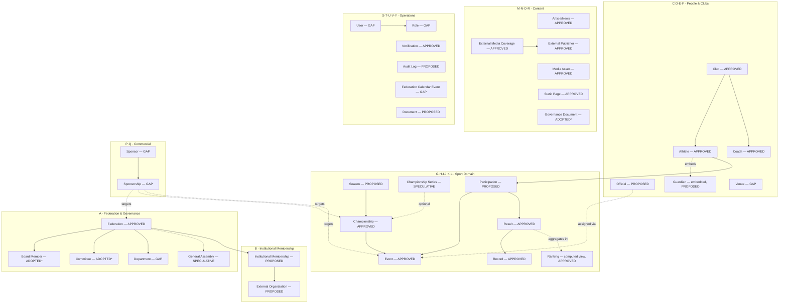

# UAEAF — Database Architecture (Domain-First, MongoDB)

**Document ID:** DB-ARCH-006
**Version:** 1.0.0
**Status:** Draft — architecture only, no schema/API/frontend/backend code produced. Pending Product Owner review (§20).
**Prepared:** August 2026
**Stage:** Architecture / Discovery — no Mongoose models, no APIs, no production database exist yet. This document is the required precondition for that work, not a substitute for it.

> **Format note, stated once:** this document uses compact tables over paragraph-per-field description, consistent with `00-MASTER-SPECIFICATION.md` and `03-Content-Data-Structuring-Document.md`. Entity IDs (`ENT-`), collection names, and field names are kept in English/Latin script throughout, as engineering identifiers — this mirrors the convention already established in `03-Content-Data-Structuring-Document.md` §4.

---

## 0. Document Control

| Field | Value |
|---|---|
| Owner | Backend/Data Architecture, reviewed by Product Owner |
| Governs | MongoDB logical + physical data architecture only |
| Does not govern | Design tokens, components, UI, API contracts, authentication implementation, Mongoose syntax |
| Modification safety | This file is new. No Design System chapter, ADR, `CLAUDE.md`, Master Specification, Content-Data Specification, or code was modified to produce it. |
| Primary sources | `03-Content-Data-Structuring-Document.md` v2.0.0 (entity/field/relationship authority), `00-MASTER-SPECIFICATION.md` v0.2.0 (page/entity cross-reference), `docs/design-system/10-Sports-Specific-Scenarios.md` (Results business rules), `05-Client-Requirements-Register-2026-08.md` (two speculative entities, §16) |
| Change process | Chapter 22's change process, applied to this document, same as Master Specification §60 |

---

## 1. Purpose & Scope

This document translates the already-approved-for-review UAEAF business/domain model (`03-Content-Data-Structuring-Document.md`) into a MongoDB logical and physical architecture: collections, embed/reference decisions, relationships, query patterns, and indexes. It performs no new business discovery — every entity, field, and open decision below is **inherited**, not re-derived. Where the source document marks a decision `مقترح — يحتاج اعتماد الاتحاد` (proposed, needs Federation approval) or `غير محسوم` (unresolved), this document designs a storage shape for it but does not resolve the business question itself.

**In scope:** logical/physical MongoDB architecture for all 38 entities in the source registry, plus two speculative entities surfaced by the August 2026 client meeting but not yet in any entity registry.

**Out of scope (per governing task instruction, Phase 14):** Mongoose schemas, NestJS/Express modules, controllers, services, REST/GraphQL contracts, frontend code, database migrations, seed data. **No implementation artifact exists beyond this document and the Figma diagram planned as a follow-up (§21).**

---

## 2. Source-of-Truth & Governance

Same hierarchy as every other UAEAF product document (`CLAUDE.md` §1, Master Spec §04):

1. Explicit current Product Owner/Federation instruction
2. `03-Content-Data-Structuring-Document.md` (frozen entity/field/relationship model, once approved)
3. `00-MASTER-SPECIFICATION.md`
4. Approved ADRs (embedded in Design System chapters)
5. This document's own architectural recommendation — **lowest priority**, always labeled as such, never presented as a business decision

A lower-priority source never silently overrides a higher one. Every entity below carries the governance status it already had in the source registry — this document adds a storage decision on top, it does not change the status.

**Database engine:** MongoDB, per this task's own framing and the presence of `.agents/skills/mongodb-schema-design`/`mongodb-query-optimizer` in-repo. Flagged for completeness: `docs/design-system/21-Technical-Architecture.md` ADR-0033 (Technical Stack Confirmation) formally confirms frontend (Next.js/React), backend (Express/Nest.js), and styling stack, but **does not name a database engine** — this is a minor documentation gap, not a conflict, since no other document names a competing engine either.

---

## 3. Architectural Principles

Six cross-cutting rules, agreed before entity-level design and applied consistently across all 38 entities below.

### 3.1 Embed vs. Reference

**Reference** relationships that grow unboundedly or need independent querying (Result, Participation, Article, Media Asset, Audit Log — never embedded in a parent). **Embed** only small, bounded, always-co-accessed sub-documents (Guardian inside Athlete, multilingual field pairs, term-date pairs). **Extended Reference** (cache a small denormalized snapshot on the referencing document) for relationships a public page renders on every hit — this is not a new pattern invented here: `03-Content-Data-Structuring-Document.md` §8.11 already specifies exactly this for Participation's "Club (at time of entry)" field, described there as a snapshot that "preserves historical accuracy even if the athlete later transfers." This document generalizes that same technique platform-wide rather than introducing a second one.

### 3.2 Multilingual Fields

Every field marked `Multilingual? = Yes` in the source document becomes one embedded object, not two top-level fields or two documents: `name: { en: String, ar: String }`. Both language values are always written and read together — this is the same "accessed together, stored together" principle, applied to language rather than relationship.

### 3.3 Polymorphic References

`Document.owningEntity` (§8.25) and `Sponsorship.target` (§8.15) reference more than one collection type. Both use a type-discriminator + reference pair (`{ targetType: 'Championship', targetId: ObjectId }`) rather than one collection per owner type — this is the documented reason those two entities were split out as their own collections in the source specification, not a new decision.

### 3.4 Computed / Derived Data (ADR-0020)

No computed value is ever independently editable or independently stored as a second source of truth. `Ranking` (ENT-006) is never a collection of record — it is produced by an aggregation pipeline against `results`, optionally materialized into a small, explicitly-labeled, fully-rebuildable `rankingsCache` collection refreshed when a Result is verified (MongoDB Computed pattern), to keep the public Rankings page from re-aggregating on every request. The same rule applies to every `Calculated? = Yes` field in the source registry (athlete medal count, club athlete count, etc.): each is either computed at read time or cached with a documented refresh trigger, never hand-edited.

### 3.5 Dual State Machines

Registry entities (Result, Event, Participation) carry `verificationStatus` (`Entered → Pending Verification → Verified/Official`). CMS entities (Article, Static Page, External Media Coverage, Governance Document) carry `publicationState` (`Draft → In Review → Approved/Rejected → Scheduled → Published → Archived`). These are never merged into one enum — already an explicit rule in Master Spec §57, applied here, not invented here.

### 3.6 Governance-Status Tagging

Every collection below carries the same status the entity already had in `03-Content-Data-Structuring-Document.md` §6:

| Badge | Meaning |
|---|---|
| **APPROVED** | Fully governed, no structural blocker |
| **ADOPTED — PENDING RATIFICATION** | Schema/Figma decision made this season (ADR-numbered), Federation sign-off still outstanding |
| **PROPOSED** | Structurally modeled and recommended, entity/cardinality/enum still `غير محسوم` |
| **GAP** | No entity/content type exists in any governing document today |
| **SPECULATIVE** | Not in the 38-entity registry at all — surfaced only by the August 2026 client meeting notes, zero field-level specification anywhere |

This document never upgrades a badge. A collection design existing below is not equivalent to Federation approval of the business decision behind it.

### 3.7 Schema Validation

Every collection uses MongoDB `$jsonSchema` validation, starting at `validationLevel: "moderate"` / `validationAction: "warn"` (per the mongodb-schema-design skill's own guidance) so early data-entry mistakes surface without hard-blocking a young CMS/dashboard, tightening to `strict`/`error` once each domain stabilizes past initial Federation content entry.

---

## 4. Domain Map


*ADOPTED = ADOPTED — PENDING RATIFICATION (space constraints).*

---

## 5. Entity Inventory & Governance Status

| ID | Entity | Collection | Cluster | Status | Aggregate Root? |
|---|---|---|---|---|---|
| ENT-001 | Federation | `federation` | A | APPROVED | Yes (singleton) |
| ENT-002 | Season | `seasons` | G | PROPOSED | Yes |
| ENT-003 | Championship | `championships` | H | APPROVED | Yes |
| ENT-004 | Event | `events` | I | APPROVED | Yes |
| ENT-005 | Result | `results` | K | APPROVED | Yes |
| ENT-006 | Ranking | *(no collection — aggregation)* / `rankingsCache` | K | APPROVED | No (derived) |
| ENT-007 | Record | `records` | L | APPROVED | Yes |
| ENT-008 | Athlete | `athletes` | D | APPROVED | Yes |
| ENT-009 | Club | `clubs` | C | APPROVED | Yes |
| ENT-010 | Coach | `coaches` | E | APPROVED | Yes |
| ENT-011 | Official | `officials` | F | PROPOSED | Yes |
| ENT-012 | Venue | `venues` | H | GAP | Yes |
| ENT-013 | Board Member | `boardMembers` | A | ADOPTED* | Yes |
| ENT-014 | Committee | `committees` | A | ADOPTED* | Yes |
| ENT-015 | Article/News | `articles` | M | APPROVED | Yes |
| ENT-016 | Media Asset | `mediaAssets` | O | APPROVED | Yes |
| ENT-017 | Discipline | `disciplines` | I | APPROVED | Yes (small ref.) |
| ENT-018 | External Media Coverage | `externalMediaCoverage` | N | APPROVED | Yes |
| ENT-019 | External Publisher | `externalPublishers` | N | APPROVED | Yes (small ref.) |
| ENT-020 | Sponsor/Partner | `sponsors` | P | GAP | Yes |
| ENT-021 | Institutional Membership | `institutionalMemberships` | B | PROPOSED | Yes |
| ENT-022 | Static Page | `staticPages` | R | APPROVED | Yes |
| ENT-023 | User | `users` | S | GAP | Yes |
| ENT-024 | Country/Emirate | `countries` | C | APPROVED | Yes (small ref.) |
| ENT-025 | Department | `departments` | A | GAP | Yes (small ref.) |
| ENT-026 | External Organization | `externalOrganizations` | B | PROPOSED | Yes |
| ENT-027 | Participation/Entry | `participations` | J | PROPOSED | Yes |
| ENT-028 | Sponsorship | `sponsorships` | Q | GAP | Yes |
| ENT-029 | Role | `roles` | S | GAP | Yes |
| ENT-030 | Notification | `notifications` | T | APPROVED | Yes |
| ENT-031 | Audit Log Entry | `auditLogs` | U | PROPOSED | Yes |
| ENT-032 | Federation Calendar Event | `calendarEvents` | V | GAP | Yes |
| ENT-033 | Document | `documents` | Y | PROPOSED | Yes |
| ENT-034 | Guardian | *(embedded in `athletes`)* | D | PROPOSED | No |
| ENT-035 | Athlete–Club Affiliation History | `athleteClubHistory` | D | PROPOSED | Yes |
| ENT-036 | Coach–Club Assignment | `coachClubAssignments` | E | PROPOSED | Yes (junction) |
| ENT-037 | Official Assignment | `officialAssignments` | F | PROPOSED | Yes (junction) |
| ENT-038 | Governance Document | `governanceDocuments` | A | ADOPTED* | Yes |
| — | General Assembly (meeting) | `generalAssemblyMeetings` | A | **SPECULATIVE** | Yes |
| — | Championship Series | `championshipSeries` | G | **SPECULATIVE** | Yes |

*ADOPTED = ADOPTED — PENDING RATIFICATION.* 38 registered entities + 2 speculative = 40 rows: 36 get a genuine standalone collection, 1 is embedded (Guardian, no collection), 1 is a derived view with an optional rebuildable cache rather than a true collection (Ranking), and the 2 speculative entities each get a placeholder collection.

---

## 6. Aggregate Roots

An **aggregate root** here means: a collection that is queried directly and owns its own lifecycle, as opposed to a sub-document that only ever exists nested inside a parent. Every collection in §5 is an aggregate root except:

- **Guardian (ENT-034)** — embedded array inside `athletes`. It is never queried independently (no "list all guardians across the Federation" use case exists anywhere in the source documents), always read/written alongside the minor athlete's own record, and bounded (a handful of guardians per athlete at most).
- **Ranking (ENT-006)** — not a stored aggregate at all; a derived view. `rankingsCache`, if built, is a rebuildable cache, not an independently-owned aggregate — it has no create/update/delete lifecycle of its own, only a rebuild trigger.

Two collections are explicitly **junction/relationship aggregates** rather than simple sub-documents, because their cardinality is itself an open business question (§3, `03-Content-Data-Structuring-Document.md` §24): `coachClubAssignments` (ENT-036) and `officialAssignments` (ENT-037). Modeling these as their own collections now means a future Federation decision to go from 1:1 to N:N costs a data migration, not a schema redesign.

---

## 7. Relationship Matrix & Cardinality

Consolidated from `03-Content-Data-Structuring-Document.md` §9, with the MongoDB implementation added. Purely reference/taxonomy edges (Discipline, Country, Venue as simple lookups) are listed but omitted from the Domain Relationship diagram (§15.2) for legibility.

| From | To | Relationship | Cardinality | Implementation | Status |
|---|---|---|---|---|---|
| Season | Championship | contains | 1:N | `championships.seasonId` (reference) | PROPOSED |
| Championship Series *(spec.)* | Championship | groups | 1:N | `championships.seriesId` (nullable reference) | SPECULATIVE |
| Championship | Event | contains | 1:N | `events.championshipId` (reference) | APPROVED |
| Championship | Venue | held at | N:1 | `championships.venueId` (reference) | Championship APPROVED / Venue GAP |
| Event | Discipline | classified as | N:1 | `events.disciplineId` (reference) | APPROVED |
| Athlete | Participation | enters | 1:N | `participations.athleteIds[]` (reference array — team/relay case) | PROPOSED |
| Participation | Event | for | N:1 | `participations.eventId` (reference) | PROPOSED |
| Participation | Result | produces | 1:0..1 | `results.participationId` (reference; not every Participation has one) | PROPOSED |
| Event | Result | produces | 1:N | `results.eventId` (reference, denormalized) | APPROVED |
| Result | Record | may qualify as | 1:0..1 | `records.resultId` (reference) | APPROVED |
| Record | Record | superseded by | 0..1 self | `records.supersededById` (nullable self-reference) | APPROVED |
| Athlete | Club | affiliated with | N:0..1 | `athletes.clubId` (nullable reference; null = "Directly affiliated with the Federation") | APPROVED |
| Athlete | Athlete–Club History | has | 1:N | `athleteClubHistory.athleteId` (reference) | PROPOSED |
| Athlete | Guardian | has (if minor) | 1:0..N | embedded array `athletes.guardians[]` | PROPOSED |
| Coach | Club | assigned to, via Assignment | N:0..N | `coachClubAssignments.{coachId, clubId}` (junction) | PROPOSED (cardinality open) |
| Official | Event/Championship, via Assignment | assigned to | N:N | `officialAssignments.{officialId, targetType, targetId}` (polymorphic junction) | PROPOSED (granularity open) |
| Article | Athlete/Club/Championship | references | N:0..N | `articles.references[]` (reference array, one-way) | APPROVED |
| External Media Coverage | External Publisher | attributes to | N:1 | `externalMediaCoverage.publisherId` (reference) | APPROVED |
| Federation | Institutional Membership | holds | 1:N | `institutionalMemberships.federationId` (reference; effectively constant) | PROPOSED |
| Institutional Membership | External Organization | with | N:1 | `institutionalMemberships.organizationId` (reference) | PROPOSED |
| Committee | Board Member | chaired by | N:1 | `committees.chairId` (reference) | ADOPTED* |
| Board Member | Committee | member of | N:N | `boardMembers.committeeIds[]` (reference array) | ADOPTED* |
| Sponsor | Sponsorship | issues | 1:N | `sponsorships.sponsorId` (reference) | GAP |
| Sponsorship | Federation \| Championship \| Event | targets | N:1 (polymorphic) | `sponsorships.{targetType, targetId}` | GAP |
| Club/Athlete/Coach/Official/Championship/Institutional Membership/Sponsorship | Document | owns | 1:N (polymorphic) | `documents.{ownerType, ownerId}` | PROPOSED |
| All entities with sensitive/admin changes | Audit Log Entry | logged by | 1:N | `auditLogs.{entityType, entityId}` | PROPOSED |
| General Assembly Meeting *(spec.)* | Club | attended by | N:N | `generalAssemblyMeetings.attendingClubIds[]` (reference array) | SPECULATIVE |

---

## 8. Collection Map — Storage Decisions

Organized by the same eight functional clusters as `03-Content-Data-Structuring-Document.md` §5. Each row states the storage decision and rationale; it does **not** repeat the full field table already published in that document — this document is the MongoDB layer on top of it, not a replacement for it.

### 8.1 Cluster A — Federation & Governance

| Collection | Decision | Rationale |
|---|---|---|
| `federation` | Own collection, single document (or a `type: 'singleton'` guard) | ENT-001 is explicitly a singleton — no list/query use case, just one anchor record for `Organization` SEO schema (Ch.14) |
| `boardMembers` | Own collection | Independently listed/sorted (`displayOrder`), independently queried by "Is Chairman" |
| `committees` | Own collection, references `boardMembers` (`chairId`) | A Committee's chair may hold a separate Board officer title — must stay a reference, not a duplicated name (source doc §8.1's own explicit reasoning) |
| `departments` | Own collection (small reference list) | Currently a flat IA listing page; modeled as a minimal collection now so it costs nothing to promote later, per GAP status — no speculative fields added beyond what's already named (name, function summary, contact) |
| `generalAssemblyMeetings` **(SPECULATIVE)** | Own collection, `attendingClubIds[]` referencing `clubs` | Placeholder only — sketch below (§16) |

### 8.2 Cluster B — Institutional Membership

| Collection | Decision | Rationale |
|---|---|---|
| `institutionalMemberships` | Own collection, references `federation` + `externalOrganizations` | N:N in spirit (Federation could in theory hold multiple memberships with the same org over time) but modeled 1 doc per membership period for historical accuracy — never a repeating array on Federation |
| `externalOrganizations` | Own collection, small reference data | Split from the membership relationship specifically so the same organization (e.g., Asian Athletics) isn't re-entered per membership record — exactly the reason the source document split ENT-026 out of ENT-021 |

### 8.3 Cluster C·D·E·F — People & Clubs

| Collection | Decision | Rationale |
|---|---|---|
| `clubs` | Own collection | Aggregate root, referenced by Athlete/Coach/Championship |
| `athletes` | Own collection. Embeds: `name{en,ar}`, `guardians[]` (bounded), photo/consent flags. References: `clubId` (nullable), `nationalityId`→`countries`, `disciplineIds[]`→`disciplines`. Denormalized: none stored on Athlete itself (Athlete is the "one" side other collections denormalize *from*, e.g. Result caches Athlete's name, not vice versa) | Athlete is the platform's most-read entity (best-governed people entity, Master Spec §13) — kept as the canonical source so every extended-reference snapshot elsewhere points back to one place |
| `athleteClubHistory` | Own collection (not embedded in Athlete) | A career-spanning transfer history is bounded per athlete but is *also* a federation-wide dashboard query ("all transfers this season," Master Spec Club management use case) — a separate, indexable, append-only collection serves both access patterns; embedding would only serve the per-athlete read |
| `coaches` | Own collection | Aggregate root |
| `coachClubAssignments` | Own junction collection, `{coachId, clubId, startDate, endDate}` | Cardinality (`1:1` vs `N:N`) is explicitly `غير محسوم` — a junction collection absorbs either outcome without a schema migration; collapsing to a simple `coaches.clubId` field now would need to be undone later |
| `officials` | Own collection, `roleType` enum field (Option A baseline per source doc §8.7, not a decision — see §17 Risks) | One collection with a role-type discriminator is the lower-risk default until Federation confirms whether Referee/Technical Official/Judge/Timekeeping/Results genuinely need different field shapes (Option B) |
| `officialAssignments` | Own polymorphic junction collection, `{officialId, targetType: 'Event'|'Championship', targetId}` | Granularity (per-Event vs. per-Championship) is `غير محسوم` — polymorphic target absorbs either without a redesign |
| `venues` | Own collection (small reference data) | GAP — currently only a text field on Championship; modeled as its own minimal collection (name, city/emirate, capacity — no fields invented beyond what's implied by "used as a Championship location") so Championship can reference it instead of duplicating venue text per record |
| `countries` | Own collection (small reference data) | Referenced by Athlete (nationality), Club (emirate) — kept as its own admin-manageable list rather than a hardcoded enum, since UAE emirates + international nationalities both flow through this one field |

### 8.4 Cluster G·H·I·J·K·L — Sport Domain

| Collection | Decision | Rationale |
|---|---|---|
| `seasons` | Own collection | PROPOSED — modeled per §8.8 spec regardless of adoption status, so Championship has somewhere to point once Season is approved |
| `championshipSeries` **(SPECULATIVE)** | Own collection, `championships.seriesId` optional back-reference | Placeholder only — sketch below (§16) |
| `championships` | Own collection. References: `seasonId` (nullable until Season adopted), `venueId`, computed `participatingClubIds` (never stored, always derived from Participation per ADR-0020) | Sponsors are explicitly **never** a direct field here (source doc §8.9: "never a direct sponsor field") — always via `sponsorships` |
| `events` | Own collection. References: `championshipId`, `disciplineId`. Embeds: nothing unbounded | An Event's Participants/Results are referenced collections, not embedded arrays — a Championship's full event list across careers-worth of Results would blow past sane document size otherwise |
| `disciplines` | Own collection (small reference/taxonomy) | Filter vocabulary, admin-manageable, referenced by Event/Athlete/Coach/Official |
| `participations` | Own collection. References: `eventId`, `athleteIds[]` (array for relay teams). Denormalized: `clubAtEntry` snapshot (explicit in source spec §8.11) | This is the entity the source document itself calls out as the newly-identified structural gap — modeled as its own collection precisely because a Participation can exist (Withdrawn/DNS) with zero corresponding Result |
| `results` | Own collection. References: `participationId`, `eventId` (denormalized for query convenience, as the source doc itself specifies), `athleteId`/`clubId`. Denormalized: athlete/club name+slug snapshot (extended reference) so `CMP-RESULTSTABLE-001` renders without joins. Embeds: `attempts[]` sub-array for field events (bounded — a handful of attempts per athlete per event, never independently queried, Ch.10 §10.7) | Highest-traffic collection on the site; extended-reference on Athlete/Club is what makes Results Table and Rankings pages fast without a `$lookup` per row |
| *(no collection)* / `rankingsCache` | Aggregation pipeline over `results`, optionally materialized | Per Principle §3.4 — never an independent source of truth |
| `records` | Own collection, references `resultId`, self-references `supersededById` | `category` stored as the governed enum (Ch.10 §10.10), extensible without a code change per that chapter's own rule |

### 8.5 Cluster M·N·O·R — Content

| Collection | Decision | Rationale |
|---|---|---|
| `articles` | Own collection. Embeds: `title{en,ar}`, `body{en,ar}`. References: `coverMediaId`, `references[]` (polymorphic-lite array to Athlete/Club/Championship, one-way, never restates the referenced fact per Ch.13 §7) | CMS entity, `publicationState` lifecycle (§3.5) |
| `mediaAssets` | Own collection | Referenced by Article, Static Page, Athlete photo, Club logo/cover, Governance Document, etc. — reusable file entity, never duplicated per referencing entity |
| `externalMediaCoverage` | Own collection, references `publisherId` | Best-governed content feature in the platform (ADR-0042) — no new modeling decision here, only the collection shape |
| `externalPublishers` | Own collection (small reference data) | Deliberately minimal by design — name/URL only, per source doc's explicit "correctly unmodeled beyond attribution" |
| `staticPages` | Own collection, optional `featuredImageId` (ADR-0044) | CMS entity, `publicationState` lifecycle |

### 8.6 Cluster P·Q — Commercial

| Collection | Decision | Rationale |
|---|---|---|
| `sponsors` | Own collection | GAP — highest-priority content type absence platform-wide; modeled here at the field shape the source doc already specifies (§8.14) so the moment Federation approves it, no redesign is needed |
| `sponsorships` | Own collection, polymorphic `{targetType, targetId}` | The reason this is its own collection rather than a `sponsorId` field on Championship/Event: the same Sponsor can back multiple targets concurrently, and a target can have multiple sponsors — a direct field cannot represent that N:N, and per-relationship data (tier, dates, contract) differs per pairing even for the same Sponsor (source doc §8.15's own explicit rationale, not new reasoning here) |

### 8.7 Cluster S·T·U·V·Y — Operations

| Collection | Decision | Rationale |
|---|---|---|
| `users` | Own collection | GAP — deepest gap in the whole audit; modeled minimally (name, email, roleId, accountStatus) without inventing an authentication implementation, per explicit out-of-scope instruction (source doc §8.20) |
| `roles` | Own collection, split from User | Configuration entity, reusable across many Users — building against the generic Editor/Approver/Publisher trio only (Master Spec §53/§58), never the unvalidated 13-role IA list |
| `notifications` | Own collection | Channel architecture governed (Ch.18 ADR-0030); this is the entity-level shape the source document adds on top |
| `auditLogs` | Own collection, append-only, polymorphic `{entityType, entityId}` | High write volume, never updated after insert — a natural future candidate for the MongoDB Archive pattern once retention volume matters (not needed at current federation scale, flagged for later, §11) |
| `calendarEvents` | Own collection | GAP — whether this domain should be built at all is still open; modeled at the minimal shape already sketched (§8.24) so a "yes" decision doesn't require new discovery |
| `documents` | Own collection, polymorphic `{ownerType, ownerId}` | One reusable file/metadata collection referenced by Club, Athlete, Coach, Official, Championship, Institutional Membership, Sponsorship — the exact reason ENT-033 was split out as its own entity in the source document rather than re-defined per owner |

---

## 9. Illustrative Document Shapes

Full field-by-field detail lives in `03-Content-Data-Structuring-Document.md` §8 — these shapes exist only to demonstrate how Principles §3.1–3.3 apply to the platform's most architecturally significant collections. Types are indicative (BSON), not a schema definition.

```jsonc
// athletes — canonical source; other collections denormalize FROM this, never into it
{
  _id: ObjectId,
  name: { en: String, ar: String },
  slug: String,                         // unique, indexed
  dateOfBirth: Date,                    // RESTRICTED
  nationalityId: ObjectId,              // ref -> countries
  clubId: ObjectId | null,              // ref -> clubs; null = "Directly affiliated with the Federation"
  disciplineIds: [ObjectId],            // ref[] -> disciplines
  guardians: [                          // EMBEDDED — bounded, always co-accessed, RESTRICTED/SENSITIVE
    { name: String, relationship: String, phone: String, nationalIdRef: ObjectId, consentDocId: ObjectId, consentDate: Date }
  ],
  registrationNumber: String,           // ADMIN_ONLY, unique
  restricted: { emiratesIdOrPassport: String, address: String, phone: String, email: String }, // RESTRICTED
  status: String,                       // enum, proposed (§10)
  createdAt: Date, updatedAt: Date
}

// participations — Principle §3.1 extended-reference example, cited from source doc §8.11
{
  _id: ObjectId,
  athleteIds: [ObjectId],               // ref[] -> athletes (array to support relay teams)
  eventId: ObjectId,                    // ref -> events
  clubAtEntry: { id: ObjectId | null, name: { en: String, ar: String } }, // DENORMALIZED SNAPSHOT — never re-synced if athlete transfers later
  status: String,                       // enum: Draft/Registered/Eligible/Confirmed/Withdrawn/DNS/Participated/Disqualified — PROPOSED, not final
  bib: String, lane: Number,
  entryDate: Date
}

// results — hot-path collection, extended-reference on Athlete/Club
{
  _id: ObjectId,
  participationId: ObjectId,            // ref -> participations
  eventId: ObjectId,                    // ref -> events, denormalized for query convenience (source doc's own instruction)
  athleteRef: { id: ObjectId, name: { en: String, ar: String }, slug: String }, // DENORMALIZED
  clubRef:    { id: ObjectId | null, name: { en: String, ar: String } } | null, // DENORMALIZED
  rank: Number,                         // repeatable across ties, next rank skipped (Ch.10 §10.9)
  performanceValue: String,             // format per discipline group, Ch.10 §10.1
  attempts: [                           // EMBEDDED — bounded, never independently queried (Ch.10 §10.7)
    { seq: Number, value: String, wind: Number | null, symbol: String | null } // symbol: 'X' | 'Pass' | 'NM'
  ],
  medal: String | null,
  windReading: Number | null,
  recordFlag: ObjectId | null,          // ref -> records, set only if valid (Ch.10 §10.8)
  verificationStatus: String,           // Entered -> Pending Verification -> Verified/Official (Ch.10, Principle §3.5)
  enteredBy: ObjectId, verifiedBy: ObjectId | null // ref -> users
}

// sponsorships — Principle §3.3 polymorphic-target example
{
  _id: ObjectId,
  sponsorId: ObjectId,                  // ref -> sponsors
  targetType: String,                   // enum: 'Federation' | 'Championship' | 'Event'
  targetId: ObjectId,                   // ref -> federation | championships | events, per targetType
  tier: String,                         // enum, proposed
  startDate: Date, endDate: Date,
  status: String                        // Active/Expired/Cancelled — proposed
}

// documents — Principle §3.3 polymorphic-owner example
{
  _id: ObjectId,
  file: { url: String, mimeType: String, size: Number },
  documentType: String,                 // License/Certificate/Regulation/Contract/Identity/Medical/Other — drives default visibility
  ownerType: String,                    // enum: 'Club' | 'Athlete' | 'Coach' | 'Official' | 'Championship' | 'InstitutionalMembership' | 'Sponsorship'
  ownerId: ObjectId,
  uploadDate: Date, expiryDate: Date | null
}
```

---

## 10. Query-First Design

Per-surface data needs, per this task's own required breakdown. Frequency is relative (High/Medium/Low), used to prioritize §11 indexing, not a measured metric.

### 10.1 Website

| Page/Query | Data Required | Source Collections | Freq. | Index Support |
|---|---|---|---|---|
| Athlete Detail | Athlete + denormalized Club name + Results list + Records + related News | `athletes`, `results` (by `athleteRef.id`), `records`, `articles` (by `references`) | High | `athletes.slug` (unique), `results.athleteRef.id` |
| Athlete Results History (PAGE-009a) | Paginated Results for one athlete, chronological | `results` | Medium | `{ athleteRef.id: 1, eventId: 1 }` via Event→Championship date |
| Championship Detail | Championship + Season + Event list + Sponsorships | `championships`, `events` (by `championshipId`), `sponsorships` (by `target`) | High (once template exists, OPEN-015) | `championships.slug`, `events.championshipId` |
| Event Detail | Event + Participation list + Results (verified only, public) | `events`, `participations` (by `eventId`), `results` (by `eventId`, `verificationStatus: 'Verified'`) | High | `{ eventId: 1, verificationStatus: 1 }` on `results` |
| Results & Rankings | Verified Results, sorted per Discipline Group's `sortDirection` (Ch.10 §10.1) | `results` | High | `{ eventId: 1, rank: 1 }`, `{ verificationStatus: 1, updatedAt: -1 }` |
| National Records | Records filtered by `category` | `records` | Medium | `{ category: 1, disciplineId: 1 }` |
| Athletes Listing (filters) | Athletes by Discipline/Club/Nationality, paginated | `athletes` | High | `{ disciplineIds: 1 }`, `{ clubId: 1 }`, `{ nationalityId: 1 }` |
| Club Detail | Club + Athlete roster + Coach roster (computed counts) | `clubs`, `athletes` (by `clubId`), `coaches` (via `coachClubAssignments`) | High | `athletes.clubId`, `coachClubAssignments.clubId` |
| News Listing/Detail | Article by publication state + optional entity references | `articles` | High | `{ publicationState: 1, publishDate: -1 }`, `slug` (unique) |
| UAEAF in the Media | External Media Coverage, latest-first, `featured` override | `externalMediaCoverage` | High | `{ publicationState: 1, featured: -1, originalPublishDate: -1 }` |
| Media Centre | Media Assets by association/album | `mediaAssets` | Medium | `{ associatedChampionshipId: 1 }`, `{ albumGrouping: 1 }` |
| Board of Directors / Committees | Board Members + Committees (with chair reference) | `boardMembers`, `committees` | Low | `{ displayOrder: 1 }` |
| Search | Published/verified content only, excludes drafts/unverified (IA §8.7) | `articles`, `athletes`, `clubs`, `championships` (Atlas Search or text index candidate) | Medium | Text index per collection, or Atlas Search (future) |

### 10.2 Admin Dashboard

| Feature | Data Required | Source Collections | Freq. | Index Support |
|---|---|---|---|---|
| Result Entry/Review | Unverified Results by Event, edit history | `results`, `auditLogs` | High | `{ eventId: 1, verificationStatus: 1 }` |
| Athlete/Club/Coach/Official Management | CRUD lists, filtered/sorted by status | `athletes`, `clubs`, `coaches`, `officials` | High | `{ status: 1, registrationNumber: 1 }` per collection |
| Club Roster / Transfer Review | Cross-athlete transfer history, this season | `athleteClubHistory` | Medium | `{ transferDate: -1 }`, `{ newClubId: 1 }` |
| CMS Content Registry | Article/Page/Media/ExternalMedia by workflow state | `articles`, `staticPages`, `mediaAssets`, `externalMediaCoverage` | High | `{ publicationState: 1, updatedAt: -1 }` per collection |
| Sponsorship Management | Active/expiring Sponsorships by target | `sponsorships` | Medium | `{ targetType: 1, targetId: 1, status: 1 }` |
| Audit Log Viewer (Super Admin) | Entries by actor/entity/date range | `auditLogs` | Low | `{ entityType: 1, entityId: 1, timestamp: -1 }`, `{ actorId: 1, timestamp: -1 }` |
| Notification Configuration | Recipient + trigger event mapping | `notifications` | Low | `{ recipientId: 1, readState: 1 }` |

### 10.3 Mobile (future, per source doc §21 readiness table)

Identical read shapes to Website §10.1 for Athlete/Club/Championship/Event/Result/Record/News/External Media/Media — no mobile-specific document shape required, consistent with ADR-0020 (presentation-agnostic entities by construction). Live Results and Push Notifications are the two mobile-first use cases named in the source document; both read from `results`/`notifications` as already shaped above.

---

## 11. Index Strategy

Indexes are proposed **only** against the query patterns in §10 — no index exists here "because a field might be filtered on someday."

| Collection | Index | Type | Purpose |
|---|---|---|---|
| `athletes` | `{ slug: 1 }` | Unique | Detail page lookup |
| `athletes` | `{ clubId: 1 }`, `{ disciplineIds: 1 }`, `{ nationalityId: 1 }` | Standard | Listing filters (§10.1) |
| `athletes` | `{ registrationNumber: 1 }` | Unique, sparse | Admin uniqueness (source doc BR-011, unresolved issuing authority — index still valid regardless) |
| `clubs` | `{ slug: 1 }` | Unique | Detail page lookup |
| `championships` | `{ slug: 1 }` | Unique | Detail page lookup |
| `championships` | `{ seasonId: 1 }` | Standard | Season rollup, once adopted |
| `events` | `{ championshipId: 1 }` | Standard | Championship's Event list |
| `events` | `{ championshipId: 1, dateTime: 1 }` | Compound | Schedule ordering |
| `participations` | `{ eventId: 1, status: 1 }` | Compound | Event's entry list by status |
| `participations` | `{ athleteIds: 1 }` | Standard (multikey) | Athlete's participation history |
| `results` | `{ eventId: 1, rank: 1 }` | Compound | Results Table default sort |
| `results` | `{ eventId: 1, verificationStatus: 1 }` | Compound | Public/unofficial split (Ch.10 §10.2, BR-002) |
| `results` | `{ athleteRef.id: 1, eventId: -1 }` | Compound | Athlete Results History |
| `records` | `{ category: 1, disciplineId: 1 }` | Compound | Records listing by category |
| `records` | `{ resultId: 1 }` | Unique | 1:1 back-reference integrity |
| `articles` | `{ slug: 1 }` | Unique | Detail page lookup |
| `articles` | `{ publicationState: 1, publishDate: -1 }` | Compound | Listing/feed ordering |
| `externalMediaCoverage` | `{ publicationState: 1, featured: -1, originalPublishDate: -1 }` | Compound | Homepage carousel + archive ordering (ADR-0042) |
| `mediaAssets` | `{ associatedChampionshipId: 1 }`, `{ associatedAthleteId: 1 }` | Standard | Gallery association queries |
| `sponsorships` | `{ targetType: 1, targetId: 1, status: 1 }` | Compound | "Sponsors for this Championship/Event/Federation" |
| `sponsorships` | `{ sponsorId: 1 }` | Standard | "All targets for this Sponsor" |
| `documents` | `{ ownerType: 1, ownerId: 1 }` | Compound | Polymorphic owner lookup |
| `auditLogs` | `{ entityType: 1, entityId: 1, timestamp: -1 }` | Compound | Per-record audit trail |
| `auditLogs` | `{ actorId: 1, timestamp: -1 }` | Compound | Per-user activity |
| `athleteClubHistory` | `{ athleteId: 1, transferDate: -1 }` | Compound | Per-athlete history |
| `athleteClubHistory` | `{ transferDate: -1 }` | Standard | Federation-wide "transfers this season" dashboard query |
| `notifications` | `{ recipientId: 1, readState: 1, timestamp: -1 }` | Compound | Notification Centre |
| `institutionalMemberships` | `{ organizationId: 1, status: 1 }` | Compound | Active membership lookups |
| `coachClubAssignments` | `{ coachId: 1 }`, `{ clubId: 1 }` | Standard | Bidirectional junction lookup |
| `officialAssignments` | `{ officialId: 1 }`, `{ targetType: 1, targetId: 1 }` | Standard | Bidirectional junction lookup |
| `boardMembers` | `{ displayOrder: 1 }`, `{ isChairman: 1 }` | Standard | Board Grid ordering, Chairman lookup |

No index is proposed for `federation` (singleton), `countries`/`disciplines`/`venues`/`externalPublishers`/`departments` (small reference collections, full-collection scans are cheap at their expected size), or `rankingsCache` (rebuilt wholesale, not queried by a variable key beyond `disciplineId`/`category`, which gets a single compound index once the cache is actually built).

---

## 12. Historical Data Strategy

| Domain | Strategy | Rationale |
|---|---|---|
| Athlete–Club transfers | Append-only `athleteClubHistory` collection, never overwritten (source doc §22) | "Never lose historical business information" — a transfer must not silently erase the prior affiliation |
| Result verification | `verificationStatus` never regresses silently; corrections create an audit trail entry, not a silent overwrite | BR-002: no unverified figure is ever publicly rendered as fact; a correction to a *verified* Result must be traceable |
| Record superseding | `records.supersededById` self-reference chain, old record never deleted | Whether superseded records stay visible is `غير محسوم` (source doc §8.13) — the chain is preserved either way; visibility is a query-time filter, not a storage decision |
| Audit Log | Append-only, no update/delete operations exposed | Ch.17 requirement: 100% of Restricted/Sensitive access recorded |
| CMS content (Article/Page/External Media) | `Archived ≠ Deleted` (Ch.13 §6c) — Archived documents remain in their collection with a state flag, never moved or dropped | Matches the already-governed publishing lifecycle exactly |
| Retention periods (Audit Log, Documents post-expiry, Guardian consent post-majority) | **Not implemented** — no TTL index is set anywhere in this document | Every retention period is `غير محسوم — يتطلب اعتماد الاتحاد` (source doc §23); inventing a number here would silently resolve a Federation-level legal question |
| Scale-driven archival (MongoDB Archive pattern) | Not applied now | At current federation scale (~12 championships/season), `results`/`auditLogs` growth does not yet justify moving cold data to separate storage — flagged as a **future** consideration once multi-year volume is measured, not a day-one requirement |

---

## 13. Localization Strategy

Per Principle §3.2 and Ch.19 ADR-0031: every field marked `Multilingual? = Yes` in the source registry is an embedded `{ en, ar }` object, both values always authored independently (no machine translation). Gregorian storage is primary for every `Date`/`DateTime` field; a Hijri display layer is a presentation-time conversion, never a second stored date. **Known engineering gap, carried forward unchanged from the source document:** `apps/web/src/app/layout.js:52-53` hardcodes `lang="ar" dir="rtl"` with no toggle — every `{en, ar}` field designed here assumes a switch that does not exist in code today. This document does not resolve that gap; it is an engineering task, not a data modeling one (source doc §16/Master Spec CONF-007).

---

## 14. CMS Integration Strategy

Per Ch.13 (ADR-0024, Headless Business Platform) and Master Spec §57: the CMS never directly couples to the frontend, and registry data (`athletes`, `championships`, `results`, …) is never owned by a CMS content type. The boundary in this data architecture:

- **Registry collections** (`athletes`, `clubs`, `coaches`, `officials`, `championships`, `events`, `participations`, `results`, `records`, `seasons`, `venues`, `disciplines`, `countries`) — entered via Admin Dashboard, governed by `verificationStatus` (Principle §3.5), never a `publicationState`.
- **CMS collections** (`articles`, `staticPages`, `mediaAssets`, `externalMediaCoverage`, `governanceDocuments`) — authored via CMS Editorial Workflow, governed by `publicationState` (Principle §3.5), reference registry entities one-way only (`articles.references[]` points at an Athlete/Club/Championship; nothing on `athletes` points back to `articles` — reverse lookup is a query, not a stored field, per source doc §7's own "never restates the fact, only links" rule).
- **Hybrid entity boundary** (Ch.13): Athlete/Club/Coach carry an "editorial overlay" — this is not a separate collection, it is additional fields on the same registry document (bio, featured flags) that the CMS is permitted to edit without changing the fact that Athlete/Club/Coach are registry-owned, not CMS-owned, entities.

---

## 15. Media Strategy

`mediaAssets` is the single reusable file/image/video/album entity (ENT-016), referenced — never duplicated — by every collection that needs an image or video: `athletes.photoId`, `clubs.logoId`/`coverImageId`, `championships.logoId`, `articles.coverMediaId`, `staticPages.featuredImageId`, `boardMembers.photoId`, `sponsors.logoId`, `sponsorships.logoOverrideId` (nullable, allows a co-branded variant without touching the Sponsor's own logo). Album is a grouping key on `mediaAssets` (`albumGrouping`), not a second collection — matches the source document's explicit "Album is a grouping of Media Assets, not a separate entity" (§8.18).

---

## 16. Speculative Placeholders

Both entities below have **zero field-level specification in any governing document** — they surfaced only in `05-Client-Requirements-Register-2026-08.md`, items #6 and #26. The sketches below exist so the architecture has a landing spot for them if the Federation confirms the domain; they are not derived from any approved field list and **must not** be treated as ready for implementation.

```jsonc
// generalAssemblyMeetings — SPECULATIVE, item #6 (~24 member clubs, distinct from Board of Directors)
{
  _id: ObjectId,
  meetingType: String,          // 'Ordinary' | 'Extraordinary' — guessed shape, not confirmed
  date: Date,
  attendingClubIds: [ObjectId], // ref[] -> clubs — "members ARE the clubs," per the client note
  agenda: { en: String, ar: String },
  minutesDocId: ObjectId | null // ref -> documents
}

// championshipSeries — SPECULATIVE, item #26 (multi-year grouping for historical performance stats)
{
  _id: ObjectId,
  name: { en: String, ar: String },
  // championships[] is NOT embedded here — championships.seriesId points back,
  // consistent with Principle 3.1 (unbounded-growth relationships are always referenced)
}
```

Neither collection appears in any index, query, or relationship claim elsewhere in this document as anything other than "optional, nullable, doesn't block anything else."

---

## 17. Architectural Risks

| Risk | Mitigation |
|---|---|
| Treating `officials` (Option A, single collection + `roleType`) as decided | Explicitly flagged PROPOSED (§8.3) — if Federation later requires Option B (separate entities per role with different fields), this is a collection split, not a redesign of the rest of the schema, since no other collection embeds Official data |
| Building `results`/`participations` before Participation is formally adopted | `results.participationId` would reference a collection that doesn't exist yet — sequencing note: Participation should be adopted before Result schema work begins, or Result temporarily references Event+Athlete directly with a documented migration path once Participation lands (source doc §25's own risk, restated here at the schema layer) |
| Denormalized snapshots (`results.athleteRef`, `participations.clubAtEntry`) drifting from the source-of-truth document | By design, not a bug — Participation's club snapshot is explicitly meant to freeze at entry time (source doc §8.11). `results.athleteRef.name` should be refreshed on Athlete name correction via application-level fan-out, not left permanently stale; this is an implementation-phase concern, flagged here so it isn't missed later |
| `auditLogs`/`results` unbounded growth over many seasons | Not a problem at current scale; flagged in §12 as a future Archive-pattern candidate, not solved here |
| Treating this document's collection shapes as approved schema | Every GAP/PROPOSED/SPECULATIVE badge in §5 still requires the Federation decision named in `03-Content-Data-Structuring-Document.md` §24 before implementation — this document designs a shape, it does not grant approval |
| No database engine formally confirmed in ADR-0033 | Flagged in §2 — a one-line addition to `21-Technical-Architecture.md` would close this gap; not blocking, since no competing engine is named anywhere either |

---

## 18. Open Questions (Federation Decisions Required)

Every item below is inherited directly from `03-Content-Data-Structuring-Document.md` §24 — none is new, none is resolved here. Grouped by what it blocks in *this* document specifically:

| Blocks | Open Decision | Source |
|---|---|---|
| `roles`/`users` real shape | Full roles & permissions model, department scopes | §24 "Users/Roles," highest priority in source document |
| `sponsors`/`sponsorships` implementation | Formal Sponsor content-type approval; sponsorship type enum; overlapping-sponsorship rule | §24 "Sponsors"/"Sponsorship" |
| `seasons`/`championships.seasonId` | Adopt Season as a formal entity; calendar-year alignment | §24 "Seasons" |
| `participations`/`results.participationId` | Adopt Participation as distinct from Result; finalize the 8 proposed status states | §24 "Participation" |
| `officials` collection shape (one vs. many) | Officials role structure (Referee/Technical Official/Judge/Timekeeping/Results) | §24 "Officials" |
| `officialAssignments` granularity | Per-Championship vs. per-Event assignment | §24 "Officials" |
| `coachClubAssignments` cardinality | Single-club vs. multi-club coaches | §24 "Coaches" |
| `records` qualifying logic | Threshold calculation per category; superseded-record visibility | §24 "Records" |
| `auditLogs`/`documents` retention | All retention periods (§12 of this document, §23 of source) | §24 "Privacy" |
| `boardMembers`/`committees`/`governanceDocuments` | Formal Federation ratification of ADR-0046/0047/0048 | §8.1 of source document |
| `generalAssemblyMeetings`/`championshipSeries` | Whether either domain should be built at all | New this document, from Client Requirements Register items #6/#26 — **not yet in any entity registry** |

---

## 19. Executive Summary

**Executive Decision: PASS WITH DEBT** — consistent with this project's established vocabulary (`CLAUDE.md` §26, Master Spec's "SAFE WITH DOCUMENTED DEBT" precedent for the Homepage). The architecture is complete and internally consistent for all 38 registered entities plus 2 explicitly-flagged speculative placeholders. 17 entities (Group A) and 3 entities (Group B) are schema-implementable today without waiting on any Federation decision. 18 entities (Groups C+D) have a designed collection shape but remain blocked on the business decisions listed in §18 — implementing them today would mean guessing at a Federation-level decision, which this document does not do.

### 19.1 Delivered
1. Domain Map (§4)
2. Entity Inventory, all 38 + 2 speculative, governance-tagged (§5)
3. Aggregate Roots (§6)
4. Relationship Matrix + Cardinality (§7)
5. Collection Map — embed/reference decision + rationale per entity (§8)
6. Illustrative document shapes for the 5 architecturally significant collections (§9)
7. Query-First Design — Website/Dashboard/Mobile (§10)
8. Index Strategy (§11)
9. Historical Data Strategy (§12)
10. Localization Strategy (§13)
11. CMS Integration Strategy (§14)
12. Media Strategy (§15)
13. Speculative Placeholders, explicitly non-binding (§16)
14. Architectural Risks (§17)
15. Open Questions / Federation Decisions Required (§18)

### 19.2 Remaining Debt (classified)
- **DESIGN SYSTEM GAP**: `sponsors`, `sponsorships`, `users`, `roles`, `venues`, `departments`, `calendarEvents` — no content type/entity exists yet in any governing document (§5 Group D).
- **DESIGN DECISION REQUIRED (Federation)**: Season adoption, Participation adoption, Officials structure, Officials/Coach assignment cardinality, Records threshold logic, all retention periods, Board/Committee/Governance Document ratification (§18).
- **OUT OF SCOPE**: Mongoose schemas, API contracts, authentication implementation, frontend code, migrations, seed data — none produced, per Phase 14 instruction.
- **VERIFIED / NOT AN ISSUE**: Embed/reference philosophy applied consistently across all 40 rows in §5; every relationship in §7 traced to a source-document relationship (§9 of `03-Content-Data-Structuring-Document.md`); no computed field modeled as independently stored (ADR-0020 compliance, verified per entity in §8).

### 19.3 Evidence
Every collection decision in §8 cites the specific source-document section it is built from (`03-Content-Data-Structuring-Document.md` §8.x for fields, §9 for relationships, §24 for open status). No entity's governance badge in §5 was upgraded from what `03-Content-Data-Structuring-Document.md` §6 already assigned it. The two speculative entities (§16) are traced to specific numbered items in `05-Client-Requirements-Register-2026-08.md` and are excluded from every index, relationship, and risk claim elsewhere in the document.

### 19.4 Regression Verification
Not applicable — no existing schema, code, or Figma file was modified to produce this document (§0 Modification Safety).

### 19.5 Exact Next Actions
1. Product Owner reviews this document and either **APPROVE DATABASE ARCHITECTURE** or requests changes (per the governing task's own Phase 14 instruction).
2. Once approved: build the Figma page "08 — Database Architecture" (5 sections: Domain Map, Entity Relationship Model, MongoDB Physical Model, Index Strategy, Modeling Legend) as the agreed follow-up pass (§21) — not in this same pass, per your earlier answer.
3. Federation resolves the items in §18, prioritized by what they block, starting with Roles & Permissions (blocks the widest surface — any real CMS access control).
4. Only after (1) is schema/Mongoose implementation work authorized to begin — still not part of this document's scope even once approved.

---

## 20. Approval

**Can database schema implementation begin?**

# READY WITH OPEN DECISIONS

Domains that may proceed to schema design immediately, independent of §18: Athlete, Club, Coach, Championship, Event, Result, Record, Ranking (view), Article/News, External Media Coverage, Media Library, Static Pages, Notification, Board Member, Committee, Governance Document (last three pending only Federation *ratification*, not further design work).

Domains that must wait on §18 before schema work: Season, Participation, Officials (+ Assignment), Coach–Club Assignment, Sponsor, Sponsorship, User, Role, Venue, Department, Federation Calendar Event, General Assembly, Championship Series.

توقيع مالك المشروع: ________________          التاريخ: ________________

---

## 21. Figma / FigJam Handoff

**Complete.** Per explicit correction during this engagement, the five diagram sections (Phase 11) were built in a **separate new FigJam file**, not as a page inside the `uaeaf-design` production Design System file — diagram/analysis scratch work does not belong mixed into the approved design system.

**File:** `UAEAF — Database Architecture` (FigJam) — https://www.figma.com/board/2ZC01ZbUx3rL7czDXWi34c

| Section | Content |
|---|---|
| 01 — Domain Map | 8 functional clusters, 40 entities (38 registered + 2 speculative), governance-status color + shape coding |
| 02 — Entity Relationship Model | Same 40 entities as connectable nodes, 27 relationship connectors (solid = required structural, dashed = optional/reference/polymorphic); taxonomy-only edges and the Document/Audit Log polymorphic fan-in omitted for legibility, per §7 |
| 03 — MongoDB Physical Model | All 39 collections (§5/§8) as FigJam tables with full field lists, type column, and color-coded Notes (reference/embedded/denormalized, cardinality inline); 5 featured collections (athletes, participations, results, sponsorships, documents) called out with their architecture pattern; 77 field-level connector lines to target collections |
| 04 — Index Strategy | Single table, all 31 indexes from §11 |
| 05 — Modeling Legend | Color/shape/line-style key for the whole file |

**Arabic mirror ("النسخة العربية"):** a full RTL-mirrored, fully-translated duplicate of all 5 sections (01(ع)–05(ع)) was added in the same file on explicit request. Entity/collection names are sourced from `03-Content-Data-Structuring-Document.md` §6's per-entity Arabic column (not just §4's ~10-row terminology table); every field name and type in §03(ع) carries a full Arabic translation with the original English identifier kept in parentheses (e.g. "تاريخ الميلاد (dateOfBirth)"); governance-status and field-marker badges are translated with the English code kept for cross-reference (e.g. "معتمد (APR)"). The layout is physically mirrored, not just text-flipped: table column order is reversed via `table.moveColumn`-equivalent construction (rightmost = Field), cluster/stage order runs right-to-left, and all 77 physical-model connectors + 27 ERD connectors attach from the mirrored edge. Font: Noto Sans Arabic (verified available and rendering correctly before building). Three entities have no governed Arabic name and are flagged as new translations: `championshipSeries` → "سلسلة البطولة" and `generalAssemblyMeetings` → "الجمعية العمومية" (both sourced from the client's own phrasing in `05-Client-Requirements-Register-2026-08.md`), and `rankingsCache` → "ذاكرة التصنيف المؤقتة" (this document's own architectural term, no business-spec source exists).

Two Plugin API limitations surfaced and were worked around: FigJam has no Auto Layout (Design-file-only), so layout is manually positioned with generous spacing; `TableCellNode` ids are not valid connector endpoints, so field-level connectors attach to the parent table's edge at the field's actual row height (visually equivalent). Connector text labels were deliberately omitted on dense diagrams — FigJam's automatic midpoint label placement collided with unrelated node text on first attempts — cardinality is instead embedded directly in the relevant table cell, and full cardinality detail lives in §7 of this document.

---

*End of Database Architecture v1.0.0. Architecture only — no Mongoose schemas, NestJS modules, controllers, services, APIs, frontend code, migrations, or seed data were produced, per governing task instruction (Phase 14). Waiting for explicit approval: **APPROVE DATABASE ARCHITECTURE**.*
