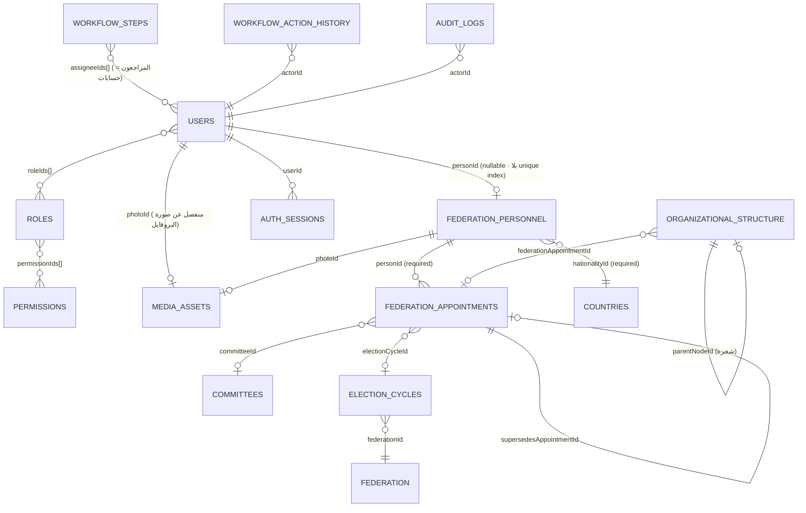

# مراجعة: نظام الحسابات والبروفايلات (Accounts ↔ People Profiles)

**النوع:** مراجعة قراءة فقط. **التاريخ:** 2026-09-26. **الفرع:** main.
**لم يُعدّل أي ملف كود، ولم يُنفّذ أي أمر Git، ولم تُكتب قاعدة البيانات.**

**دليل تشغيل الاختبارات:** تشغيل واحد للملفات المرتبطة —
`npm test -- --runInBand --testPathPatterns="(users\.service|users\.controller|federation-appointments)"`
→ **6 suites / 42 tests، كلها ناجحة.**

> **تصحيح لمعطى في التكليف:** لا يوجد `isSuperAdmin` في الكود إطلاقًا
> (`grep -rn "isSuperAdmin" api/src` → صفر نتائج). الـSuper Admin مُنفّذ كـ**دور
> مزروع** يحمل كل صلاحيات الكتالوج المعدودة، لا كـbypass. وللفرق نتيجة عملية
> مباشرة، مذكورة في D5 و P1-1.

---

## 1. الخلاصة

**بشروط.** الأساس المعماري سليم، وأفضل من المطلوب في نقطتين: الحساب والبروفايل
كيانان منفصلان فعلًا بربط اختياري، والمناصب (memberships) مُنمذجة في مجموعة
مستقلة تصلح للمجلس واللجان والإدارة التنفيذية بنفس الشكل، مع الدورات الانتخابية
ككيان قائم. لكن الطبقة التشغيلية ناقصة بشكل يمنع البناء فوقها الآن:
**لا يوجد أي مسار تعديل (Update) للبروفايلات ولا للمناصب ولا للجان** — لا في
الكتالوج ولا في الـcontrollers — فالأدمن يستطيع الإنشاء والحذف فقط، والـSuper
Admin يرث نفس النقص. **وأقسام السيرة (D3) غير موجودة بالمرة**، فالصفحة الشخصية
غير قابلة للبناء. وفوق ذلك **صفحة مجلس الإدارة الحالية على الموقع تنشر كل
الموظفين النشطين لا أعضاء المجلس**، مع بريدهم، بينما الـendpoint الصحيح موجود
ومُختبر وغير مستعمل. الخلاصة: ابنِ على النموذج، لا على الـAPI كما هي.

---

## 2. P0 — تُقرأ أولًا

### P0-1 — صفحة مجلس الإدارة تنشر كل الموظفين النشطين، لا أعضاء المجلس

**الدليل:**

- `api/src/modules/federation-governance/federation-personnel/federation-personnel.service.ts:63-66`
  — `findAllPublic()` = `repository.find({ status: 'Active' })`. لا فلترة على
  منصب ولا على عضوية مجلس. أي سجل شخص حالته `Active` يخرج.
- `apps/web/src/components/pages/board-members/board-members-screen.tsx:28`
  — الصفحة تقرأ `GET /federation-personnel/public` وتعتبر الناتج "الأعضاء".
- نفس الملف `:65` — العدّاد `members.length`، و`:94` يعرضه تحت الترجمة
  `Sections.boardMembers` ("أعضاء مجلس الإدارة")، و`:103-147` يرسم كل سجل كبطاقة
  عضو مجلس.
- نفس الملف `:134-141` — يطبع `publicContact.email` كرابط `mailto:`.

**الأثر:** أي موظف أو عضو لجنة أو مدير تنفيذي حالته `Active` يظهر على
`/about/board-members` كعضو مجلس إدارة، باسمه وصورته ونبذته وبريده، ويُحسب في
العدّاد المعلن. هذا خطأ في صحة المعلومة المنشورة عن أشخاص حقيقيين، لا خطأ عرض.

**المصدر الصحيح موجود بالفعل وغير مستعمل:**
`GET /federation-appointments/public` →
`federation-appointments.service.ts:113-148` (`currentLeadership`) يفلتر ثلاثة
شروط مجتمعة: `status: 'Active'`، والمنصب لم ينتهِ، والدور من
`LEADERSHIP_ROLES = ['President','BoardMember']` (`:14`)، ويعيد خمسة حقول فقط.
ومحروس بتسعة اختبارات في `federation-appointments.public.spec.ts:61-132` — منها
`leaves out committee roles, which belong to the committees page` (`:112`).
أي أن الحماية مكتوبة ومُختبرة، والصفحة لا تستدعيها.

**التوصية:** تحويل `board-members-screen.tsx` إلى
`GET /federation-appointments/public`. تكلفة تقديرية: **2-3 ساعات** (يكسب
أيضًا `positionTitle` الذي تفتقده الصفحة حاليًا). لا تغيير في الـschema.

### P0-2 — البريد العام يُنشر بلا مفتاح ظهور لكل سجل (قرار مالك مطلوب)

بمعيار البند 10 في التكليف (`email` على endpoint عام = P0) هذا P0. لكن الدليل
يقول إنه **تصميم مقصود لا تسريب**، فالحكم لك:

- `federation-personnel/schemas/personnel-contact.schema.ts:3-4` — `publicContact`
  موصوف حرفيًا `[PUBLIC]` "official public-facing contact only".
- نفس الملف `:16-19` — `internalContact` (`personalEmail`, `idNumber`) موصوف
  `[RESTRICTED]`، و**مُستبعد بنيويًا** من
  `federation-personnel-public-response.dto.ts:18-29` (كلاس منفصل، لا denylist).
- `federation-personnel.service.ts:70-82` — `toPublicResponse` يبني الحقول
  واحدًا واحدًا، فإضافة حقل جديد للـschema لا تسرّبه تلقائيًا.

**الفجوة الحقيقية:** لا يوجد `showEmail` ولا أي مفتاح ظهور لكل سجل كما توقّع
التكليف. الظهور قرار على مستوى المجموعة (الحقل عام دائمًا) لا على مستوى الشخص.
فمن يُسجَّل له بريد رسمي يُنشر بريده، وطريقة المنع الوحيدة هي عدم تسجيله.

**ولا تسريب `userId` ولا `password hash` ولا tokens في أي endpoint عام** —
`toResponse` في `users.service.ts:196-209` قائمة سماح،
و`authMethods.passwordHash` عليه `select: false` ولا يُقرأ إلا في
`users.repository.ts:26-31` لأجل مقارنة كلمة المرور.

---

## 3. جدول المطابقة D1–D6

| القرار | الحالة | الدليل |
|---|---|---|
| **D1** — كيانان منفصلان، ربط اختياري 1↔1 | **مطابق** | `users` و`federationPersonnel` مجموعتان مستقلتان: `users/schemas/user.schema.ts:34`، `federation-personnel/schemas/federation-personnel.schema.ts:33`. الربط `user.schema.ts:53-54`: `personId` بـ`default: null` → حساب بلا بروفايل ✓. لا شيء في `FederationPersonnel` يستلزم حسابًا → بروفايل بلا حساب ✓. الربط مُتحقَّق لا مُصدَّق: `users.service.ts:100-109`. |
| **D2** — الأدمن فقط يعدّل البروفايلات | **مطابق شكليًا / معطّل فعليًا** | لا endpoint يسمح لصاحب الحساب بتعديل بروفايله — `users.controller.ts` لا يملك إلا `PATCH me/preferences` (`:67`) وهو للغة والثيم فقط (`users.service.ts:229-240`). **لكن لا يوجد endpoint تعديل للأدمن أيضًا:** `federation-personnel.controller.ts` فيه `Post/Get/Get public/Get :id/Delete` ولا `@Patch`، و`permission-catalogue.ts:134-136` يعرّف `Create/Read/Delete` بلا `Update`. القرار غير قابل للممارسة. |
| **D3** — بروفايل واحد + قائمة مناصب + أقسام سيرة | **جزئي** | **مناصب: مطابق وأفضل من المطلوب** — `federationAppointments` مجموعة مستقلة فيها الجهة (`committeeId` `:72` / `electionCycleId` `:77`)، والدور (`roleType` `:62` + `positionTitle` `:66`)، والفترة (`termStart` `:80` / `termEnd` `:84`)، والحالة (`status` `:87`، ستة قيم). **الدورات ككيان: مطابق** — `election-cycles/schemas/election-cycles.schema.ts` (لا نص حر). **أقسام السيرة: غير موجودة** — الـschema كله `:35-63` = `fullName / photoId / shortBio / biography / nationalityId / publicContact / internalContact / status / socialLinks`. لا مؤهلات ولا شهادات ولا مناصب سابقة خارجية ولا خبرات ولا إنجازات، ولا تحكّم ظهور لأي قسم. |
| **D4** — دورة حياة مستقلة | **جزئي** | **قفل الحساب لا يمسّ البروفايل: مطابق** — `users.service.ts:182-191` يكتب `accountStatus` ويُبطل الجلسات فقط، ولا يلمس `federationPersonnel`. **حذف الحساب: مستحيل أصلًا** — لا `users:Delete` في الكتالوج (`:223-226`) ولا `@Delete` في `users.controller.ts` (صفر نتائج). **قفل المنصب بتاريخ نهاية: غير ممكن** — `federationAppointments` بلا `Update` (كتالوج `:131-133`، والـcontroller بلا `@Patch`). الطريق الوحيد لإغلاق منصب هو إنشاء خلف عبر `supersedesAppointmentId` (`federation-appointments.service.ts:53-62`). فاستقالة بلا خلف لا حل لها إلا `DELETE` = أرشفة (`controller.ts:47-51`) — وهو بالضبط ما يمنعه D4. قيمة `'Resigned'` موجودة في الـenum (`schema:20-28`) لكنها تُكتب وقت الإنشاء فقط. |
| **D5** — فريق NoTime = Super Admin بلا استثناء جديد | **مطابق** | لا استثناء جديد ولا bypass: `bootstrap/seed-admin.ts:81-86` و`:166-171` يزرعان دورًا اسمه `Super Admin` بـ`isSystemRole: true`، و`sync-permission-catalogue.ts:49` يجعله يحمل كتالوج الصلاحيات كاملًا. الحلّ per-request عبر `jwt.strategy.ts:62` ← `roles.service.ts:61-92` (قراءتان مفهرستان). `permissions.guard.ts:57-60` يقارن الزوج (resourceType, action) بلا أي فرع خاص. **النتيجة الجانبية:** الدور يرث ثغرات الكتالوج — وبما أن `federationPersonnel:Update` غير معرّف، فالـSuper Admin نفسه لا يستطيع تعديل بروفايل. |
| **D6** — سياسات الموافقة | **موصوف (لا حكم)** | البروفايلات والمناصب **خارج** `WORKFLOW_ENTITY_TYPES` (`common/constants/workflow-entity-types.ts:14-28` — القائمة الـ13 لا تضمّهما)، ومؤكَّد في تعليق `federation-personnel.schema.ts:30-32` و`federation-appointments.schema.ts:49-50`: "Not workflow-governed: no `publicationState`". أي لا قائمة موافقات ولا مراجعة ولا سجل نسخ — الإنشاء = نشر فوري. بالمقابل `committees` و`organizationalStructure` **داخل** القائمة (`:23-24`) وقراءتهما العامة تمرّ بـ`publications → revisions.snapshotData`. **المراجع لازم يكون عنده حساب:** `workflow-steps/schemas` `:29-33` — `assigneeType` مثبّت على `'User'` و`assigneeIds` ref → `User`، والتعليق `:15-17` يقولها صراحة: "approval routing is always to named individuals, never a role or committee as a group". **لا ربط بين المراجع وبروفايله:** `workflow-action-history/schemas` `:32-33` يسجّل `actorId` ref → `User`، والاسم المعروض يأتي من `users.name` عبر `users.service.ts:137-140` (`findNamesByIds`)، لا من `federationPersonnel`. |

---

## 4. مخطط العلاقات الحالي

> بند 9 يمنع إنشاء أي ملف غير هذا التقرير، و`archify` تُنتج ملف HTML مستقل —
> فالمخطط مُضمَّن هنا كـMermaid بدلًا منه.

**سلسلة العمل، ملفًا ملفًا:**

| المرحلة | الملف | الدور |
|---|---|---|
| Schema (حساب) | `platform-administration/users/schemas/user.schema.ts` | الحساب + `personId` + الحالة + قفل المحاولات |
| Schema (حساب) | `.../users/schemas/auth-method.schema.ts` | `passwordHash` بـ`select: false` |
| Schema (مشترك) | `common/schemas/base.schema.ts` | `createdBy / updatedBy / archivedAt / archivedBy` لكل المجموعات |
| Schema (بروفايل) | `federation-governance/federation-personnel/schemas/federation-personnel.schema.ts` | سجل الشخص |
| Schema (بروفايل) | `.../federation-personnel/schemas/personnel-contact.schema.ts` | فصل `[PUBLIC]` عن `[RESTRICTED]` |
| Schema (مناصب) | `.../federation-appointments/schemas/federation-appointments.schema.ts` | المنصب: جهة + دور + فترة + حالة + خلافة صريحة |
| Schema (جهات) | `.../committees/schemas/committees.schema.ts` · `.../election-cycles/schemas/election-cycles.schema.ts` · `.../organizational-structure/schemas/organizational-structure.schema.ts` | اللجان · الدورات · شجرة الهيكل |
| Repository | `common/repositories/base.repository.ts` | CRUD واعٍ بالـsoft delete + `findPaginated` (غير مستعمل هنا) |
| Repository | `.../users/users.repository.ts` | `findByEmail` مع `+authMethods.passwordHash` |
| Repository | `.../federation-personnel/federation-personnel.repository.ts` · `.../federation-appointments/federation-appointments.repository.ts` | وراثة صريحة بلا إضافات |
| Service | `.../users/users.service.ts` | إنشاء · ربط · أدوار · حالة الحساب · `toResponse` (قائمة سماح) · CSV |
| Service | `.../federation-personnel/federation-personnel.service.ts` | إنشاء · قراءة · `toPublicResponse` · أرشفة |
| Service | `.../federation-appointments/federation-appointments.service.ts` | خلافة صريحة · `currentLeadership` |
| Service | `.../roles/roles.service.ts` | `resolvePermissions` + قاعدة "لا تمنح ما لا تملك" |
| Controller | `.../users/users.controller.ts` · `.../federation-personnel/federation-personnel.controller.ts` · `.../federation-appointments/federation-appointments.controller.ts` | الحدود العامة/المحمية |
| Guard | `common/guards/jwt-auth.guard.ts` → `auth/strategies/jwt.strategy.ts` → `common/guards/permissions.guard.ts` | مصادقة → حلّ الصلاحيات per-request → تصريح + تسجيل الرفض |
| Interceptor | `common/interceptors/audit-log.interceptor.ts` | صف `auditLogs` لكل POST/PATCH/PUT/DELETE ناجح |
| Bootstrap | `bootstrap/seed-admin.ts` · `bootstrap-admin.ts` · `sync-permission-catalogue.ts` | كسر الحلقة المغلقة + الكتالوج + دور Super Admin |
| الداشبورد | `apps/dashboard/src/app/[locale]/(app)/users/page.tsx:44` | يجلب `/federation-personnel` لقائمة الربط |
| الداشبورد | `apps/dashboard/src/components/admin/users/create-user-form.tsx:66,91,254` | حقل اختيار الشخص وقت إنشاء الحساب |
| الداشبورد | `apps/dashboard/src/lib/admin/create-user-body.ts:13-14,55,67` | تمرير `personId` |
| الداشبورد | `apps/dashboard/src/components/admin/users/user-directory.tsx` | دليل الحسابات (لا يعرض الربط ولا يعدّله) |
| الموقع | `apps/web/src/components/pages/board-members/board-members-screen.tsx` | صفحة المجلس — تستهلك المصدر الخطأ (P0-1) |
| الموقع | `apps/web/src/components/pages/committees/committees-screen.tsx:19` | صفحة اللجان — "No committee list is served yet" |

**لا شاشة داشبورد للبروفايلات ولا للمناصب على الإطلاق.** الاستعمال الوحيد
لـ`/federation-personnel` في الداشبورد هو قائمة منسدلة داخل نموذج إنشاء حساب.

---

## 5. المخاطر

### P1

| # | الوصف | الدليل | الأثر | التوصية | التكلفة |
|---|---|---|---|---|---|
| **P1-1** | **لا مسار تعديل لأي شيء في هذا النطاق.** `federationPersonnel` و`federationAppointments` و`committees` و`electionCycles` كلها `Create/Read/Delete` بلا `Update` | `permission-catalogue.ts:103-105, 125-127, 131-136`؛ الـcontrollers الأربعة بلا `@Patch` | تصحيح خطأ إملائي في اسم عضو مجلس = حذف السجل وإنشاؤه من جديد، فيفقد `createdAt` ويكسر كل `personId`/`committeeId` الذي يشير إليه. والـSuper Admin يرث النقص (D5) | إضافة `Update` للأربعة في الكتالوج + `@Patch(':id')` + DTOs جزئية. **تحذير:** `users.service.ts:229-240` يوثّق فخًا حقيقيًا في هذا المشروع — تحت `ES2023` كل خاصية معلنة موجودة على الـDTO كـ`undefined`، فدمج ساذج يمحو حقولًا لم تُرسَل. استعمل نفس نمط `!== undefined` | **1.5-2 يوم** للأربعة |
| **P1-2** | **إغلاق منصب بتاريخ نهاية غير ممكن بلا خلف** (مخالفة D4 مباشرة) | `federation-appointments.controller.ts` بلا `@Patch`؛ الطريق الوحيد `service.ts:53-62` | استقالة أو وفاة بلا خلف: إما يبقى المنصب `Active` للأبد، أو يُؤرشَف السجل — والأرشفة تُخفي العضو من الأرشيف الذي يفترض أن يبقى | `PATCH /federation-appointments/:id/close` يكتب `termEnd` + `status` من `['Completed','Resigned','Removed','Transitioned','Deceased']`، بلا حذف | **0.5 يوم** (داخل P1-1) |
| **P1-3** | **`users.personId` بلا unique index، ويُكتب مرة واحدة، ولا يقرأه أحد** | الفهرس الوحيد على `users` هو البريد: `user.schema.ts:108`. `resolvePersonId` (`users.service.ts:100-109`) يتحقق من الوجود لا التفرّد. `personId` يُكتب في `create` فقط (`:78, 87`) ولا endpoint للربط/فك الربط. `grep "\.personId"` → قارئان فقط: الإنشاء و`toResponse:202` | حسابان يمكن أن يُربطا بنفس الشخص بلا خطأ (يخالف 1↔1). وربط حساب قائم ببروفايل يستلزم حذف الحساب — وهو مستحيل | فهرس جزئي `{ personId: 1 }` unique على `personId: { $ne: null }, archivedAt: null` + `PATCH /users/:id/person`. الفهرس **بعد** فحص التكرارات، على سابقة `bootstrap/check-policy-duplicates.ts` | **0.5-1 يوم** |
| **P1-4** | **أقسام السيرة (D3) غير موجودة** | `federation-personnel.schema.ts:35-63` — القائمة كاملة | الصفحة الشخصية (CV) غير قابلة للبناء. `biography` حقل `LocalizedText` واحد لا أقسام قابلة للتكرار بظهور لكل عنصر | قسم ADR (المسودة أدناه) ثم subdocument arrays بـ`isVisible` لكل عنصر | **3-4 أيام** (schema + DTO + endpoints + شاشة داشبورد + اختبارات) |
| **P1-5** | **صفر فهارس على `federationPersonnel` و`federationAppointments`** | `grep "\.index("` على `federation-governance` بالكامل → صفر نتائج | كل قراءة مسح كامل، بما فيها الـendpoint العام و`currentLeadership`. صفحة الهيكل ستصفّي `personId`/`committeeId` بلا فهرس | `{ personId: 1, status: 1 }`، `{ committeeId: 1, status: 1 }`، `{ electionCycleId: 1 }`، `{ roleType: 1, status: 1 }` على المناصب؛ `{ status: 1 }` على الأشخاص | **2-3 ساعات** |
| **P1-6** | **لا بوابة تحرير على البروفايلات** | خارج `WORKFLOW_ENTITY_TYPES` (`:14-28`)؛ التعليقان `federation-personnel.schema.ts:30-32` و`federation-appointments.schema.ts:49-50` | إنشاء سجل شخص = نشره على الموقع فورًا، بلا مراجعة ولا سجل نسخ ولا استرجاع. وغير متماسك مع `committees` المجاورة التي تمرّ بالـworkflow | قرار مالك (سؤال 2). القائمة **مغلقة** بقرار FigJam `100:7435`، فالتوسيع قرار حاكمية لا تنفيذ | حسب القرار |
| **P1-7** | **صفحة اللجان غير قابلة للبناء: لا قائمة عامة** | `committees.controller.ts:39-43` — `GET :id/public` فقط. مُعترف به في `apps/web/src/lib/pages/public-pages.ts:206` و`committees-screen.tsx:19` | لا طريق عام لمعرفة أي لجان موجودة. ولا endpoint يجلب أعضاء لجنة (`findActiveByRole` موجود `:90`، ولا مقابل له بـ`committeeId`) | `GET /committees/public` (قائمة الـLive) + `GET /committees/:id/members/public` | **1-1.5 يوم** |
| **P1-8** | **صفر اختبارات لـ`federation-personnel`** | لا `*.spec.ts` في المجلد | `toPublicResponse` هو الحاجز الوحيد أمام `internalContact`، وغير محروس. حقل جديد يُضاف للـDTO بلا كسر أي اختبار | الأسماء في القسم 8 | **0.5 يوم** |

### P2

| # | الوصف | الدليل | التوصية | التكلفة |
|---|---|---|---|---|
| P2-1 | أرشفة شخص تترك `users.personId` معلّقًا | `federation-personnel.service.ts:84-86` أرشفة فقط؛ `base.repository.ts:15` يصفّي `archivedAt` فيُرجع `null` بصمت | تصفير `personId` في الحسابات المرتبطة عند الأرشفة، أو فحص سلامة مرجعية | 2-3 ساعات |
| P2-2 | `publicContact.email` مُتحقَّق بـ`@IsString()` لا `@IsEmail()` | `create-federation-personnel.dto.ts:18-21` | `@IsEmail()` — الحقل يُطبع كـ`mailto:` على الموقع | 15 دقيقة |
| P2-3 | لا pagination على `findAll`/`findAllPublic` | `federation-personnel.service.ts:45-47, 63-66`؛ `findPaginated` جاهز في `base.repository.ts:106-117` وغير مستعمل | استعماله على المسار العام | 1-2 ساعة |
| P2-4 | `currentLeadership` يقرأ كل المناصب النشطة ثم يصفّي الدور في الذاكرة | `federation-appointments.service.ts:114-119` | `find({ status:'Active', roleType: { $in: LEADERSHIP_ROLES } })` مع الفهرس من P1-5 | 30 دقيقة |
| P2-5 | الشروط المترابطة على المنصب غير مفروضة (`committeeId` لأدوار اللجان، `electionCycleId` للرئيس والعضو) | `federation-appointments.schema.ts:68-70` — القرار مقصود وموثّق: "the board states no schema-level conditional requirement" | تحقّق على مستوى الـservice لا الـschema، احترامًا للتوثيق | 2-3 ساعات |
| P2-6 | لا `slug` على `federationPersonnel` | الـschema بالكامل | الصفحة الشخصية ستُعنون بـObjectId. سابقة `pages.slug` موجودة | مع P1-4 |

### أثر ثغرة الـaudit interceptor على هذا النطاق (خارج النطاق للإصلاح)

`audit-log.interceptor.ts:152-156` — `if (!entityType || !rawEntityId) return;`
يتخطّى الصف بصمت. **الأثر على الحسابات والبروفايلات محدود عمليًا:** كل مسار
كتابة في هذا النطاق يوفّر أحد المصدرين — `:id` في المسار
(`PATCH /users/:id/status` و`/roles`، و`DELETE` على الأشخاص والمناصب)، أو
`_id`/`id` في الرد (`POST /users` يعيد `UserResponseDto.id`،
و`POST /federation-personnel` يعيد المستند). و`entityTypeFor` (`:121-134`)
يحوّل `federation-personnel` → `federationPersonnel` بالـcamelCase المطلوب،
فالصفوف قابلة للربط مع `workflowInstances`/`revisions`. **الخطر يظهر مع كل
endpoint جديد يخالف الشكلين** — مثل `PATCH /users/:id/person` المقترح في P1-3
لو أعاد `204`. لا إصلاح هنا؛ يُذكر كقيد على التصميم القادم.

---

## 6. الفجوات التي تعطّل الصفحات القادمة

### مجلس الإدارة (مع الهيكل التنظيمي)

- **معطّل:** P0-1 — المصدر الحالي خطأ. `/federation-appointments/public` جاهز ومُختبر.
- **معطّل:** `positionTitle` (الاسم الدقيق للمنصب) موجود على المنصب لا على الشخص، والصفحة الحالية لا تعرضه لأنها لا تقرأ المناصب.
- **معطّل:** P1-1 و P1-2 — لا تعديل ولا إغلاق منصب.
- **ناقص:** لا endpoint لأعضاء مجلس دورة سابقة (الأرشيف). `electionCycleId` موجود على المنصب، ولا مسار قراءة به.
- **الهيكل:** `organizationalStructure` هو الوحيد في النطاق الذي **يملك** `Update` (`permission-catalogue.ts:176`) و`setParent` بمنع الحلقات (`organizational-structure.schema.ts:42`) — لكن قراءته العامة `GET :id/public` فقط، فلا طريق لجلب الشجرة كاملة. الصفحة حاليًا في `PREPARING_PAGES`.

### اللجان (صفحة لكل لجنة)

- **معطّل:** P1-7 — لا قائمة عامة ولا endpoint لأعضاء لجنة.
- **معطّل:** `committees` بلا `Update` (`:103-105`) — وصف اللجنة غير قابل للتعديل، وهو محتوى تحريري بإقرار الـschema نفسه (`committees.schema.ts:21-22`).
- **مسار مختلف:** `committees` **داخل** الـworkflow، فالقراءة العامة تمرّ بـ`publications → revisions.snapshotData`، بينما أعضاؤها (`federationAppointments`) **خارجه**. أي صفحة واحدة بمصدرين مختلفي الحاكمية: نصّ اللجنة يحتاج موافقة، وقائمة أعضائها لا.

### الصفحة الشخصية (CV)

- **معطّل تمامًا:** P1-4 — لا أقسام سيرة.
- **معطّل:** لا `GET /federation-personnel/:id/public`. الموجود `/public` (قائمة) و`/:id` (يتطلب `federationPersonnel:Read`).
- **معطّل:** لا endpoint لتاريخ مناصب شخص واحد (`findByIds` للأشخاص موجود `:57-59`، ولا مقابل له للمناصب بـ`personId`).
- **ناقص:** لا `slug` (P2-6)، ولا `Publish`/`publicationState` فصفحة كل شخص تُنشر لحظة إنشاء السجل.

---

## 7. أسئلة تحتاج قرارك

**سؤال 1 — البريد العام للأشخاص (P0-2).**

1. **يبقى كما هو**: الحقل `[PUBLIC]` بتصميمه، ومن لا يريد نشر بريده لا يُسجّله. التكلفة: صفر. المقايضة: الافتراضي هو النشر، والخطأ البشري يكشف بريدًا.
2. **مفتاح ظهور لكل سجل** (`showPublicContact: boolean`, default `false`): التكلفة ~3 ساعات. المقايضة: الافتراضي يصبح الكتمان، ويلزم مرور واحد على السجلات القائمة.
3. **إزالة البريد من المسار العام نهائيًا** والاكتفاء بنموذج "اتصل بنا": التكلفة ~1 ساعة. المقايضة: يفقد الاتصال المباشر بمسؤول محدد.

**توصيتي: (2).** الكتمان-بالافتراض هو المعيار للبيانات الشخصية، وهو يطابق ما توقّعه تكليفك (`showEmail`) بلا تغيير في بنية `[PUBLIC]/[RESTRICTED]` القائمة.

**سؤال 2 — هل تدخل البروفايلات الـworkflow (P1-6)؟**

1. **تبقى خارجه**: صفر تكلفة. المقايضة: لا مراجعة ولا سجل نسخ ولا استرجاع لأي سجل شخص، بينما `committees` المجاورة محمية.
2. **إضافة `federationPersonnel` فقط** للقائمتين A و B + `publicationState`: ~2-3 أيام. المقايضة: **توسيع قائمة مغلقة** بقرار FigJam `100:7435`، ويستلزم ADR وتحديث الـFigJam.
3. **إضافة الاثنين** (الأشخاص والمناصب): ~4-5 أيام. المقايضة: تعيين عضو مجلس يصبح خاضعًا لموافقة — الأدق حاكميًا والأثقل تشغيليًا.

**توصيتي: (2).** سجل الشخص محتوى تحريري منشور (نبذة وسيرة وصورة) بنفس معنى وصف اللجنة. أما المنصب فسجل إداري وقائعي، وحمايته الحقيقية هي سجل التدقيق لا قائمة الموافقات.

**سؤال 3 — أقسام السيرة (P1-4): مُضمّنة أم مجموعة مستقلة؟**

1. **subdocument arrays داخل `federationPersonnel`**، كل عنصر بـ`isVisible` و`displayOrder`: ~3 أيام. المقايضة: قراءة واحدة للصفحة الشخصية كلها، لكن المستند ينمو ولا يمكن الاستعلام عن قسم بمعزل.
2. **مجموعة `personCredentials` مستقلة** بـ`personId` + `sectionType`: ~4 أيام. المقايضة: أنظف للاستعلام والترقيم، وقراءة إضافية لكل صفحة.
3. **`ContentBlock` القائم** (`common/schemas/content-block.schema.ts`): ~1.5 يوم. المقايضة: أرخص، لكن الأقسام تصبح نصًا حرًا غير قابل للاستعلام ("كل من يحمل شهادة IAAF" يصبح مستحيلًا).

**توصيتي: (1).** الأقسام الخمسة تُقرأ دائمًا معًا في سياق شخص واحد، ولا يوجد حتى الآن أي متطلب يستعلم عبر الأشخاص. و(2) يشتري مرونة لا يطلبها أحد بثمن قراءة إضافية في كل صفحة.

**سؤال 4 — ربط حساب ببروفايل بعد الإنشاء (P1-3).**

1. **`PATCH /users/:id/person`** تحت `users:Update` + فهرس unique: ~0.5-1 يوم. **توصيتي.**
2. **الاكتفاء بوقت الإنشاء**: صفر تكلفة. المقايضة: موظف قائم عُيّن في المجلس لا يمكن ربط حسابه ببروفايله إلا بحذف حسابه — وهو مستحيل بالـAPI.
3. **الربط من جهة البروفايل** (`PATCH /federation-personnel/:id/user`): نفس التكلفة، لكنه يضع كتابة على `users` داخل نطاق صلاحية `federationPersonnel` — أرفضه لهذا السبب.

---

## 8. الاختبارات الناقصة (أسماء فقط)

**`federation-personnel.service.spec.ts`** (الملف كله غير موجود)

- `toPublicResponse omits internalContact entirely, whatever it holds`
- `toPublicResponse names its fields explicitly, so a new schema field is not published by default`
- `findAllPublic returns only Active personnel`
- `findAllPublic does not return an Inactive person even when they hold an active appointment`
- `create rejects a photoId that is not a usable image`
- `remove archives rather than deletes, and leaves the record readable as an archive`

**`federation-personnel.public.spec.ts`**

- `the public endpoint requires no authentication`
- `an archived person disappears from the public listing`

**`board-members-page.integration.spec.ts`** (حرس P0-1)

- `the board page lists only President and BoardMember appointments`
- `an active staff member with no board appointment does not appear on the board page`
- `the announced count equals the number of serving board members, not the number of personnel records`

**`users.service.person-link.spec.ts`** (حرس D1)

- `refuses to link a second account to a person who already has one`
- `an account may exist with no person, and a person with no account`
- `unlinking clears personId without touching the person record`

**`accounts-profiles-lifecycle.spec.ts`** (حرس D4)

- `suspending an account leaves the linked person visible on the public site`
- `archiving a person does not suspend the linked account`
- `archiving a person clears the dangling personId on linked accounts`
- `closing an appointment sets termEnd and status without archiving the row`
- `a closed appointment still resolves for the archive view`

**`federation-appointments.update.spec.ts`** (حرس P1-1 و P1-2)

- `a partial update leaves unmentioned fields untouched (ES2023 undefined trap)`
- `closing an appointment does not touch any other appointment of the same roleType`

**`federation-personnel.audit.spec.ts`**

- `creating a person writes an auditLogs row with entityType federationPersonnel`
- `archiving a person writes a Delete row carrying the previous value`
- `the audit snapshot of a person redacts internalContact`

---

## 9. مسودات ADR مقترحة (عنوان + ملخص فقط)

**ADR-XXXX — Person CV Sections (D3)**
الأقسام الخمسة (المؤهلات، الشهادات والدورات، المناصب السابقة خارج الاتحاد،
الخبرات، الإنجازات) كـsubdocument arrays داخل `federationPersonnel`، لكل عنصر
`isVisible` و`displayOrder`. يسجّل لماذا لا مجموعة مستقلة (لا متطلب استعلام عبر
الأشخاص) ولا `ContentBlock` (يفقد البنية القابلة للاستعلام)، ولماذا الظهور على
مستوى العنصر لا القسم (شهادة واحدة قد تُحجب دون بقية الشهادات).

**ADR-XXXX — Account ↔ Person Link Cardinality**
تثبيت 1↔1 بفهرس جزئي unique على `users.personId`، وإجراء الربط/فك الربط بعد
الإنشاء، وسلوك الربط عند أرشفة الشخص. يسجّل لماذا الفهرس جزئي (سابقة
`users.email` و`pages.slug`) وترتيب النشر (فحص التكرارات ← بناء الفهرس، سابقة
`check-policy-duplicates.ts`).

**ADR-XXXX — Appointment Closure Without Succession**
مسار إغلاق منصب صريح بتاريخ نهاية وحالة نهائية، بلا أرشفة، حتى لا تكون
الأرشفة هي الطريق الوحيد لتسجيل استقالة. يسجّل العلاقة بقرار الخلافة الصريحة
`supersedesAppointmentId` (قرار #3) وأن هذا لا يعيد القاعدة الضمنية المُلغاة.

**ADR-XXXX — Public Contact Visibility for Federation Personnel**
(إن اختير الخيار 2 في السؤال 1) مفتاح ظهور لكل سجل مع الكتمان بالافتراض، فوق
فصل `[PUBLIC]/[RESTRICTED]` القائم لا بدلًا منه.

---

## 10. تحقّق من القيود

| القيد | الحالة |
|---|---|
| لم يُعدّل أي ملف كود | ✔ الملف الوحيد المُنشأ هو هذا التقرير |
| لم يُنفّذ أي أمر Git | ✔ ولا أمر واحد |
| لا dependencies ولا seeders ولا migrations ولا كتابة DB | ✔ |
| تشغيل واحد للاختبارات المرتبطة | ✔ 6 suites / 42 tests ناجحة |
| المواضع المحمية لم تُمسّ | ✔ حلّ الصلاحيات per-request ودور Super Admin ومحرك الـworkflow وسياساته و`AuditLogsRepository`: قراءة فقط |
| لا قرار تصميم مُتخذ ذاتيًا | ✔ كل اقتراح معروض كخيارات مرقّمة بتوصية، بلا تنفيذ |
